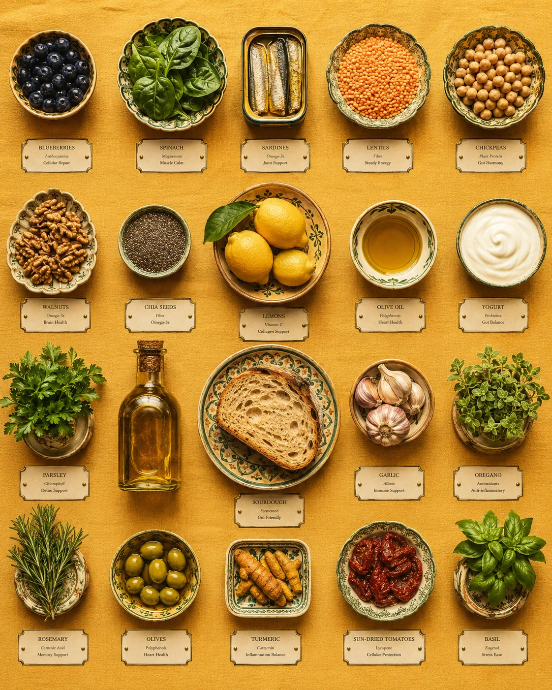
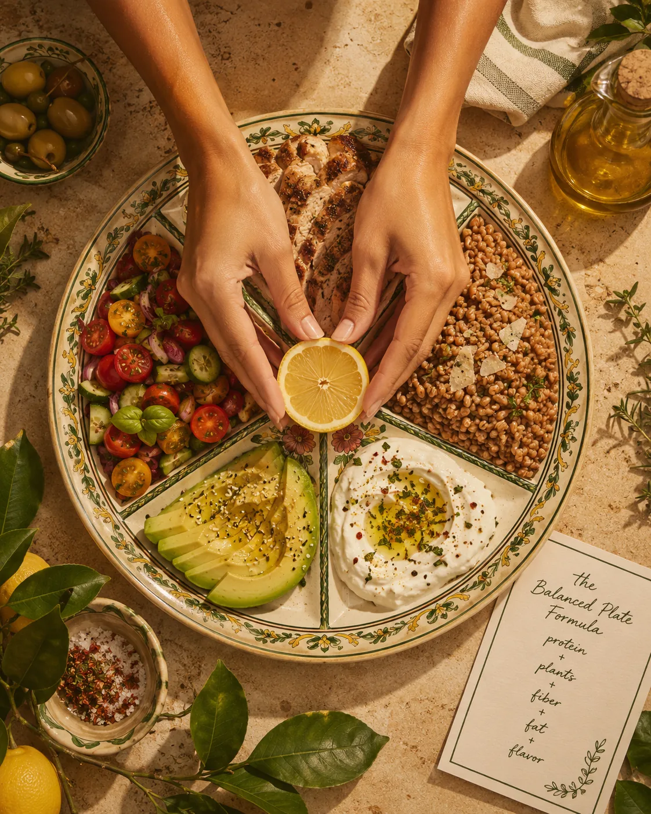

Anti-inflammatory eating can sound like another wellness rulebook.
Another list of foods to avoid.
Another reason to feel guilty about your coffee, your bread, your pasta, your chocolate, your imperfect week.
But it does not need to be that way.
At its best, anti-inflammatory eating is not a strict diet. It is a supportive way of eating that helps your body feel steadier, better nourished, and more resilient over time.
It is less about controlling every bite and more about building meals around foods that support your health: colorful plants, quality protein, healthy fats, fiber-rich carbohydrates, herbs, spices, and Mediterranean-inspired simplicity.
For women, especially in the 30s, 40s, and beyond, this way of eating can be a beautiful foundation. Not because food can fix everything, but because the body often feels better when it receives consistent nourishment, stable blood sugar, enough protein, enough fiber, and meals that feel satisfying rather than punishing.
This guide will help you understand what anti-inflammatory eating means, which foods to focus on, what to limit without fear, and how to begin in a way that feels realistic.
No extremes.
No perfection.
Just a calmer, more intelligent way to feed yourself.

## What Is Inflammation?

Inflammation is part of your body’s natural immune response.
When you get injured or sick, inflammation helps your body protect and repair itself. This short-term response is normal and necessary.
The concern is chronic low-grade inflammation — a more persistent, background level of inflammation that may be influenced by many factors, including diet quality, stress, sleep, body composition, blood sugar, activity levels, smoking, alcohol, environmental exposures, and certain medical conditions.
Chronic inflammation is complex. It is not caused by one food, one stressful week, or one night of poor sleep.
And it is not something to obsess over.
But your daily habits can influence the internal environment your body lives in. Food is one of those habits — and one of the most practical places to begin.

## What Does Anti-Inflammatory Eating Mean?
Anti-inflammatory eating means emphasizing foods and eating patterns that may help support a healthier inflammatory response in the body.
In practice, this usually means eating more:
* vegetables
* fruits
* beans and lentils
* whole grains
* nuts and seeds
* extra virgin olive oil
* herbs and spices
* fish and seafood
* minimally processed foods
And eating less of the foods that tend to be less supportive when they become the foundation of the diet, such as:
* sugary drinks
* frequent ultra-processed snacks
* processed meats
* deep-fried foods
* refined carbohydrates eaten alone
* excessive alcohol
Harvard Health lists foods such as tomatoes, olive oil, leafy greens, nuts, fatty fish, and fruits like berries, cherries, and oranges as examples of anti-inflammatory foods. It also notes that less supportive foods include refined carbohydrates, fried foods, sugary drinks, red meat, processed meat, margarine, shortening, and lard. (Harvard Health)
But this is important: anti-inflammatory eating is not about never eating a croissant again.
It is about your pattern.
Your usual meals.
Your daily foundations.
The foods you return to most often.
That is what shapes your health far more than one meal.

## Why Anti-Inflammatory Eating Matters for Women

Women often arrive at this topic through symptoms.
Fatigue.
Brain fog.
Bloating.
Joint discomfort.
Cravings.
Hormonal shifts.
Skin changes.
Blood sugar swings.
Feeling puffy, tired, or inflamed.
These experiences can be frustrating, especially when life is already full.
Anti-inflammatory eating is not a diagnosis or a cure. But it can be a supportive foundation for several areas that matter deeply to women’s wellbeing:
* metabolic health
* blood sugar balance
* heart health
* gut health
* hormonal transitions
* healthy aging
* recovery from exercise
* energy stability
* body composition
* mood and mental clarity
A 2024 review describes anti-inflammatory diets as patterns rich in fruits, vegetables, whole grains, nuts, seeds, legumes, healthy fats, herbs, spices, and other nutrient-dense foods, while limiting foods that may promote inflammation when consumed frequently. (PMC)
For women over 35, this becomes especially relevant because the body may become more sensitive to poor sleep, chronic stress, under-eating, low protein, alcohol, and blood sugar swings. If you are already exploring metabolic health, you may also want to read [Metabolic Health for Women Over 35: A Simple Guide](/journal/metabolic-health-for-women-over-35/) and [Why Your Metabolism Changes in Your 30s and 40s](/journal/why-your-metabolism-changes-in-your-30s-and-40s/).
Anti-inflammatory eating is not a separate wellness project.
It is part of the same foundation: steady meals, enough protein, colorful plants, healthy fats, fiber, movement, and recovery.

## The Mediterranean Connection
The Mediterranean diet is one of the most well-studied eating patterns connected to inflammation and long-term health.
It is not a strict diet with one exact definition. It is more of a food pattern inspired by traditional ways of eating around the Mediterranean: vegetables, fruits, legumes, whole grains, olive oil, nuts, seeds, herbs, fish, seafood, and simple meals built from whole foods.
Mayo Clinic describes the Mediterranean diet as a heart-healthy eating plan that emphasizes vegetables, fruits, whole grains, beans, nuts, seeds, olive oil, and herbs and spices. (Mayo Clinic) Cleveland Clinic also notes that the Mediterranean diet encourages unsaturated fats, including omega-3 fatty acids, and limits sodium and saturated fat. (Cleveland Clinic)
This is why the Mediterranean approach fits so beautifully with anti-inflammatory eating.
It is not cold or clinical.
It is not dry chicken and steamed broccoli.
It is not a diet culture punishment dressed up as wellness.
It is olive oil, herbs, lentils, fish, citrus, tomatoes, greens, yogurt, beans, berries, nuts, and meals that feel both nourishing and pleasurable.
That matters.
Because the most supportive way of eating is the one you can return to — not the one you survive for two weeks.

## The Best Anti-Inflammatory Foods to Focus On

Instead of beginning with what to remove, begin with what to add.
This creates a healthier mindset and a more sustainable pattern.
Here are the main food groups to focus on.

### 1. Colorful Vegetables
Vegetables are one of the foundations of anti-inflammatory eating.
They provide fiber, vitamins, minerals, antioxidants, water, and plant compounds that support overall health. The goal is not to eat only salads. It is to include more color and variety across your week.
Helpful options include:
* leafy greens
* tomatoes
* peppers
* carrots
* broccoli
* cauliflower
* mushrooms
* zucchini
* eggplant
* onions
* garlic
* asparagus
* cabbage
* cucumber
* beets
* herbs
A practical beginner goal:
Add one vegetable to two meals per day.
That might mean spinach in your eggs, tomatoes with lunch, roasted vegetables with dinner, or cucumber and herbs alongside a protein-rich snack.
Keep it simple enough to repeat.

### 2. Berries and Whole Fruits
Fruit is often misunderstood in wellness spaces because it contains natural sugar.
But whole fruit is not the same as added sugar. Whole fruit comes with fiber, water, vitamins, minerals, and polyphenols.
Berries are especially useful because they are rich in plant compounds and easy to add to breakfast, yogurt bowls, oats, or snacks.
Good options include:
* blueberries
* strawberries
* raspberries
* blackberries
* cherries
* oranges
* kiwi
* apples
* pears
* pomegranate
* peaches
* plums
A simple pairing:
Fruit + protein or fat
Examples:
* berries with Greek yogurt
* apple with nut butter
* orange with boiled eggs
* pear with cottage cheese
* cherries with walnuts
This helps support blood sugar stability and keeps the snack more satisfying.
For more on meal structure and energy, read [Blood Sugar Balance for Women: What It Means and Why It Matters](/journal/blood-sugar-balance-for-women/).

### 3. Extra Virgin Olive Oil

Extra virgin olive oil is one of the signature foods of Mediterranean eating.
It provides monounsaturated fats and polyphenols, and it makes simple food taste beautiful.
Use it for:
* salads
* roasted vegetables
* cooked greens
* bean dishes
* lentil bowls
* fish
* soups
* dips
* eggs
* tomato-based dishes
You do not need to drown food in oil. But using olive oil intentionally can make meals more satisfying and help you move away from overly dry, restrictive eating.
A simple upgrade:
Replace some butter, creamy dressings, or refined oils with extra virgin olive oil when it makes sense.
This is not about perfection. It is about your usual pattern.

### 4. Fatty Fish and Omega-3 Foods
Fatty fish provides omega-3 fatty acids, which are often discussed in relation to inflammation and heart health.
Helpful options include:
* salmon
* sardines
* mackerel
* trout
* anchovies
* herring
* tuna, in moderation
For many women, eating fish two times per week can be a realistic starting point, if they enjoy it and it fits their diet.
Plant-based omega-3 sources include:
* chia seeds
* flaxseed
* walnuts
* hemp seeds
These are not exactly the same as marine omega-3s, but they can still be useful additions to a nutrient-rich diet.
Easy ideas:
* salmon with potatoes and greens
* sardines on sourdough with tomato and herbs
* tuna and white bean salad
* trout with roasted vegetables
* Greek yogurt bowl with chia seeds and berries
* walnuts over oats or salad
If you are pregnant, breastfeeding, have medical conditions, or are unsure about fish intake or supplements, speak with a qualified healthcare provider.

### 5. Beans, Lentils, and Chickpeas

Legumes are deeply underrated.
They are rich in fiber, plant protein, minerals, and slow-digesting carbohydrates. They also fit beautifully into Mediterranean-style meals.
Options include:
* lentils
* chickpeas
* white beans
* black beans
* kidney beans
* cannellini beans
* split peas
* edamame
Ways to use them:
* lentil soup with olive oil and herbs
* chickpea salad with cucumber, lemon, parsley, and tahini
* white bean dip with vegetables
* black bean bowls with rice and avocado
* lentils added to salads
* bean stew with tomatoes and greens
* hummus with vegetables and boiled eggs
If legumes make you bloated, begin with smaller portions and increase gradually. Rinsing canned beans well can also help.
Anti-inflammatory eating should support digestion, not overwhelm it.

### 6. Whole Grains and Fiber-Rich Carbohydrates
Carbohydrates are not the enemy of anti-inflammatory eating.
The most supportive carbohydrates tend to be fiber-rich, minimally processed, and paired with protein and healthy fats.
Good options include:
* oats
* quinoa
* barley
* farro
* brown rice
* buckwheat
* rye bread
* whole grain sourdough
* potatoes
* sweet potatoes
* beans and lentils
* fruit
Whole grains are part of the Mediterranean pattern and can support digestion, fullness, and steady energy. Mayo Clinic notes that the Mediterranean diet is typically high in vegetables, fruits, whole grains, beans, nuts, seeds, and olive oil. (Mayo Clinic)
If you often feel tired after meals, the issue may not be carbohydrates themselves. It may be the way the meal is built.
A bowl of plain pasta feels different from pasta with tuna, tomato, olive oil, herbs, and greens.
A slice of toast alone feels different from toast with eggs, avocado, and tomatoes.
For more on this, read [Why You Feel Tired After Eating — and What May Help](/journal/why-you-feel-tired-after-eating-and-what-may-help/) and [How to Build a Blood-Sugar-Friendly Breakfast](/journal/how-to-build-a-blood-sugar-friendly-breakfast/).

### 7. Nuts and Seeds
Nuts and seeds provide healthy fats, minerals, fiber, and some protein.
Helpful options include:
* almonds
* walnuts
* pistachios
* hazelnuts
* pumpkin seeds
* chia seeds
* flaxseed
* hemp seeds
* sesame seeds
* tahini
Easy ways to use them:
* walnuts in Greek yogurt
* chia seeds in oats
* tahini over roasted vegetables
* pumpkin seeds on salad
* almond butter with apple
* sesame seeds over bowls
* pistachios with fruit
Because nuts and seeds are energy-dense, portions matter. But they are not something to fear.
They help meals feel satisfying — and satisfaction is part of sustainability.

### 8. Herbs, Spices, Garlic, and Citrus
Flavor is not decoration. It is what makes healthy eating repeatable.
Herbs, spices, garlic, onion, citrus, vinegar, and mustard can turn simple foods into meals you actually want to eat.
Use more:
* parsley
* basil
* mint
* dill
* cilantro
* thyme
* rosemary
* oregano
* cinnamon
* turmeric
* ginger
* cumin
* paprika
* black pepper
* garlic
* lemon
* lime
* vinegar
Harvard’s quick-start guide to anti-inflammatory eating notes that some herbs and spices, including cinnamon, ginger, cayenne pepper, and turmeric, may offer modest benefits. (Harvard Health)
But even beyond potential benefits, herbs and spices make food more enjoyable.
And enjoyable food is easier to keep eating.

### 9. Fermented Foods
Fermented foods can support gut health for some people, and gut health is connected to immune and metabolic wellbeing.
Options include:
* yogurt with live cultures
* kefir
* sauerkraut
* kimchi
* miso
* tempeh
* fermented pickles
You do not need to force fermented foods if they do not suit your digestion. Start small and notice how your body responds.
For a simple beginner option, Greek yogurt with berries, chia seeds, and walnuts can be a beautiful anti-inflammatory breakfast.

## Foods to Limit Without Fear

Anti-inflammatory eating is not about moralizing food.
Still, some foods are less supportive when they become daily staples.
You may feel better limiting:
* sugary drinks
* frequent sweets and pastries
* processed meats
* deep-fried foods
* ultra-processed snack foods
* refined carbohydrates eaten alone
* excessive alcohol
* very low-protein meals
* meals built mostly around caffeine and convenience
Harvard Health includes refined carbohydrates, fried foods, sugary beverages, red meat, and processed meat among foods associated with inflammation when consumed frequently. (Harvard Health)
But the wording matters: limit, not fear.
A birthday cake is not inflammation.
A pizza night is not failure.
A pastry on holiday is not a ruined body.
The goal is to make your usual pattern more supportive, while still having a normal, flexible life.
That is where long-term wellness lives.

## How to Build an Anti-Inflammatory Plate

Use this simple formula:

**Protein + colorful plants + fiber-rich carbohydrate + healthy fat + flavor**
Example Plate
* Protein: salmon, chicken, eggs, tofu, Greek yogurt, lentils, beans
* Colorful plants: greens, tomatoes, peppers, broccoli, berries, herbs
* Fiber-rich carbohydrate: oats, potatoes, quinoa, rice, beans, fruit, whole grains
* Healthy fat: olive oil, avocado, nuts, seeds, tahini
* Flavor: lemon, garlic, herbs, spices, vinegar, mustard
This structure supports blood sugar, fullness, nutrient intake, and meal satisfaction.
It also connects beautifully with metabolic health. For more on this foundation, read [The Best Foods to Support a Healthy Metabolism](/journal/the-best-foods-to-support-a-healthy-metabolism/) and [Body Recomposition for Women: Nutrition Basics](/journal/body-recomposition-for-women-nutrition-basics/).

## Anti-Inflammatory Breakfast Ideas

Breakfast is a powerful place to begin because it can influence your energy, cravings, and blood sugar for the rest of the day.
Try:
* Greek yogurt with berries, chia seeds, walnuts, and cinnamon
* eggs with spinach, tomatoes, avocado, and sourdough
* oats with Greek yogurt, berries, flaxseed, and almond butter
* tofu scramble with vegetables and potatoes
* smoked salmon with rye bread, cucumber, lemon, and dill
* cottage cheese with fruit, pistachios, and cinnamon
* chia pudding with berries and Greek yogurt
If your mornings are rushed, prepare one repeatable breakfast you can rely on. Anti-inflammatory eating becomes easier when you do not have to make every meal from scratch in your head.
For more ideas, read [High-Protein Breakfast Ideas for Steady Energy](/journal/high-protein-breakfast-ideas-for-steady-energy/).

## Anti-Inflammatory Lunch and Dinner Ideas

Lunch and dinner are ideal for Mediterranean-inspired meals.
Try:
* salmon with potatoes, greens, olive oil, and lemon
* lentil soup with herbs and a side of Greek yogurt
* chicken bowl with quinoa, roasted vegetables, herbs, and tahini
* chickpea salad with cucumber, tomatoes, parsley, olive oil, and lemon
* tofu with rice, greens, sesame, and ginger
* sardines on sourdough with tomato, arugula, and olive oil
* turkey or bean chili with avocado and herbs
* whole grain pasta with tuna, tomatoes, garlic, olive oil, and spinach
* roasted vegetable and white bean bowl with pesto or tahini
* eggs with sautéed greens, potatoes, and herbs
These meals are simple, but they are not boring.
That is the quiet luxury of this eating style: nourishing food that still feels like food.

## Anti-Inflammatory Snack Ideas
Snacks can be supportive when they are built with enough protein, fiber, or healthy fat.
Try:
* Greek yogurt with berries
* apple with almond butter
* hummus with vegetables
* boiled eggs with tomatoes
* cottage cheese with pear and cinnamon
* walnuts with fruit
* edamame with sea salt
* chia pudding
* tuna or sardines on whole grain crackers
* kefir with berries
* roasted chickpeas
* dark chocolate with nuts, if you enjoy it
If you often snack because lunch was too light, the solution may not be better snacks. It may be a more satisfying lunch.
Read [High-Protein Snacks That Actually Keep You Full](/journal/high-protein-snacks-that-keep-you-full/) if this is a pattern for you.

## A Simple 3-Day Beginner Plan

This is not a strict meal plan. It is a simple example of what anti-inflammatory eating can look like.
| Day | Breakfast | Lunch | Snack | Dinner |
| --- | --- | --- | --- | --- |
| Day 1 | Greek yogurt with berries, chia seeds, walnuts, and cinnamon | Chickpea salad with cucumber, tomatoes, parsley, olive oil, lemon, and boiled eggs | Apple with almond butter | Salmon with potatoes, greens, olive oil, and herbs |
| Day 2 | Eggs with spinach, tomatoes, avocado, and sourdough | Lentil soup with herbs and a side salad | Cottage cheese with berries | Chicken or tofu bowl with quinoa, roasted vegetables, tahini, and lemon |
| Day 3 | Oats with Greek yogurt, berries, flaxseed, and cinnamon | Tuna and white bean salad with greens, olive oil, and herbs | Hummus with vegetables | Whole grain pasta with tomatoes, garlic, olive oil, spinach, and sardines or tofu |
The point is not to copy this perfectly.
The point is to notice the rhythm:
Protein.
Plants.
Fiber.
Healthy fats.
Flavor.
That rhythm is the foundation.

## Common Mistakes to Avoid
### 1. Turning It Into Another Restrictive Diet
Anti-inflammatory eating should not make your life smaller.
If you become afraid of every food, the stress may outweigh the benefit. Use this approach to add support, not create anxiety.
### 2. Removing Too Much Too Quickly
Some women try to cut gluten, dairy, sugar, coffee, alcohol, red meat, nightshades, grains, and everything enjoyable all at once.
This is rarely necessary as a first step.
Start by adding more supportive foods before removing everything.
### 3. Not Eating Enough Protein
A plate of vegetables is lovely, but it may not keep you full or support muscle.
Include protein at meals, especially if you are active or over 35.
### 4. Forgetting Blood Sugar Balance
Even healthy foods can leave you tired if the meal is unbalanced. Pair carbohydrates with protein, fiber, and healthy fats.
### 5. Ignoring Stress and Sleep
Food matters, but it is not the whole story.
Sleep, stress, movement, sunlight, recovery, and emotional wellbeing also shape inflammation and metabolic health.
### 6. Expecting Immediate Results
Anti-inflammatory eating is not a three-day detox.
It is a long-term pattern. Give your body time.

## How to Start This Week
Begin with three simple shifts.
### 1. Add Color to Two Meals Per Day
This could be berries at breakfast, tomatoes at lunch, greens at dinner, or herbs on everything.
### 2. Use Olive Oil More Often
Swap creamy dressings or dry meals for olive oil, lemon, herbs, and garlic.
### 3. Build One Balanced Breakfast
Choose one breakfast with protein, fiber, and healthy fat. Repeat it until it becomes easy.
That is enough to begin.
You do not need to rebuild your entire life by Monday.

## Related Reading

- [Mediterranean Diet for Women Over 40: What to Eat and Why It Works](/journal/mediterranean-diet-for-women-over-40) — connects this approach to a simple long-term eating pattern.
- [Fiber for Women’s Health: Gut, Hormones, and Blood Sugar](/journal/fiber-for-womens-health-gut-hormones-blood-sugar) — goes deeper on the gut, hormone, and blood sugar benefits of high-fiber foods.
- [Healthy Fats for Hormones, Skin, and Energy](/journal/healthy-fats-for-hormones-skin-and-energy) — shows how fats like olive oil, avocado, nuts, and seeds support satisfying anti-inflammatory meals.

## Final Thoughts

Anti-inflammatory eating for women is not about fear.
It is not about perfect meals, strict rules, or removing every food you love.
It is about creating a more supportive pattern — one that gives your body the nutrients, fiber, protein, healthy fats, and steady energy it needs to function well.
The Mediterranean approach offers a beautiful model: simple ingredients, colorful plants, olive oil, beans, fish, herbs, whole grains, yogurt, nuts, and meals that feel generous rather than restrictive.
This is how wellness becomes livable.
Not another full-time job.
Not another way to judge yourself.
Not another plan you have to recover from.
Just food that supports your life.
One plate at a time.

Gentle note: This article is for educational purposes only and does not replace medical advice. If you have an autoimmune condition, inflammatory disease, diabetes, digestive disorder, food allergy, history of disordered eating, or symptoms such as persistent fatigue, pain, digestive changes, rapid weight changes, or hormonal disruption, speak with a qualified healthcare professional or registered dietitian for personalized guidance.
