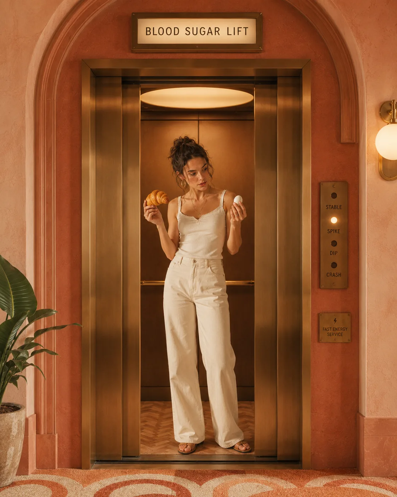
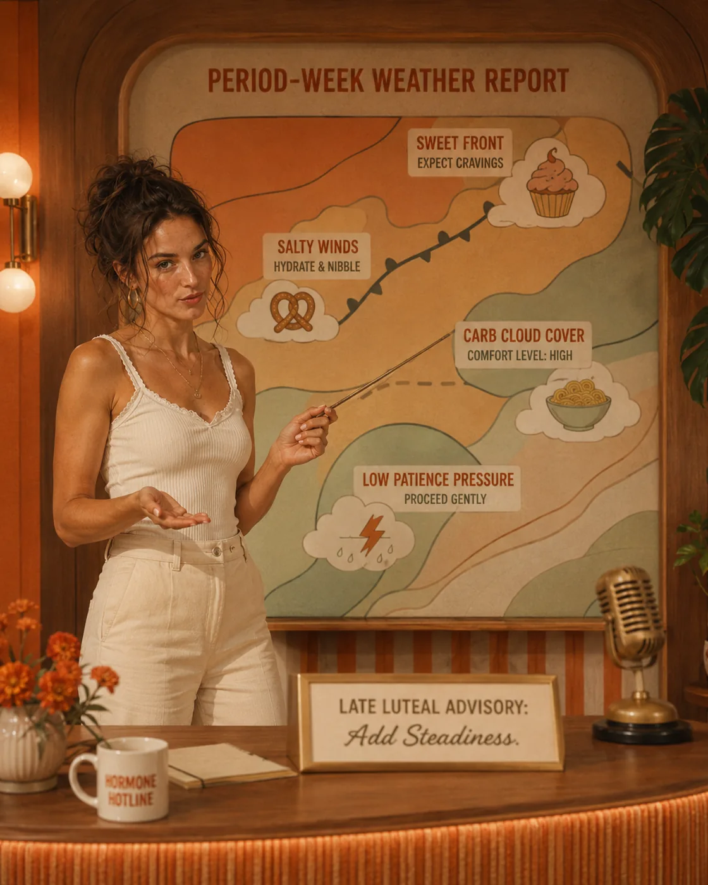
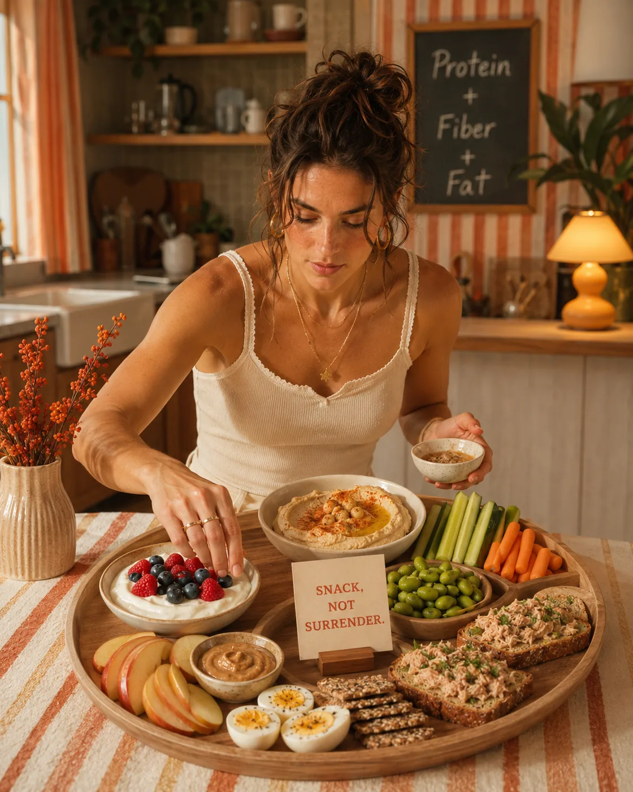
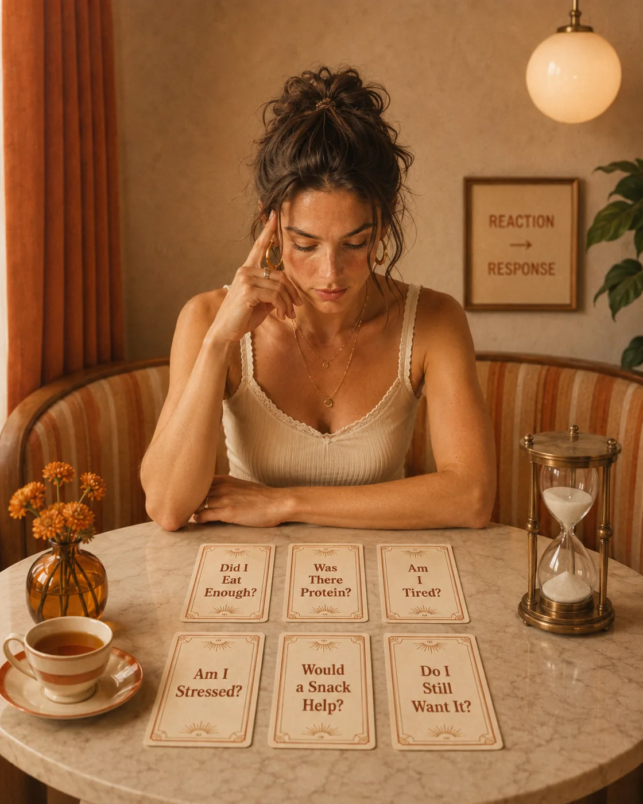
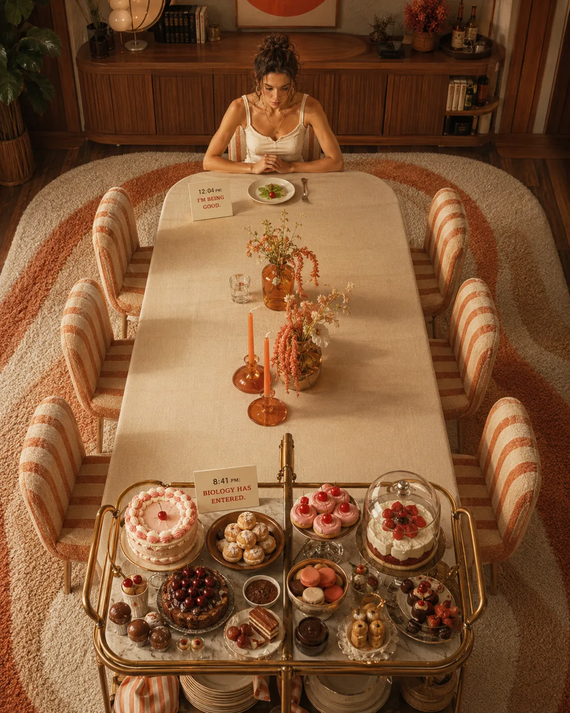

Cravings can feel very personal.

One minute you are fine. The next, you are looking for chocolate, bread, crisps, something sweet, something salty, something quick — and it does not feel like a gentle preference. It feels urgent.

For many women, cravings are followed by guilt.

Why do I have no discipline?

Why can I eat well all morning and then fall apart in the afternoon?

Why do I crave sugar when I’m stressed, tired, or overwhelmed?

But cravings are rarely just about willpower.

They are often a message from the body. Sometimes that message is about blood sugar. Sometimes it is about stress. Sometimes it is about under-eating, poor sleep, hormones, emotional load, or a nervous system that has been running on high alert for too long.

And often, it is a combination.

Understanding the connection between cravings, blood sugar, and stress can help you respond with more clarity and less shame.

Because the goal is not to control yourself harder.

The goal is to support your body better.

If you are new to this topic, start with [Blood Sugar Balance for Women: What It Means and Why It Matters](/journal/blood-sugar-balance-for-women). It gives the foundation for understanding how blood sugar affects energy, hunger, cravings, and mood.

Gentle note: This article is for educational purposes only and does not replace medical advice. If you have diabetes, insulin resistance, PCOS, reactive hypoglycemia, an eating disorder history, thyroid concerns, mental health concerns, or persistent intense cravings, please work with a qualified healthcare professional for personalized support.

## Why Cravings Are Not a Character Flaw

Cravings are not proof that you are weak.

They are influenced by biology, environment, habits, emotions, sleep, stress hormones, blood sugar patterns, and the foods available around you.

Stress can affect eating behavior, and Harvard Health explains that stress hormones and highly palatable foods — especially foods rich in sugar and fat — can push people toward overeating or comfort eating. (Harvard Health)

This matters because many women try to solve cravings with more restriction.

They skip breakfast.

They eat a tiny lunch.

They avoid carbs.

They drink more coffee.

They promise to be “better tomorrow.”

Then by late afternoon or evening, the cravings become stronger.

Not because they failed.

Because the body is trying to solve a real problem: low energy, stress, fatigue, emotional tension, or unstable fuel.

## The Blood Sugar and Cravings Connection

Blood sugar refers to the amount of glucose in your bloodstream. Glucose is a key energy source, especially for your brain and muscles.

After you eat carbohydrates, your body breaks them down into glucose. Insulin helps move glucose from your blood into your cells. This is normal and necessary.

The issue is when blood sugar rises and falls in a way that feels dramatic.

For some people, meals or snacks that are mostly refined carbohydrates — especially without enough protein, fiber, or fat — may lead to a quicker rise in blood sugar followed by a noticeable dip. That dip can leave you feeling tired, hungry, foggy, irritable, or craving fast energy.

The CDC notes that stress hormones can make blood sugar rise or fall unpredictably, and that stress can also affect how well people care for themselves day to day. (CDC)

This is where cravings can enter the picture.

When your energy drops, your body often asks for the fastest available fuel.

That usually means sugar or refined carbohydrates.

Not because you are doing something wrong.

Because your body is trying to get energy quickly.

For more on the post-meal side of this, read [Why You Feel Tired After Eating — and What May Help](/journal/why-you-feel-tired-after-eating-and-what-may-help).

## Why Stress Can Make Cravings Stronger

Stress changes the way the body prioritizes energy.

When your body perceives stress, it may release hormones such as cortisol and adrenaline. These hormones help mobilize energy so you can respond to a challenge. In modern life, the challenge may not be a physical threat — it may be deadlines, messages, emotional pressure, caregiving, money stress, poor sleep, or a constant feeling of being behind.

The body does not always know the difference.

Cleveland Clinic notes that stress hormones, including cortisol, can spike blood sugar, and that ongoing stress may contribute to insulin resistance over time. (Cleveland Clinic)

Harvard Health also explains that stress may influence overeating, especially when comfort foods are readily available. (Harvard Health)

This is why cravings often feel stronger during stressful seasons.

Your body is looking for relief.

Your brain is looking for reward.

Your nervous system is looking for comfort.

Your blood sugar may be less stable.

And your capacity to pause and choose calmly may be lower.

That is not a moral failure.

That is physiology meeting real life.

For the wider metabolic side of stress and blood sugar, read [Metabolic Health for Women Over 35: A Simple Guide](/journal/metabolic-health-for-women-over-35). If stress shows up as an afternoon dip, [Simple Ways to Reduce Afternoon Energy Crashes](/journal/simple-ways-to-reduce-afternoon-energy-crashes) is a useful next step.

## Why Sugar and Refined Carbs Feel So Appealing When You’re Stressed

When you are stressed, sweet and refined foods can feel soothing because they offer quick energy and reward.

They are easy.

They are accessible.

They require no preparation.

They offer a moment of comfort.

And honestly, sometimes that is exactly why they are appealing.

The problem is not having something sweet.

The problem is when sugar becomes the only reliable pause in your day.

If you are using food as your main way to regulate stress, your cravings may become less about hunger and more about relief.

This is why simply saying “stop eating sugar” is not very useful.

A better question is:

What is this craving trying to do for me?

Is it giving you energy?

Comfort?

A break?

Pleasure?

A way to delay something?

A way to calm down?

A way to keep going when you are exhausted?

Once you understand the job of the craving, you can respond more wisely.

## The Sleep, Blood Sugar, and Cravings Triangle

Poor sleep can make cravings harder to manage.

When you sleep badly, your body may become less efficient at managing blood sugar. Sleep Foundation notes that even partial sleep deprivation over one night can increase insulin resistance, which may affect blood sugar levels. (Sleep Foundation)

Sleep loss can also influence appetite, food choices, and energy. Sleep Foundation explains that lack of sleep may increase calorie intake and affect how the body responds to insulin. (Sleep Foundation)

This helps explain why the day after poor sleep often feels harder.

You may crave more sugar.

You may need more caffeine.

You may feel less motivated to cook.

You may feel hungrier.

You may feel more emotionally reactive.

You may have less patience with yourself.

In other words, cravings after poor sleep are not random.

They make sense.

If your cravings are worse after a bad night, the solution may not be stricter food rules. It may be more recovery, a steadier breakfast, hydration, and a more realistic plan for the day.

## The Afternoon Craving Pattern

Many women notice cravings between 3 and 6 p.m.

This window is not accidental.

By then, several things may be happening at once:

* breakfast was too light

* lunch was low in protein

* coffee has worn off

* stress has accumulated

* hydration is low

* the brain is tired

* blood sugar may be dipping

* dinner still feels far away

* emotional restraint is lower

This is why afternoon cravings often feel so intense.

Your body is not just asking for chocolate.

It may be asking for food, water, rest, movement, light, or relief from pressure.

For a deeper guide on this pattern, read [Simple Ways to Reduce Afternoon Energy Crashes](/journal/simple-ways-to-reduce-afternoon-energy-crashes). It connects beautifully with this article and helps readers build steadier habits across the day.

## Cravings Before Your Period

Many women notice stronger cravings before their period, especially for sweet, salty, or carbohydrate-rich foods.

This can be influenced by hormonal shifts, appetite changes, mood changes, sleep quality, and stress sensitivity across the cycle. Some women also feel more emotionally stretched in the late luteal phase — the days before menstruation — which can make cravings feel louder.

This does not mean you need to “fight” your body.

It may mean you need to support it differently.

Before your period, you may benefit from:

* slightly more nourishing carbohydrates

* enough protein at meals

* magnesium-rich foods

* warm meals

* more sleep

* gentler training

* fewer long gaps between meals

* planned satisfying snacks

* less pressure to eat perfectly

Your body may not need discipline here.

It may need steadiness.

## Under-Eating Can Make Cravings Worse

One of the most overlooked causes of cravings is simply not eating enough.

This can happen unintentionally.

You wake up busy.

You drink coffee.

You have a light breakfast.

You eat a “clean” lunch that is mostly vegetables.

You push through the afternoon.

Then evening arrives and your cravings feel enormous.

That is not lack of control.

That is biology.

If the body does not receive enough energy earlier in the day, it often asks for fast energy later. Sugar cravings may become stronger because the body is trying to correct an energy deficit quickly.

This is why eating enough is not indulgent.

It is stabilizing.

A supportive day often begins with a strong breakfast. If mornings are a challenge for you, read [How to Build a Blood-Sugar-Friendly Breakfast](/journal/how-to-build-a-blood-sugar-friendly-breakfast) and [High-Protein Breakfast Ideas for Steady Energy](/journal/high-protein-breakfast-ideas-for-steady-energy).

## Protein Helps Make Cravings Quieter

Protein is not magic, but it can be deeply helpful.

It supports satiety, muscle maintenance, and steadier appetite signals. For women in their 30s, 40s, and beyond, protein becomes especially important because muscle tissue plays a central role in metabolic health, strength, and aging.

If your meals are low in protein, cravings may feel stronger — especially later in the day.

This is not about eating only protein.

It is about giving your meals more staying power.

For more context, read [Why Protein Matters More as You Age](/journal/why-protein-matters-more-as-you-age) and [How Much Protein Do Women Over 35 Really Need?](/journal/how-much-protein-do-women-over-35-need).

Simple protein upgrades include:

* Greek yogurt at breakfast

* eggs with toast

* cottage cheese with fruit

* chicken or lentils in salad

* tofu or tempeh in bowls

* fish with potatoes and vegetables

* edamame as a snack

* beans added to soup

* protein-rich snacks between meals

Often, cravings do not disappear because you restricted more.

They soften because you nourished better.

## Fiber Helps Slow the Energy Rollercoaster

Fiber helps slow digestion and can support steadier energy after meals.

Meals that include fiber-rich carbohydrates — such as oats, beans, lentils, berries, vegetables, potatoes with skin, and whole grains — usually feel more sustaining than meals made mostly of refined carbohydrates.

The goal is not to eliminate carbohydrates.

It is to choose carbohydrates that give your body more to work with.

Examples:

* oats instead of sugary cereal

* berries instead of juice

* lentils instead of only white pasta

* seeded bread instead of white toast alone

* potatoes with eggs and vegetables

* beans added to a lunch bowl

Carbohydrates can absolutely belong in a blood-sugar-friendly way of eating.

They often just need better company: protein, fiber, fat, and enough total food.

## Stress Eating vs. Physical Hunger

Sometimes cravings come from physical hunger.

Sometimes they come from emotional hunger.

Often, they overlap.

Physical hunger may feel like:

* stomach emptiness

* low energy

* difficulty focusing

* irritability

* hunger building gradually

* feeling satisfied after a balanced meal

Stress cravings may feel like:

* sudden urgency

* craving one specific food

* wanting comfort or escape

* eating while distracted

* feeling emotionally tense

* not feeling satisfied even after eating

Neither is “bad.”

Both are information.

If it is physical hunger, eat.

If it is stress, you may still choose to eat — but it can help to add another form of support too.

Food can be part of comfort.

It just should not have to do the entire job alone.

## What to Do When a Craving Hits

When a craving feels urgent, try pausing for one minute before deciding what to do.

Not to deny yourself.

To understand what you need.

Ask:

1. Did I eat enough today?

If not, you may need real food, not another promise to be disciplined.

2. Did my last meal include protein?

If not, add protein now.

3. Am I tired?

If yes, sugar may be a quick-energy request.

4. Am I stressed or emotionally overloaded?

If yes, food may be a regulation tool.

5. Would a balanced snack help first?

Sometimes the craving softens after protein and fiber.

6. Do I still want the sweet food?

If yes, you can choose it more calmly — ideally without turning it into a guilt event.

This approach helps you move from reaction to response.

That is the real skill.

## Blood-Sugar-Friendly Snacks for Cravings

If your cravings often appear between meals, a planned snack may help.

For more ideas, read [High-Protein Snacks That Actually Keep You Full](/journal/high-protein-snacks-that-keep-you-full).

Try:

* Greek yogurt with berries and cinnamon

* apple with almond or peanut butter

* cottage cheese with fruit

* boiled eggs with seeded crackers

* hummus with vegetables

* edamame with sea salt

* chia pudding with Greek yogurt

* tuna or salmon on toast

* protein smoothie with berries and chia seeds

* dates with nut butter and a protein-rich side

Notice the structure: protein, fiber, and fat.

Not because you are trying to be perfect.

Because your body usually feels better when snacks have support.

## How to Reduce Stress-Related Cravings

You cannot always remove stress.

But you can change how often your body has to survive it without support.

1. Eat enough earlier in the day

Start with breakfast and lunch. If both are too light, cravings later are much more likely.

2. Add protein to every main meal

Protein helps meals last longer and can make cravings less urgent.

3. Stop using coffee as a meal replacement

Coffee can be enjoyable, but it cannot replace food. For some women, caffeine on an empty stomach can make anxiety, shakiness, or cravings worse.

4. Plan an afternoon snack

A planned snack is not failure. It can be a stabilizing tool.

5. Take a short walk after meals

Light movement after meals can support digestion, blood sugar regulation, and mental clarity.

6. Build tiny stress pauses into the day

Try two minutes of breathing, stepping outside, stretching, or making tea without your phone.

7. Prioritize sleep where possible

Poor sleep can make cravings louder and blood sugar regulation harder. (Sleep Foundation)

8. Make comfort more diverse

Food can be comforting. But it helps to have other forms of comfort too: warmth, music, rest, movement, connection, journaling, sunlight, or quiet.

You are not trying to become perfectly regulated.

You are trying to give your body more options.

## What Not to Do

When cravings feel intense, these strategies often backfire:

**Skipping meals**

This usually makes cravings stronger later.

**Cutting out all carbohydrates**

Some women feel worse when they remove too many carbs, especially during high-stress seasons, intense training, or before their period.

**Relying on willpower alone**

Willpower is weaker when you are tired, hungry, stressed, or under-slept.

**Keeping no satisfying foods around**

Overly rigid food environments can make cravings feel more rebellious and urgent.

**Turning every craving into a moral issue**

Food is not a personality test.

Cravings are not a failure.

They are a signal worth understanding.

## When Cravings May Need More Support

Cravings are common, but it may be worth getting professional support if they feel intense, distressing, or hard to manage.

Speak with a qualified healthcare professional, registered dietitian, or mental health professional if:

* cravings feel uncontrollable

* you often binge or feel out of control around food

* you feel guilt, shame, or anxiety after eating

* you regularly feel shaky, dizzy, sweaty, or weak

* cravings come with mood swings or severe fatigue

* you suspect insulin resistance, PCOS, diabetes, or thyroid issues

* you have a history of disordered eating

* food feels emotionally overwhelming

You do not need to figure everything out alone.

Support is not a last resort. It is part of care.

## Related Reading

- [Blood Sugar Balance for Women: What It Means and Why It Matters](/journal/blood-sugar-balance-for-women) — gives the foundation for steadier energy, hunger, mood, and cravings.
- [Simple Ways to Reduce Afternoon Energy Crashes](/journal/simple-ways-to-reduce-afternoon-energy-crashes) — helps with the afternoon pattern where fatigue and cravings often meet.
- [High-Protein Snacks That Actually Keep You Full](/journal/high-protein-snacks-that-keep-you-full) — offers practical snack ideas when cravings are partly a fuel problem.

## The Gentle Takeaway

Cravings are not always about sugar.

Sometimes they are about blood sugar.

Sometimes they are about stress.

Sometimes they are about sleep.

Sometimes they are about under-eating.

Sometimes they are about hormones.

Sometimes they are about needing comfort in a life that asks too much from you.

The answer is not to shame yourself into control.

The answer is to build a steadier foundation.

Eat enough.

Add protein.

Choose fiber-rich carbohydrates.

Hydrate.

Sleep where you can.

Move gently after meals.

Create small pauses in your day.

Let food be pleasurable without making it responsible for your entire emotional life.

Your cravings are not the enemy.

They are a conversation with your body.

And you can learn to listen without letting them run the whole day.

