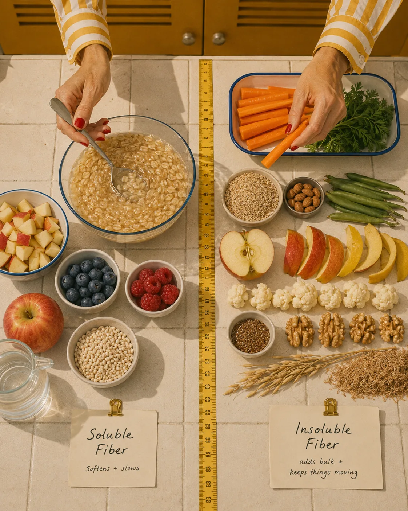
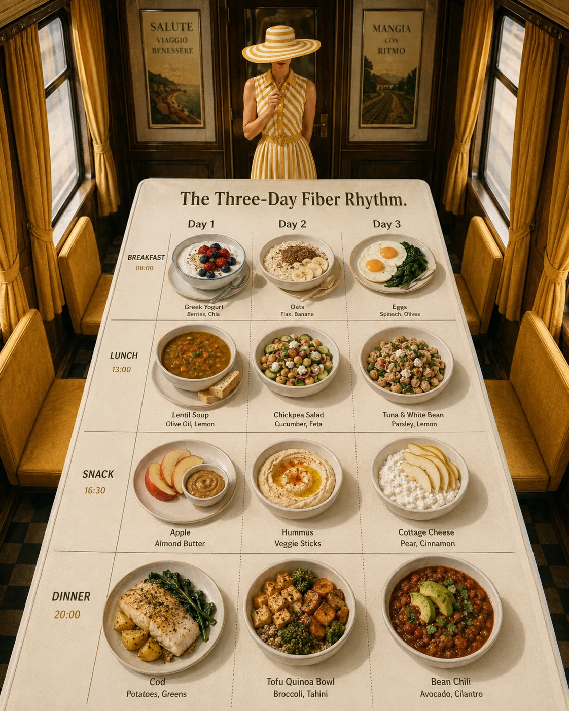

Fiber is not glamorous.

It does not usually get the same attention as protein, collagen, magnesium, or the latest wellness supplement. It is quiet. Familiar. Almost too simple to feel exciting.

And yet, fiber is one of the most important nutrients for women’s health.

It supports digestion, gut bacteria, blood sugar balance, cholesterol, fullness, metabolic health, and the way the body processes and eliminates certain compounds. It also sits beautifully at the center of anti-inflammatory and Mediterranean-style eating.

For women in their 30s, 40s, and beyond, fiber becomes especially valuable because this is often the stage of life when energy, digestion, hormones, cravings, cholesterol, body composition, and blood sugar can all start to feel a little more sensitive.

The good news is that fiber does not require a complicated plan.

It lives in ordinary foods: beans, lentils, oats, berries, apples, vegetables, chia seeds, flaxseed, whole grains, potatoes, nuts, and herbs.

Simple foods.

Powerful effect.

No drama required.

If you are following the anti-inflammatory and Mediterranean cluster, this article pairs closely with [Anti-Inflammatory Eating for Women: A Practical Beginner’s Guide](/journal/anti-inflammatory-eating-for-women/) and [Mediterranean Diet for Women Over 40: What to Eat and Why It Works](/journal/mediterranean-diet-for-women-over-40/).

## What Is Fiber?

Fiber is a type of carbohydrate found in plant foods that your body cannot fully digest.

Unlike starches and sugars, fiber mostly passes through the digestive system without being broken down into glucose. But that does not mean it is useless. In fact, fiber does some of its best work because it is not digested in the usual way.

Fiber helps add structure to food, supports bowel regularity, feeds beneficial gut bacteria, slows digestion, supports fullness, and can help with blood sugar and cholesterol.

Harvard’s Nutrition Source explains that fiber comes in two main types, soluble and insoluble, and both are beneficial for health. Soluble fiber can help lower glucose levels and blood cholesterol, while insoluble fiber helps food move through the digestive system. (The Nutrition Source)

Fiber is found only in plant foods, such as:

* vegetables

* fruits

* beans

* lentils

* chickpeas

* whole grains

* nuts

* seeds

* herbs

* some starchy plants like potatoes and sweet potatoes

Animal foods like meat, fish, eggs, and dairy do not contain fiber.

This is why a high-protein diet that is very low in plants may still leave digestion, blood sugar, and gut health under-supported.

Protein matters.

Fiber matters too.

## Why Fiber Matters for Women

Fiber supports several areas that are especially relevant for women’s wellbeing.

It can help with:

* bowel regularity

* gut microbiome support

* blood sugar stability

* fullness and appetite regulation

* cholesterol levels

* heart health

* metabolic health

* hormone-related detoxification pathways

* anti-inflammatory eating patterns

* steady energy

Mayo Clinic notes that fiber can help normalize bowel movements, support bowel health, lower cholesterol, help control blood sugar, and support healthy weight management. (Mayo Clinic)

For women, this matters because digestion is not separate from the rest of the body.

When digestion is sluggish, blood sugar is swinging, meals are low in plants, or fiber is very low, many women feel the difference. They may feel more bloated, snacky, tired, constipated, or less satisfied after meals.

Fiber is not a magic fix. But it is a foundation.

And foundations are where sustainable wellness begins.

## Soluble vs. Insoluble Fiber

You do not need to memorize fiber categories to eat well, but understanding the difference can be useful.

### Soluble Fiber

Soluble fiber dissolves in water and forms a gel-like substance in the digestive tract. This can slow digestion and help support blood sugar and cholesterol levels.

Foods rich in soluble fiber include:

* oats

* barley

* beans

* lentils

* apples

* citrus fruits

* berries

* chia seeds

* flaxseed

* psyllium

* carrots

* peas

Mayo Clinic notes that soluble fiber forms a gel-like material in the stomach, slows digestion, and can help lower cholesterol and blood sugar. (Mayo Clinic)

### Insoluble Fiber

Insoluble fiber does not dissolve in water. It helps add bulk to stool and supports movement through the digestive system.

Foods rich in insoluble fiber include:

* whole grains

* wheat bran

* vegetables

* nuts

* seeds

* fruit skins

* beans

* lentils

Most plant foods contain a mix of both types.

So instead of worrying about soluble versus insoluble fiber at every meal, focus on variety.

Beans one day.

Oats the next.

Berries often.

Vegetables daily.

Seeds sprinkled in.

Whole grains when they suit you.

That rhythm works beautifully.

## Fiber and Gut Health

Fiber is one of the main ways we feed the gut microbiome.

Your gut microbiome is the community of microorganisms living in your digestive tract. These microbes interact with digestion, immune function, metabolism, and the production of certain compounds.

Some fibers are fermented by gut bacteria, producing short-chain fatty acids, including butyrate, acetate, and propionate. The Linus Pauling Institute notes that fermentation of dietary fiber produces beneficial short-chain fatty acids, and that butyrate is the preferred energy source for colon cells. (Linus Pauling Institute)

This is one reason fiber is so important for gut health.

When your diet is low in fiber, your gut bacteria may receive less of the nourishment they need. When your diet includes a diverse range of plant foods, you give your gut a richer environment.

Helpful gut-supportive fiber foods include:

* lentils

* beans

* chickpeas

* oats

* berries

* apples

* onions

* garlic

* asparagus

* artichokes

* flaxseed

* chia seeds

* barley

* vegetables

* herbs

But here is the important part: more fiber is not always better immediately.

If your digestion is sensitive, or if you currently eat very little fiber, increasing too quickly may cause bloating, gas, or discomfort.

The body often needs time to adapt.

## Fiber and Hormones

Fiber does not “balance hormones” in a quick or magical way.

But it can support some of the systems that influence hormonal wellbeing.

One of the key ways fiber may matter is through digestion and elimination. The body processes hormones such as estrogen through the liver and digestive system. Regular bowel movements help the body eliminate waste products efficiently.

Fiber also supports blood sugar balance, gut health, and metabolic health — all of which can influence how women feel hormonally.

For women in perimenopause or menopause, this becomes especially relevant because hormonal shifts can affect body composition, cravings, cholesterol, sleep, and mood. A fiber-rich Mediterranean-style pattern can support the wider foundation: blood sugar, heart health, gut health, and meal satisfaction.

This does not mean fiber alone will fix PMS, perimenopause symptoms, estrogen concerns, or irregular cycles.

It means fiber is part of a supportive daily environment.

For a broader nutrition foundation, read [Healthy Fats for Hormones, Skin, and Energy](/journal/healthy-fats-for-hormones-skin-and-energy/) and [Metabolic Health for Women Over 35: A Simple Guide](/journal/metabolic-health-for-women-over-35/).

## Fiber and Blood Sugar Balance

Fiber is one of the most practical tools for blood sugar balance.

Soluble fiber can slow digestion, which may help reduce sharper rises in blood sugar after meals. Harvard’s Nutrition Source notes that soluble fiber can help lower glucose levels, and Mayo Clinic also notes that fiber can help control blood sugar. (The Nutrition Source)

This is why a bowl of plain refined cereal may leave you hungry quickly, while oats with Greek yogurt, berries, chia seeds, and walnuts may keep you steady for longer.

Fiber helps make carbohydrates more supportive.

Instead of fearing carbs, you can choose and build them better.

Examples:

* oats instead of a low-fiber cereal

* berries with yogurt instead of fruit juice alone

* lentils with rice instead of plain rice alone

* potatoes with skin, protein, and olive oil

* chickpeas in a salad

* beans in a bowl

* whole fruit instead of fruit juice

Fiber works especially well when combined with protein and healthy fats.

For more on this, read [Blood Sugar Balance for Women: What It Means and Why It Matters](/journal/blood-sugar-balance-for-women/) and [How to Build a Blood-Sugar-Friendly Breakfast](/journal/how-to-build-a-blood-sugar-friendly-breakfast/).

## Fiber and Cholesterol, Heart Health, and Metabolism

Fiber is also important for heart and metabolic health.

Soluble fiber can help lower LDL cholesterol, and high-fiber eating patterns are linked with heart-healthier diets overall. Mayo Clinic notes that high-fiber foods can help lower cholesterol and blood sugar, while Harvard Health reports that fiber-rich diets may support blood pressure, cholesterol, and weight management. (Mayo Clinic)

This matters for women, especially after 40, because cardiovascular and metabolic markers can shift with age, menopause transition, sleep changes, stress, and body composition.

The American Heart Association’s 2026 dietary guidance emphasizes vegetables, fruits, whole grains, healthy protein sources including beans, peas, lentils and nuts, fish and seafood, and minimizing processed meats, refined carbohydrates, and sugary drinks. (www.heart.org)

Notice how closely this overlaps with Mediterranean eating.

Vegetables.

Fruit.

Whole grains.

Legumes.

Nuts.

Fish.

Less ultra-processed food.

This is not a coincidence.

Fiber-rich foods are often the same foods that support anti-inflammatory eating, metabolic health, and long-term wellbeing.

## How Much Fiber Do Women Need?

Fiber needs vary based on age, energy intake, digestion, health conditions, and overall diet.

A common general recommendation is around 25 grams of fiber per day for women, though some women may benefit from more or less depending on tolerance and health needs. Mayo Clinic notes that the suggested amount of daily fiber depends on age and calorie intake. (Mayo Clinic)

But rather than obsessing over a number immediately, begin by looking at your current pattern.

Ask:

* Do I eat vegetables daily?

* Do I eat beans, lentils, or chickpeas weekly?

* Do I eat whole fruit, or mostly juice?

* Do I include oats, whole grains, potatoes, or other fiber-rich carbohydrates?

* Do I use nuts, seeds, chia, or flax?

* Are my meals mostly protein and refined starch, with little plant variety?

If fiber is currently low, increasing gradually is much better than jumping from 10 grams to 30 grams overnight.

Your gut will appreciate the manners.

## The Best High-Fiber Foods for Women

Here are the most useful fiber-rich foods to build into your week.

### 1. Beans, Lentils, and Chickpeas

Legumes are some of the best foods for fiber.

They also provide plant protein, minerals, slow-digesting carbohydrates, and excellent meal satisfaction.

Try:

* lentils

* chickpeas

* black beans

* white beans

* cannellini beans

* kidney beans

* split peas

* edamame

Easy ideas:

* lentil soup with herbs and olive oil

* chickpea salad with cucumber, tomatoes, parsley, and tahini

* white bean dip with vegetables

* black bean rice bowl with avocado

* lentils added to salads

* hummus with carrots and boiled eggs

* bean stew with greens

If legumes bloat you, start with small portions. Even 2–3 tablespoons added to a meal is a useful beginning.

### 2. Vegetables

Vegetables provide fiber, water, vitamins, minerals, and plant compounds.

Aim for variety across the week.

Good options include:

* leafy greens

* broccoli

* cauliflower

* carrots

* peppers

* tomatoes

* mushrooms

* zucchini

* eggplant

* cucumber

* cabbage

* asparagus

* onions

* garlic

* artichokes

* herbs

Simple ways to add more:

* spinach in eggs

* roasted vegetables at dinner

* cucumber and tomatoes with lunch

* frozen vegetables in soups

* shredded carrots in salads

* sautéed mushrooms with protein

* herbs on everything

You do not need to make a perfect salad.

Just add plants more often.

### 3. Berries and Whole Fruits

Whole fruit is an easy way to add fiber, hydration, and natural sweetness.

Good options include:

* raspberries

* blackberries

* blueberries

* strawberries

* apples

* pears

* oranges

* kiwi

* peaches

* plums

* cherries

* pomegranate

Keep the skin on fruits like apples and pears when possible, because the skin adds fiber.

Pair fruit with protein or fat for better satisfaction:

* berries with Greek yogurt

* apple with almond butter

* pear with cottage cheese

* orange with walnuts

* kiwi with yogurt

* pomegranate over salad

Fruit is not the enemy of blood sugar when it is eaten as whole fruit and paired well.

### 4. Oats and Whole Grains

Oats are a particularly useful fiber-rich food because they contain beta-glucan, a type of soluble fiber.

Other helpful grains include:

* barley

* quinoa

* farro

* buckwheat

* rye

* brown rice

* bulgur

* whole grain bread

* whole grain pasta

Simple ideas:

* oats with Greek yogurt, berries, and chia

* quinoa bowl with chicken or tofu

* barley soup with vegetables

* whole grain sourdough with eggs and avocado

* farro salad with herbs and beans

* whole grain pasta with tuna, tomatoes, and spinach

Carbohydrates become more supportive when they bring fiber with them.

### 5. Nuts and Seeds

Nuts and seeds provide fiber, healthy fats, minerals, and texture.

Useful options include:

* chia seeds

* flaxseed

* pumpkin seeds

* hemp seeds

* sesame seeds

* almonds

* walnuts

* pistachios

* hazelnuts

Easy ways to use them:

* chia seeds in yogurt

* ground flaxseed in oats

* pumpkin seeds on soup

* hemp seeds over salad

* walnuts with berries

* almond butter with apple

* tahini over roasted vegetables

Chia and flax are especially easy to add without changing the whole meal.

Start with a teaspoon or tablespoon, not half the jar.

### 6. Potatoes and Resistant Starch

Potatoes are often unfairly dismissed.

But potatoes, especially with the skin, can provide fiber, potassium, and satisfying carbohydrates.

There is also something called resistant starch, a type of carbohydrate that resists digestion and can behave more like fiber. Resistant starch can form when starchy foods such as potatoes, rice, or pasta are cooked and cooled.

This does not mean cold potatoes are magic. But it does mean that potatoes, rice, and whole-food starches can fit into a gut- and blood-sugar-supportive eating pattern when built well.

Try:

* potatoes with salmon and greens

* cooled potato salad with olive oil, herbs, and eggs

* rice bowl with beans and vegetables

* lentils with potatoes and herbs

* sweet potatoes with Greek yogurt and chili

The goal is not to fear starch.

It is to combine it with protein, fiber, fat, and color.

### 7. Fermented and Prebiotic Foods

Fermented foods do not always contain much fiber, but they can support gut health in other ways.

Prebiotic foods contain fibers and compounds that feed beneficial gut bacteria.

Prebiotic-rich foods include:

* onions

* garlic

* leeks

* asparagus

* artichokes

* bananas, especially slightly underripe

* oats

* beans

* lentils

* apples

* flaxseed

Fermented foods include:

* yogurt with live cultures

* kefir

* sauerkraut

* kimchi

* miso

* tempeh

* fermented pickles

Not everyone tolerates every prebiotic or fermented food well. If your digestion is sensitive, introduce them slowly.

Gut health is not a contest.

## How to Increase Fiber Without Bloating

This matters.

Many women hear “eat more fiber” and suddenly add huge salads, beans, chia pudding, bran cereal, and raw vegetables all in the same day.

Then they feel bloated, uncomfortable, and decide fiber does not work for them.

Often, the problem is not fiber itself. It is the speed.

Try this instead.

### 1. Increase Gradually

Add one fiber-rich food at a time.

For example:

* Week 1: add berries to breakfast

* Week 2: add lentils to lunch twice

* Week 3: add chia or flax to yogurt

* Week 4: add an extra vegetable at dinner

Slow is not less effective. Slow is more sustainable.

### 2. Drink Enough Water

Fiber works best with fluids. If you increase fiber but not water, constipation may feel worse.

Add water throughout the day, herbal tea, soups, mineral water, or water-rich foods like fruits and vegetables.

### 3. Spread Fiber Across the Day

Do not try to eat all your fiber at dinner.

Include a little at breakfast, lunch, snacks, and dinner.

### 4. Cook Vegetables When Needed

Raw vegetables can be harder for some people to digest.

Cooked vegetables, soups, stews, and roasted vegetables may feel gentler.

### 5. Start Small With Legumes

If beans are difficult, begin with:

* hummus

* lentil soup

* canned beans rinsed well

* small portions

* edamame

* split peas

You can build tolerance over time.

### 6. Notice Personal Tolerance

Some people with IBS, inflammatory bowel disease, endometriosis-related digestive symptoms, or other gut conditions may need more individualized support.

Fiber is beneficial, but the type and amount matter.

## How to Build a High-Fiber Plate

Use this simple formula:

Protein + fiber-rich carbohydrate + colorful plants + healthy fat

Examples:

* eggs + sourdough + tomatoes + avocado

* Greek yogurt + berries + oats + chia seeds

* salmon + potatoes + broccoli + olive oil

* lentils + roasted vegetables + tahini + herbs

* chicken + quinoa + greens + pumpkin seeds

* tofu + rice + vegetables + sesame

This structure supports gut health, blood sugar, fullness, and energy.

It also fits beautifully with Mediterranean eating.

For more on plate-building, read [Mediterranean Diet for Women Over 40: What to Eat and Why It Works](/journal/mediterranean-diet-for-women-over-40/) and [How to Build a Blood-Sugar-Friendly Breakfast](/journal/how-to-build-a-blood-sugar-friendly-breakfast/).

## High-Fiber Breakfast Ideas

Breakfast is a beautiful place to add fiber because it can support blood sugar and fullness early in the day.

Try:

* oats with Greek yogurt, berries, chia seeds, and walnuts

* Greek yogurt with raspberries, ground flaxseed, and almonds

* eggs with spinach, tomatoes, avocado, and whole grain toast

* chia pudding with berries and kefir or yogurt

* cottage cheese with pear, cinnamon, and pistachios

* tofu scramble with vegetables and potatoes

* whole grain sourdough with avocado, eggs, and herbs

If you often feel snacky soon after breakfast, check whether your meal includes both protein and fiber.

For more ideas, read [High-Protein Breakfast Ideas for Steady Energy](/journal/high-protein-breakfast-ideas-for-steady-energy/).

## High-Fiber Lunch and Dinner Ideas

Lunch and dinner are where fiber can become easy.

Try:

* lentil soup with olive oil and herbs

* salmon with potatoes, greens, and broccoli

* chickpea salad with cucumber, tomatoes, parsley, tahini, and boiled eggs

* chicken quinoa bowl with roasted vegetables and pumpkin seeds

* tofu stir-fry with rice and vegetables

* tuna and white bean salad with greens and olive oil

* whole grain pasta with tomatoes, spinach, garlic, and sardines or tofu

* bean chili with avocado and herbs

* roasted vegetable bowl with hummus and chicken or tempeh

* egg frittata with vegetables and a side salad

The goal is not to make every meal high-fiber at once.

The goal is to make fiber normal.

## High-Fiber Snack Ideas

A good snack should help you feel steady, not hungrier.

Try:

* apple with almond butter

* Greek yogurt with berries and chia

* hummus with carrots and cucumber

* cottage cheese with pear

* roasted chickpeas

* edamame

* chia pudding

* orange with walnuts

* whole grain crackers with tuna

* avocado on rye toast

* berries with kefir

* dates with walnuts, if they suit your blood sugar and appetite

For more snack inspiration, read [High-Protein Snacks That Actually Keep You Full](/journal/high-protein-snacks-that-keep-you-full/).

## A Simple 3-Day High-Fiber Meal Rhythm

This is not a strict meal plan. It is a simple example of how fiber can fit into normal eating.

Day 1

Breakfast: Greek yogurt with berries, chia seeds, walnuts, and cinnamon

Lunch: Lentil soup with herbs and olive oil

Snack: Apple with almond butter

Dinner: Salmon with potatoes, broccoli, greens, and lemon

Day 2

Breakfast: Oats with Greek yogurt, flaxseed, blueberries, and almonds

Lunch: Chickpea salad with cucumber, tomatoes, parsley, tahini, and boiled eggs

Snack: Hummus with vegetables

Dinner: Chicken or tofu bowl with quinoa, roasted vegetables, olive oil, and herbs

Day 3

Breakfast: Eggs with spinach, tomatoes, avocado, and whole grain toast

Lunch: Tuna and white bean salad with greens, olive oil, lemon, and herbs

Snack: Cottage cheese with pear and pistachios

Dinner: Bean chili with avocado and a side salad

Notice the rhythm:

Plants.

Protein.

Fiber-rich carbohydrates.

Healthy fats.

Flavor.

That is the foundation.

## Common Mistakes to Avoid

### 1. Increasing Fiber Too Quickly

This is the most common mistake. Add fiber slowly so your gut can adjust.

### 2. Forgetting Protein

Fiber is wonderful, but a high-fiber meal still needs protein to support muscle, fullness, and metabolic health.

### 3. Eating Only Raw Vegetables

Raw salads are not the only way to eat fiber. Soups, stews, roasted vegetables, oats, lentils, and cooked greens often feel gentler.

### 4. Drinking Too Little Water

Fiber needs fluid. If you increase fiber and feel constipated, hydration may need attention.

### 5. Depending Only on Supplements

Psyllium or other fiber supplements may be helpful for some people, but whole foods bring more nutrients, flavor, and variety.

### 6. Thinking More Is Always Better

Very high fiber intake can be uncomfortable for some women, especially with digestive conditions. The best amount is the one your body tolerates well.

### 7. Ignoring Symptoms

If fiber causes severe bloating, pain, diarrhea, constipation, or worsening symptoms, get personalized support. Your body may need a different approach.

## How to Start This Week

Start with three simple shifts.

### 1. Add Berries or Fruit to Breakfast

Try berries with Greek yogurt, apple with oats, or pear with cottage cheese.

### 2. Add Legumes Twice This Week

Use lentils, chickpeas, beans, or hummus.

### 3. Add One Tablespoon of Seeds

Try chia, ground flaxseed, hemp seeds, or pumpkin seeds in yogurt, oats, salads, or bowls.

That is enough.

Small additions become a pattern.

A pattern becomes a lifestyle.

A lifestyle supports the body quietly, every day.

## Related Reading

- [Anti-Inflammatory Eating for Women: A Practical Beginner’s Guide](/journal/anti-inflammatory-eating-for-women) — shows how fiber-rich plants fit into a broader anti-inflammatory pattern.
- [Blood Sugar Balance for Women: What It Means and Why It Matters](/journal/blood-sugar-balance-for-women) — explains why fiber can help meals feel steadier.
- [A Simple Balanced Plate Method for Women Who Feel Overwhelmed by Nutrition](/journal/simple-balanced-plate-method-for-women) — makes it easier to add fiber without overhauling every meal.

## Final Thoughts

Fiber may not be glamorous, but it is one of the most powerful foundations of women’s health.

It supports gut health, blood sugar balance, cholesterol, fullness, metabolic health, and the daily rhythm of digestion. It also connects beautifully with anti-inflammatory and Mediterranean eating.

For women over 35 and 40, fiber-rich foods can help create meals that feel steadier, more satisfying, and more supportive of long-term health.

The goal is not to become perfect.

It is to make plants more present.

Beans in the soup.

Berries in the yogurt.

Seeds in the oats.

Greens with dinner.

Lentils on the table.

Olive oil, herbs, and color.

Simple food.

Deep support.

That is where the magic of fiber really lives.

Gentle note: This article is for educational purposes only and does not replace medical advice. If you have IBS, inflammatory bowel disease, endometriosis-related digestive symptoms, diabetes, kidney disease, a history of disordered eating, unexplained digestive changes, persistent constipation, diarrhea, pain, or blood sugar concerns, speak with a qualified healthcare professional or registered dietitian for personalized guidance.
