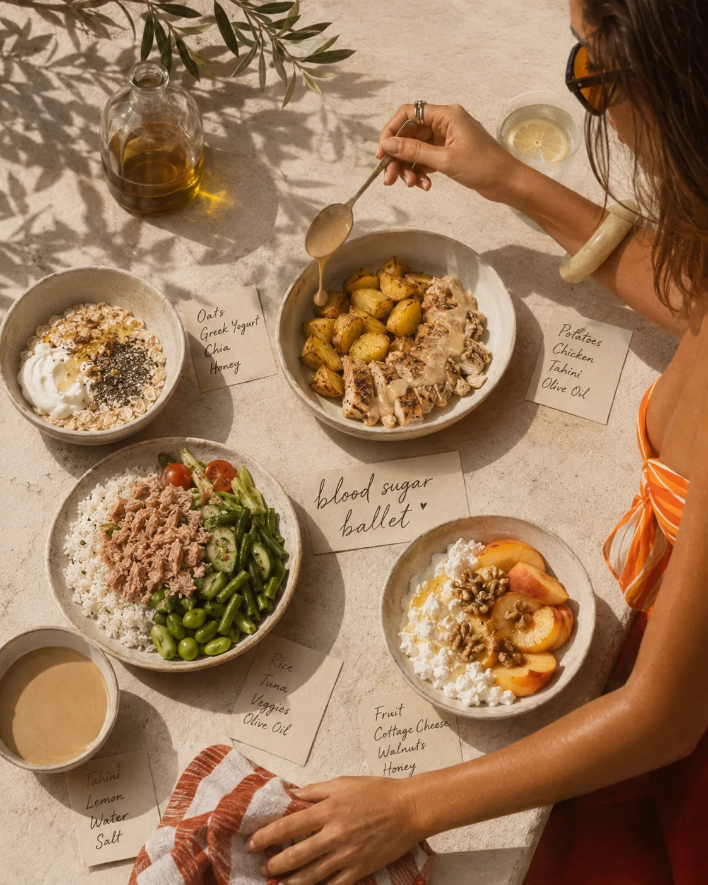
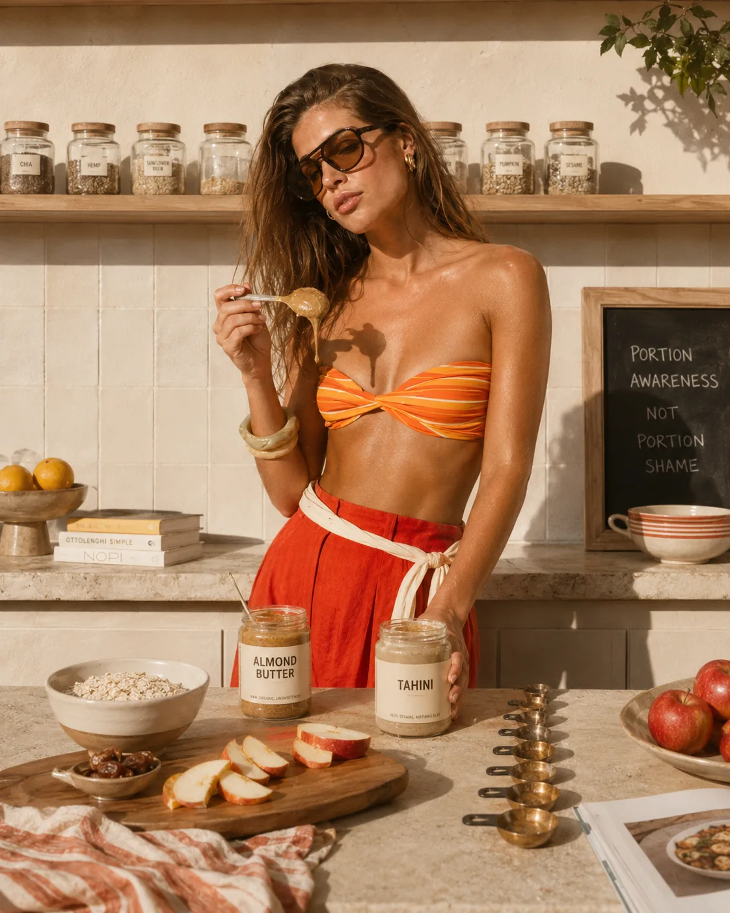
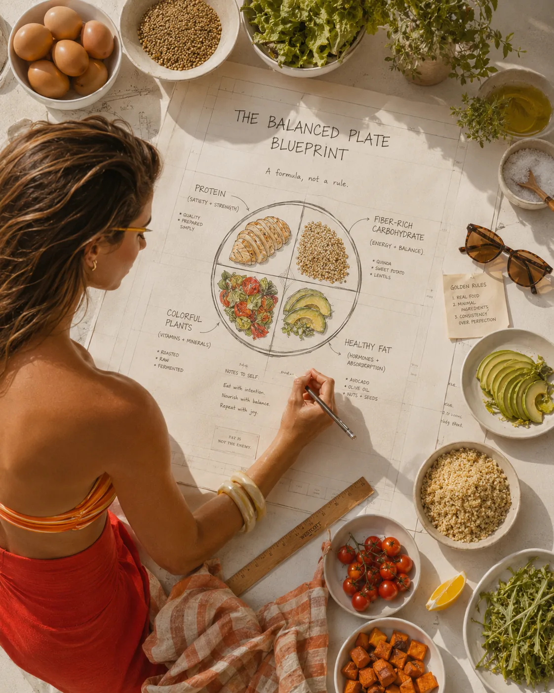

For years, many women were taught to fear fat.
Choose the low-fat yogurt.
Skip the egg yolk.
Avoid olive oil.
Order the dressing on the side.
Eat the dry salad and call it discipline.
And for many women, that message left a quiet imprint: fat became something suspicious. Something to minimize. Something that made food feel “too much.”
But your body needs fat.
Not endless amounts. Not any kind of fat without context. But enough quality fats to support energy, hormones, skin, brain health, satisfaction, and long-term wellbeing.
Healthy fats are especially important for women because they help meals feel complete. They support the absorption of fat-soluble vitamins. They are part of cell membranes. They influence the texture and resilience of skin. And they make food feel satisfying enough to actually sustain.
This does not mean every meal needs to be covered in oil or avocado. It simply means fat deserves a calmer place at the table.
Not feared.
Not worshipped.
Just understood.
If you are following the anti-inflammatory and Mediterranean eating cluster, this article pairs beautifully with [Anti-Inflammatory Eating for Women: A Practical Beginner’s Guide](/journal/anti-inflammatory-eating-for-women) and [The Best Foods to Support a Healthy Metabolism](/journal/the-best-foods-to-support-a-healthy-metabolism).

## First: Fat Is Not the Enemy
Dietary fat is essential.
Your body uses fat for energy, vitamin absorption, cell structure, nerve function, hormone production, inflammation regulation, and many other processes. Harvard Health explains that fat helps the body absorb certain vitamins and minerals, supports cell membranes, and plays a role in blood clotting, muscle movement, and inflammation. (Harvard Health)
The confusion comes from the fact that not all fats have the same effect on health.
Some fats are more supportive.
Some are better limited.
Some depend on the overall pattern of your diet.
In general, most women benefit from emphasizing unsaturated fats, especially from Mediterranean-style foods such as extra virgin olive oil, nuts, seeds, avocado, olives, and fatty fish.
The American Heart Association recommends choosing foods rich in monounsaturated and polyunsaturated fats in place of foods high in saturated and trans fats. (www.heart.org)
So the goal is not “eat no fat.”
The goal is to choose fats that support your body well — and use them in a balanced way.

## What Are Healthy Fats?
Healthy fats usually refer to unsaturated fats.
These include:
* Monounsaturated fats, found in olive oil, avocado, almonds, hazelnuts, and olives
* Polyunsaturated fats, including omega-3 and omega-6 fats, found in fatty fish, walnuts, chia seeds, flaxseed, hemp seeds, and some plant oils
Mayo Clinic explains that unsaturated fats include monounsaturated and polyunsaturated fats, and that omega-3 and omega-6 fatty acids are types of polyunsaturated fats. (Mayo Clinic)
These fats are often associated with heart-healthier eating patterns, especially when they replace less supportive fats rather than simply being added on top of an already high-calorie, low-nutrient diet.
This is a subtle but important point.
Healthy fats are still energy-dense. A little can go a long way.
But when used thoughtfully, they make meals more satisfying, more nourishing, and more enjoyable.

## Why Women Need Fat in Their Diet
Women often focus on protein and carbohydrates when thinking about nutrition, but fat plays a quiet and important role.
Fat helps support:
* hormone production
* cell structure
* skin barrier function
* vitamin absorption
* brain and nervous system health
* satiety and meal satisfaction
* steady energy
* anti-inflammatory eating patterns
* heart health
* enjoyment and flavor
Fat also helps absorb fat-soluble vitamins: vitamins A, D, E, and K.
So if you are eating a big salad with no fat at all, you may not absorb some nutrients as well as you would if you included olive oil, avocado, nuts, seeds, eggs, or another fat source.
This is one reason ultra-low-fat eating can feel unsatisfying and incomplete for many women.
Your body was not designed to live on dry meals forever.

## Healthy Fats and Hormones
Hormones are chemical messengers, and they are deeply influenced by overall nourishment, energy availability, sleep, stress, movement, and health status.
Dietary fat is part of this picture because fats are involved in cell structure and hormone production.
This does not mean eating avocado will “balance your hormones” overnight. That kind of claim is too simplistic.
But chronically eating too little fat — especially while also under-eating calories, over-exercising, or living under high stress — may leave the body under-supported.
For women, this matters because hormonal health is sensitive to overall energy availability. If the body does not feel adequately nourished, it may prioritize survival over optimal reproductive or metabolic function.
Healthy fats can support hormonal wellbeing as part of a larger foundation that includes:
* enough total food
* enough protein
* fiber-rich carbohydrates
* strength training
* blood sugar balance
* sleep
* stress regulation
* recovery
* medical care when needed
This is why fat should not be isolated as a magic hormone food. Instead, think of it as one part of a supportive plate.
For more on this broader foundation, read [Why Eating Less Is Not Always Better for Your Metabolism](/journal/why-eating-less-is-not-always-better-for-your-metabolism) and [Metabolic Health for Women Over 35: A Simple Guide](/journal/metabolic-health-for-women-over-35).

## Healthy Fats and Skin
Skin is not only shaped by what you put on it. It is also influenced by nutrition, hydration, sleep, hormones, stress, genetics, sun exposure, and overall health.
Fats are part of skin structure and barrier function. The Linus Pauling Institute notes that essential fatty acids play an important role in skin barrier function, and that deficiency in essential fatty acids can affect skin health. (Linus Pauling Institute)
This does not mean eating more fat is a guaranteed solution for dry skin, acne, or aging. Skin is more complex than that.
But healthy fats may support the skin by contributing to:
* barrier function
* moisture retention
* cell membrane structure
* a healthier inflammatory environment
* absorption of fat-soluble nutrients
* overall nourishment
Some of the most skin-supportive fat sources include:
* fatty fish
* extra virgin olive oil
* walnuts
* chia seeds
* flaxseed
* avocado
* eggs
* nuts and seeds
Also, do not underestimate the basics: hydration, adequate protein, sleep, sun protection, and enough total food.
Glowing skin rarely comes from one ingredient.
It usually comes from a better-supported body.

## Healthy Fats and Energy
Fat is a concentrated source of energy.
This can be helpful, especially for women who feel hungry soon after meals or who find low-fat meals unsatisfying.
A meal with protein, fiber-rich carbohydrates, and a small amount of healthy fat usually feels more stable than a meal that is very low in fat and protein.
For example:
* toast alone may leave you hungry quickly
* toast with eggs and avocado may hold you longer
* fruit alone may feel light
* fruit with Greek yogurt and walnuts may feel more satisfying
* a salad with only vegetables may not be enough
* a salad with salmon, lentils, olive oil, and seeds becomes a meal
Healthy fats do not give the same quick energy as carbohydrates, but they help slow digestion and improve satisfaction.
That can support steadier energy across the day.
For more on meal structure, read [Blood Sugar Balance for Women: What It Means and Why It Matters](/journal/blood-sugar-balance-for-women) and [How to Build a Blood-Sugar-Friendly Breakfast](/journal/how-to-build-a-blood-sugar-friendly-breakfast).

## Healthy Fats and Blood Sugar Balance
Fat can help slow digestion, which may reduce how quickly blood sugar rises after a meal when fat is included as part of a balanced plate.
This is one reason pairing carbohydrates with protein, fiber, and healthy fats often works better than eating carbohydrates alone.
For example:
* oats with Greek yogurt, chia, and almond butter
* sourdough with eggs and avocado
* rice with salmon, vegetables, and olive oil
* fruit with cottage cheese and walnuts
* potatoes with chicken, salad, and tahini dressing
This does not mean every carbohydrate needs to be heavily “buffered,” or that fat should be added excessively.
It simply means meals often feel better when they are more complete.
If you often experience post-meal fatigue or afternoon crashes, read [Why You Feel Tired After Eating — and What May Help](/journal/why-you-feel-tired-after-eating-and-what-may-help) and [Simple Ways to Reduce Afternoon Energy Crashes](/journal/simple-ways-to-reduce-afternoon-energy-crashes).

## The Best Healthy Fat Foods for Women
Let’s make this practical.
Here are some of the best healthy fat foods to include regularly.

### 1. Extra Virgin Olive Oil
Extra virgin olive oil is one of the signature fats of the Mediterranean eating pattern.
It is rich in monounsaturated fat and contains polyphenols. It also makes simple food feel beautiful — which matters more than people admit.
Use it for:
* salads
* roasted vegetables
* cooked greens
* fish
* eggs
* lentils
* beans
* soups
* dips
* grain bowls
Simple ideas:
* olive oil, lemon, and herbs over salad
* olive oil over roasted vegetables
* tomato, cucumber, olive oil, and sea salt
* lentils with olive oil, parsley, and lemon
* eggs with greens and olive oil
This is one of the easiest upgrades for anti-inflammatory, Mediterranean-style eating.

### 2. Avocado
Avocado provides monounsaturated fat, fiber, potassium, and a creamy texture that makes meals more satisfying.
Use it with:
* eggs
* toast
* salads
* grain bowls
* tacos
* smoothies
* chicken or fish
* beans and lentils
Simple ideas:
* eggs with avocado and tomatoes
* chicken bowl with rice, greens, and avocado
* chickpea salad with avocado and herbs
* avocado on sourdough with smoked salmon
Avocado is nourishing, but it is not magic. Think of it as one lovely fat option — not a requirement.

### 3. Fatty Fish
Fatty fish provides omega-3 fatty acids, especially EPA and DHA.
The NIH Office of Dietary Supplements explains that omega-3s are important components of cell membranes and are involved in several body systems, including the cardiovascular, immune, endocrine, and pulmonary systems. (Office of Dietary Supplements)
Good options include:
* salmon
* sardines
* mackerel
* trout
* herring
* anchovies
* tuna, in moderation
Easy ideas:
* salmon with potatoes and greens
* sardines on sourdough with tomato and herbs
* mackerel salad with cucumber and lemon
* trout with roasted vegetables
* tuna and white bean salad
If you do not eat fish, you can include plant omega-3 sources like chia seeds, flaxseed, hemp seeds, and walnuts. These contain ALA, a plant form of omega-3, though it is not the same as EPA and DHA from fish.
Supplements can be useful for some people, but they are not automatically necessary for everyone. Speak with a healthcare professional if you are pregnant, breastfeeding, taking blood-thinning medication, managing high triglycerides, or considering high-dose omega-3 supplements.

### 4. Nuts
Nuts provide healthy fats, minerals, fiber, and some protein.
Good options include:
* walnuts
* almonds
* pistachios
* hazelnuts
* cashews
* Brazil nuts
* pecans
Use them in:
* yogurt bowls
* oats
* salads
* trail mixes
* snacks with fruit
* roasted vegetable dishes
* homemade granola
Simple ideas:
* Greek yogurt with berries and walnuts
* apple with almond butter
* salad with pistachios
* oats with hazelnuts and cinnamon
* orange slices with walnuts
Portion matters because nuts are energy-dense. A small handful can be enough.

### 5. Seeds
Seeds are small but useful.
They provide fats, fiber, minerals, and texture.
Good options include:
* chia seeds
* flaxseed
* hemp seeds
* pumpkin seeds
* sesame seeds
* sunflower seeds
Simple ideas:
* chia seeds in yogurt
* ground flaxseed in oats
* hemp seeds over salads
* pumpkin seeds on soup
* sesame seeds on rice bowls
* tahini dressing over vegetables
Chia and flax are especially useful if you want plant-based omega-3 sources.
Ground flaxseed is often easier for the body to use than whole flaxseed.

### 6. Eggs
Eggs provide fat, protein, choline, and several micronutrients.
The yolk contains much of the fat and many nutrients, which is one reason removing it automatically is not always necessary.
Eggs can be a helpful food for women who want quick, protein-rich, satisfying meals.
Ideas:
* eggs with spinach and tomatoes
* boiled eggs with fruit
* omelet with mushrooms and herbs
* eggs with avocado and sourdough
* frittata with vegetables
* eggs over lentils or greens
If you have specific cholesterol concerns or have been advised to limit eggs, follow your healthcare provider’s guidance.

### 7. Olives
Olives are another Mediterranean staple.
They add flavor, saltiness, and satisfaction to meals. They pair especially well with vegetables, fish, eggs, beans, and grain bowls.
Use them in:
* Greek-style salads
* tuna and white bean salad
* roasted vegetable bowls
* omelets
* tapenade
* chicken or fish dishes
* lentil salads
A few olives can make a meal feel more complete and pleasurable.

### 8. Tahini and Nut Butters
Tahini, almond butter, peanut butter, cashew butter, and other nut or seed butters can be useful when used intentionally.
They add richness, flavor, and satiety.
Ideas:
* tahini lemon dressing over roasted vegetables
* almond butter with apple
* peanut butter in oats
* tahini over lentil bowls
* cashew butter in smoothies
* sesame tahini sauce with tofu
Choose versions with simple ingredients when possible.
Nut butters are easy to overdo, so spoon them rather than eating from the jar if portions matter for your goals.

### 9. Full-Fat or Moderate-Fat Dairy, If Tolerated
Dairy can be a nuanced topic.
Some women tolerate it beautifully. Others do not. There is no need to force it or fear it automatically.
If tolerated, options like Greek yogurt, kefir, cottage cheese, and some cheeses can provide protein, calcium, and satisfaction.
Depending on your goals and preferences, you may choose:
* 0% Greek yogurt with nuts or seeds added
* 2% Greek yogurt for more creaminess
* cottage cheese with fruit
* kefir with berries
* small amounts of cheese in Mediterranean-style meals
The key is the whole pattern.
A little feta over a chickpea salad is very different from building most meals around highly processed, high-saturated-fat foods.

## Fats to Limit
Some fats are better limited, especially when they become frequent staples.
The American Heart Association recommends replacing foods high in saturated and trans fats with foods rich in monounsaturated and polyunsaturated fats. (www.heart.org)
Try to limit:
* industrial trans fats
* frequent deep-fried foods
* highly processed snack foods
* processed meats
* large amounts of butter, cream, and high-fat processed foods
* pastries and packaged baked goods as daily staples
This does not mean butter or dessert can never exist in your life.
It means your everyday fat sources matter.
A Mediterranean-style pattern usually emphasizes olive oil, nuts, seeds, fish, avocado, and olives more often than butter, fried foods, and processed meats.
Again: pattern, not perfection.

## How Much Healthy Fat Do You Need?
There is no one perfect amount of fat for every woman.
Your needs depend on:
* total calorie intake
* activity level
* health status
* hormones
* digestion
* goals
* food preferences
* training routine
* medical conditions
A practical approach is to include a small to moderate amount of healthy fat at most meals, especially when it helps the meal feel satisfying.
Examples of a reasonable portion:
* 1 tablespoon olive oil
* ¼ to ½ avocado
* a small handful of nuts
* 1–2 tablespoons seeds
* 1–2 tablespoons tahini or nut butter
* a serving of fatty fish
* 1–2 eggs
You do not need to count every gram unless you are working toward a specific goal and find tracking helpful.
For most women, a plate-based approach is enough.

## How to Build a Balanced Plate With Healthy Fats
Healthy fats work best when they are part of a complete meal.
Use this formula:
**Protein + fiber-rich carbohydrate + colorful plants + healthy fat**
Examples:
* eggs + sourdough + tomatoes + avocado
* salmon + potatoes + greens + olive oil
* Greek yogurt + berries + oats + walnuts
* lentils + roasted vegetables + herbs + tahini
* chicken + quinoa + salad + olive oil dressing
* tofu + rice + vegetables + sesame seeds
This structure supports fullness, energy, blood sugar, and nourishment.
For body composition goals, read [Body Recomposition for Women: Nutrition Basics](/journal/body-recomposition-for-women-nutrition-basics). For metabolic health, read Healthy Fats for Hormones, Skin, and Energy alongside [Metabolic Health for Women Over 35: A Simple Guide](/journal/metabolic-health-for-women-over-35).

## Healthy Fat Meal Ideas
### Breakfast Ideas
* Greek yogurt with berries, chia seeds, and walnuts
* eggs with avocado, tomatoes, and sourdough
* oats with ground flaxseed and almond butter
* smoked salmon with rye bread, cucumber, lemon, and dill
* cottage cheese with pear, cinnamon, and pistachios
* tofu scramble with olive oil, spinach, and potatoes
### Lunch Ideas
* salmon salad with greens, olive oil, avocado, and herbs
* chickpea bowl with tahini, cucumber, tomatoes, and parsley
* tuna and white bean salad with olive oil and lemon
* chicken quinoa bowl with avocado and roasted vegetables
* lentil soup with olive oil and Greek yogurt on the side
* eggs with roasted vegetables and tahini dressing
### Dinner Ideas
* sardines on sourdough with tomatoes and arugula
* trout with potatoes, greens, and olive oil
* tofu with rice, vegetables, and sesame
* turkey or bean chili with avocado
* whole grain pasta with olive oil, garlic, tuna, and spinach
* lentils with roasted eggplant, herbs, and tahini
### Snack Ideas
* apple with almond butter
* Greek yogurt with chia seeds
* walnuts with berries
* boiled eggs with tomatoes
* hummus with vegetables
* cottage cheese with pistachios
* dark chocolate with almonds, if you enjoy it
Simple food. Thoughtfully built.
That is the whole idea.

## Common Mistakes to Avoid
### 1. Going Too Low-Fat
Very low-fat meals may leave you unsatisfied and more likely to graze later.
If your meals feel “healthy” but never satisfying, fat may be missing.
### 2. Adding Fat Without Enough Protein
Avocado toast is lovely, but it may not hold you long if there is no protein. Add eggs, smoked salmon, Greek yogurt on the side, tofu, or another protein source.
### 3. Overdoing Nuts and Nut Butters
Nuts and nut butters are nourishing, but easy to eat in large amounts. Use them intentionally.
### 4. Thinking Healthy Fat Cancels Out Everything Else
Olive oil is wonderful, but a meal still needs protein, fiber, and enough micronutrients.
### 5. Fearing All Saturated Fat
You do not need to panic about small amounts of saturated fat within an overall healthy pattern. The bigger goal is to emphasize unsaturated fats most often.
### 6. Depending on Supplements Before Food
Omega-3 supplements may be useful for some women, but food should come first when possible. Supplements are not a replacement for a supportive eating pattern.

## Related Reading

- [Anti-Inflammatory Eating for Women: A Practical Beginner’s Guide](/journal/anti-inflammatory-eating-for-women) — places healthy fats inside a broader anti-inflammatory food pattern.
- [Mediterranean Diet for Women Over 40: What to Eat and Why It Works](/journal/mediterranean-diet-for-women-over-40) — shows how olive oil, fish, nuts, and seeds fit into Mediterranean-style eating.
- [Blood Sugar Balance for Women: What It Means and Why It Matters](/journal/blood-sugar-balance-for-women) — explains why pairing fat with protein and fiber can support steadier energy.

## Final Thoughts
Healthy fats are not the enemy.
They are part of how your body builds, communicates, absorbs, repairs, and feels satisfied.
For women, fats can support the larger foundations of hormone health, skin health, energy, blood sugar balance, and anti-inflammatory eating — especially when they come from foods like olive oil, fatty fish, avocado, nuts, seeds, eggs, olives, tahini, and Mediterranean-style meals.
You do not need to eat high-fat to be healthy.
You do not need to fear fat to be healthy.
You need balance.
Enough protein.
Enough fiber.
Enough color.
Enough healthy fat to make meals feel complete.
That is where sustainable nourishment begins.
Not in dry restriction.
Not in wellness extremes.
But in meals that support your body and still feel like a life you want to live.

Gentle note: This article is for educational purposes only and does not replace medical advice. If you have high cholesterol, heart disease, gallbladder concerns, digestive conditions, diabetes, hormonal conditions, are pregnant or breastfeeding, or are considering supplements such as omega-3 capsules, speak with a qualified healthcare professional or registered dietitian for personalized guidance.
