There is nothing wrong with needing a snack.

This feels important to say, because many women treat snacking like a personal failure.

As if hunger between meals means they lack discipline.  
As if wanting something in the afternoon means they did something wrong.  
As if a snack is only acceptable if it is tiny, low-calorie, and slightly joyless.

But your body is not a machine. Your days are not identical. Your appetite will not be perfectly scheduled.

Some days you train.  
Some days your lunch is too light.  
Some days stress is high.  
Some days your cycle changes your hunger.  
Some days dinner is far away and your body is simply asking for support.

The problem is not always snacking.

The problem is often snacks that do not actually satisfy you.

A rice cake alone.  
A few crackers.  
A piece of fruit when you needed something more.  
A “healthy” bar that somehow makes you hungrier.  
A handful of something eaten quickly while standing in the kitchen.

Then, twenty minutes later, you are still searching.

Not because you are weak.

Because your snack did not do its job.

High-protein snacks can help bridge the gap between meals, support steadier energy, reduce cravings, and make your appetite feel calmer. Not in a strict or obsessive way. Just in a practical, supportive way.

Because sometimes the kindest thing you can do for your body at 4 p.m. is not another coffee.

It is an actual snack.

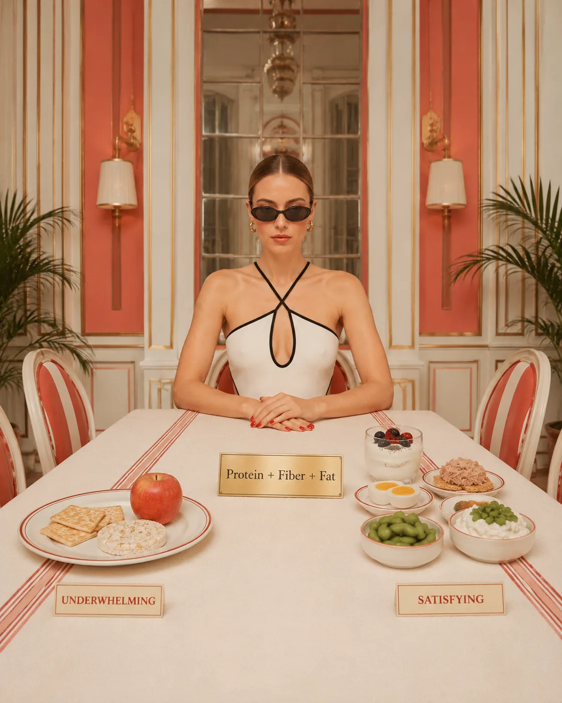

## Why Protein Helps Snacks Feel More Satisfying

Protein is one of the most helpful nutrients for fullness.

When a snack includes protein, it tends to feel more substantial. It gives your body something to work with. It can help slow digestion, support blood sugar balance when paired with carbohydrates, and reduce the feeling of needing to keep grazing.

This matters especially for women over 35, when energy, appetite, recovery, stress, and hormonal shifts may feel less predictable than they used to.

A protein-rich snack can help support:

* steadier energy
* fewer cravings
* better fullness between meals
* muscle maintenance
* post-workout recovery
* blood sugar balance
* less evening overeating
* a calmer relationship with food

This does not mean every snack needs to be perfectly balanced.

It means that if your snacks are not keeping you full, protein is one of the first things to check.

Related reading: [Why Protein Matters More as You Age](/journal/why-protein-matters-more-as-you-age/)

## What Makes a Snack Actually Filling?

A filling snack usually has more than one thing going for it.

The most supportive snacks often include:

### Protein + Fiber + Healthy Fat

This combination tends to work better than snacks made mostly of quick carbohydrates alone.

For example:

An apple alone may be refreshing, but it may not keep you full for long.  
An apple with Greek yogurt or nut butter is more satisfying.

Crackers alone may be easy, but they may leave you wanting more.  
Crackers with tuna, hummus, cheese, or cottage cheese become more supportive.

Fruit alone is not bad.  
Toast alone is not bad.  
A date alone is not bad.

But if your goal is fullness and steady energy, pairing matters.

A good snack should not leave you feeling like you need another snack immediately after.

That is not a snack.

That is an opening act.

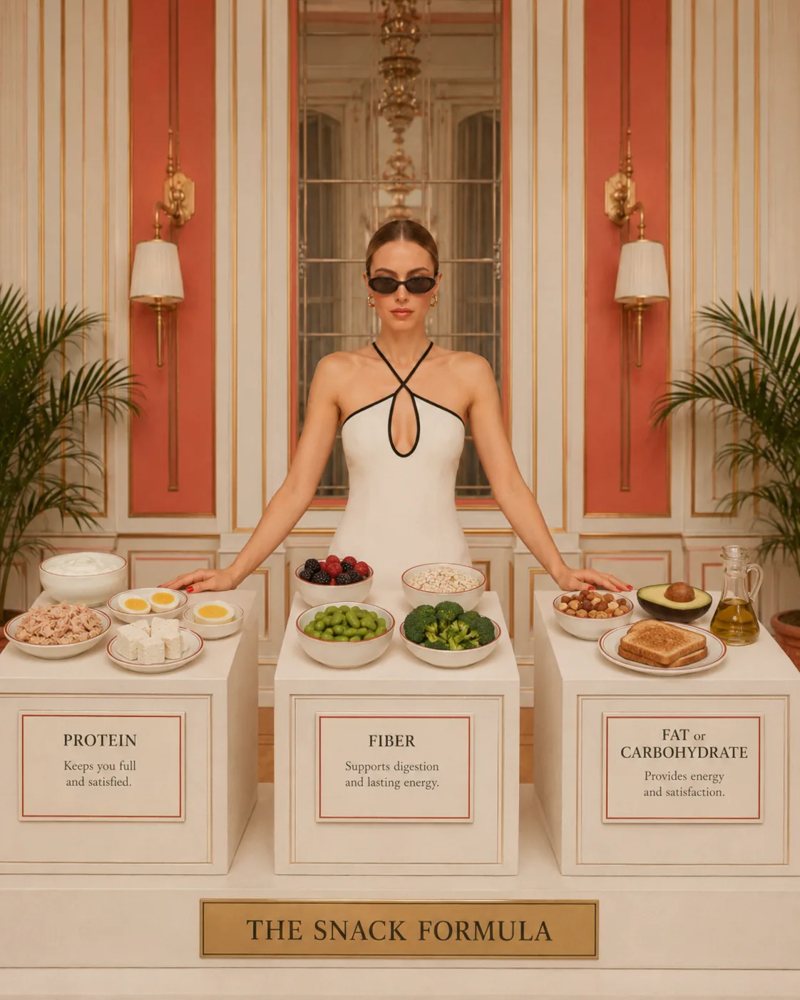

## When Snacks Are Actually Helpful

Some women feel better with three meals and no snacks.

Others do much better with one planned snack, especially in the afternoon.

Neither is morally superior.

Snacks can be helpful if:

* you have a long gap between meals
* you train between meals
* you feel shaky, irritable, or distracted when hungry
* your lunch is early and dinner is late
* you are trying to increase protein
* you often overeat at dinner because you arrive too hungry
* you feel more cravings during certain phases of your cycle
* your schedule is busy and unpredictable

A snack is not a failure.

It can be a small piece of structure.

And for many women, structure feels much better than trying to “be good” until they are ravenous.

## When Constant Snacking Means Your Meals Need More Support

At the same time, if you feel like you are snacking all day and never really satisfied, snacks may not be the main issue.

Your meals may be too small, too low in protein, too low in fiber, or too inconsistent.

A common pattern looks like this:

Coffee for breakfast.  
A light lunch.  
A “healthy” snack.  
Another snack.  
More coffee.  
Dinner while very hungry.  
Something sweet after dinner.  
A promise to start fresh tomorrow.

This is not a willpower problem.

It is a nourishment pattern.

Before judging your snacks, look at your meals.

Do they include:

* enough protein?
* fiber-rich carbohydrates?
* healthy fats?
* enough total food?
* a rhythm that matches your day?

If not, the body will keep asking.

And it will usually ask louder later.

Related reading: [Protein Timing: Does It Matter for Women?](/journal/protein-timing-does-it-matter-for-women/)

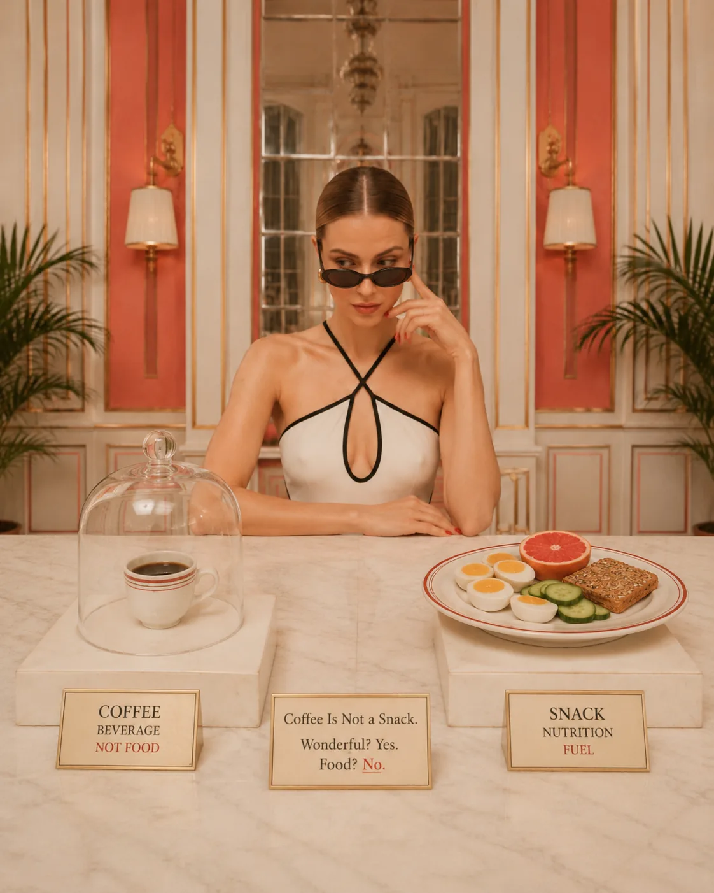

## High-Protein Snacks That Actually Keep You Full

Below are practical high-protein snack ideas that are easy to build, satisfying, and realistic for busy days.

Some are sweet. Some are savory. Some need no cooking. Some are portable. None require you to become a different person.

### 1. Greek Yogurt With Berries and Chia Seeds

This is one of the easiest high-protein snacks.

Greek yogurt provides protein, berries add fiber and freshness, and chia seeds add fiber and healthy fats.

Try this:

* Greek yogurt
* berries
* chia seeds
* cinnamon
* a small drizzle of honey, optional

Why it keeps you full

It combines protein, fiber, and a little fat. It also works beautifully when you want something sweet but still supportive.

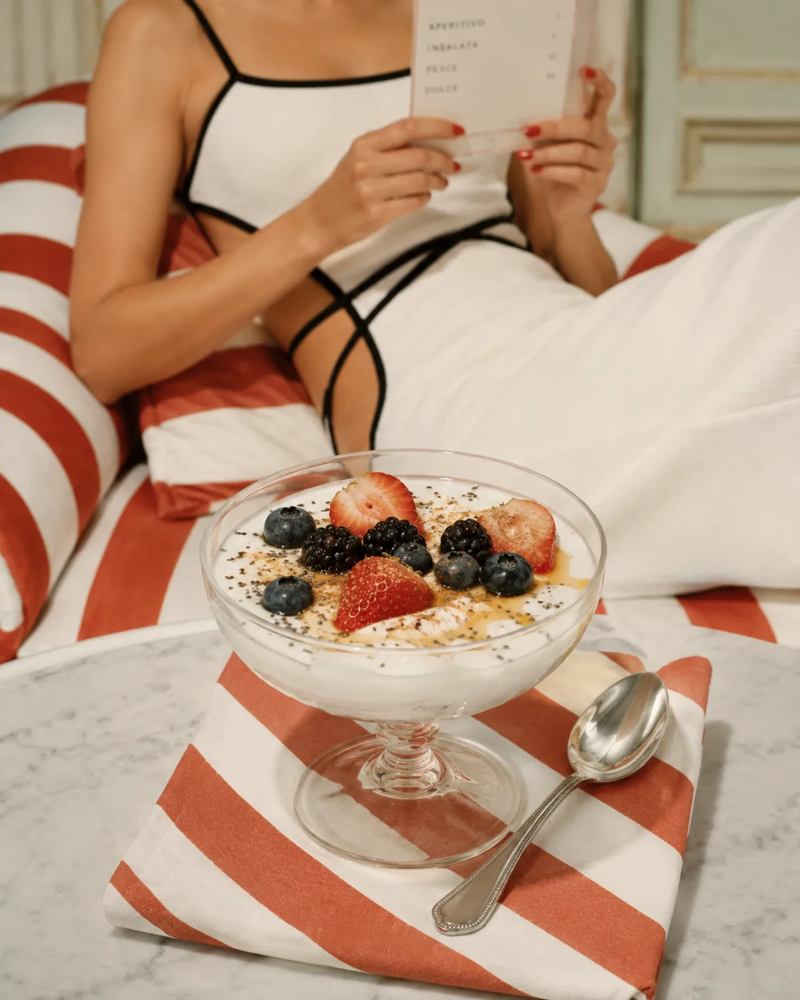

### 2. Cottage Cheese With Fruit or Savory Toppings

Cottage cheese is high in protein and very flexible.

You can make it sweet or savory depending on what you crave.

Sweet version:

* cottage cheese
* berries or banana
* cinnamon
* walnuts or almonds

Savory version:

* cottage cheese
* cucumber
* tomatoes
* olive oil
* black pepper
* herbs

It keeps you full because:

It gives you a strong protein base and can be paired with fiber, fat, and texture so it feels like real food — not a sad little diet snack.

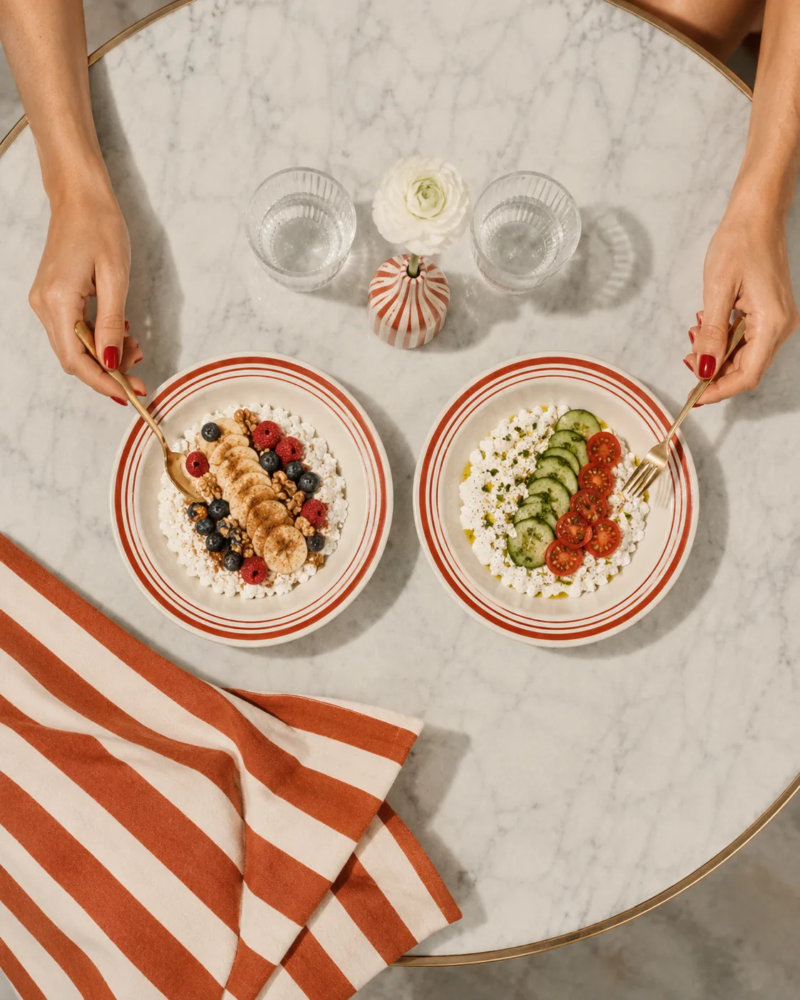

### 3. Boiled Eggs With Fruit or Vegetables

Boiled eggs are simple, portable, and easy to prepare in advance.

On their own, they may not feel like enough for everyone, so pair them with fruit, vegetables, or whole grain toast.

Try this:

* 2 boiled eggs
* cherry tomatoes or cucumber
* fruit
* sea salt and black pepper

Why it keeps you full

Eggs provide protein and fat, while fruit or vegetables add volume, fiber, and freshness.

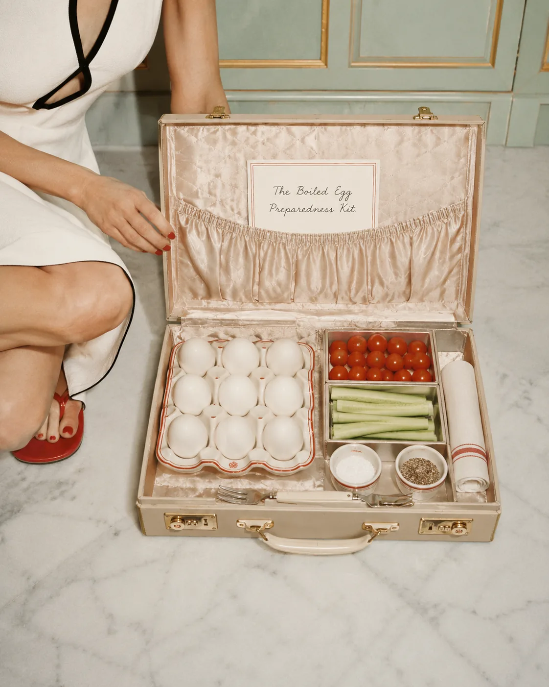

### 4. Tuna or Salmon on Crackers

This is a very practical snack when you want something savory.

Choose whole grain crackers, rice cakes, sourdough toast, or cucumber slices as the base.

Try this:

* tuna or salmon
* whole grain crackers
* Greek yogurt or olive oil
* lemon
* herbs
* cucumber slices

This works, because

Fish provides protein, and pairing it with crackers or vegetables makes the snack more complete.

It is also much more satisfying than wandering into the kitchen and eating crackers directly from the box while pretending that counts as a plan.

### 5. Apple With Greek Yogurt or Nut Butter

Fruit is lovely, but fruit alone may not always hold you.

Pairing it with protein and butter nut makes it much more satisfying.

Try this:

* sliced apple
* Greek yogurt with cinnamon
* or cottage cheese
* And a little nut butter joy.

Why it keeps you satiated

The fruit gives carbohydrates and fiber. The Greek yogurt adds protein. Nut butter adds fat and satisfaction.

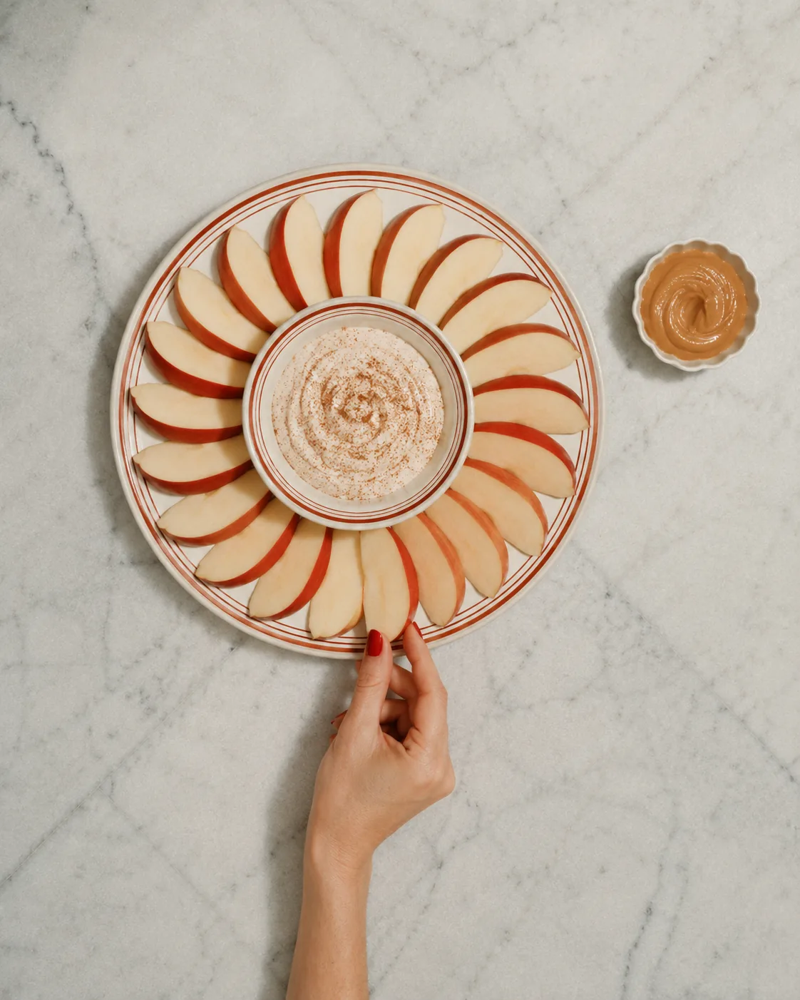

### 6. Edamame With Sea Salt

Edamame is a beautiful plant-based protein snack.

It is easy, satisfying, and rich in both protein and fiber.

Try this:

* steamed edamame
* sea salt
* chili flakes
* lemon or lime

Why it keeps you full

Edamame contains both protein and fiber, which makes it more filling than many typical snack foods.

It is also the kind of snack that feels casual but quietly does the work.

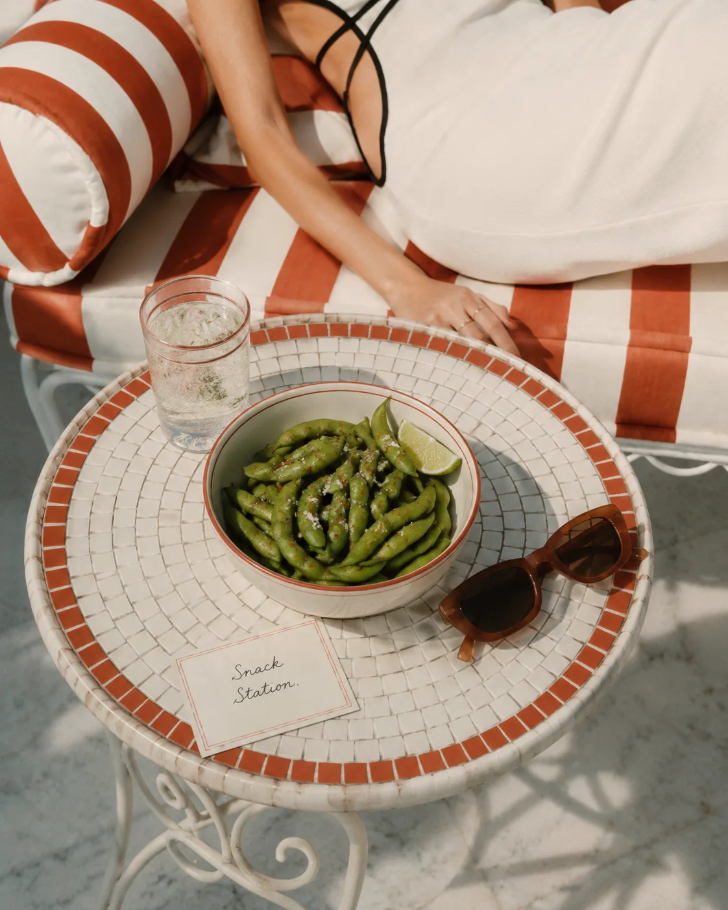

### 7. Hummus With Vegetables and Toast

Hummus is satisfying, but on its own it may not be extremely high in protein unless the portion is generous.

To make it more filling, pair it with vegetables and a protein addition if needed.

Try this:

* hummus
* cucumber, carrots, peppers, or tomatoes
* whole grain toast or crackers
* boiled egg, turkey, tofu, or Greek yogurt on the side if you want more protein

It keeps you satiated because

Hummus adds fiber, fat, and some protein. Pairing it with another protein source makes it more substantial.

### 8. Turkey or Chicken Roll-Ups

This is simple and fast.

Use turkey or chicken slices and wrap them around cucumber, avocado, cheese, or hummus.

Try this:

* turkey or chicken slices
* cucumber
* avocado
* cheese or hummus
* mustard or herbs

Why it keeps you full

It is protein-forward and easy to prepare. Add vegetables or whole grain crackers if you need more volume and energy.

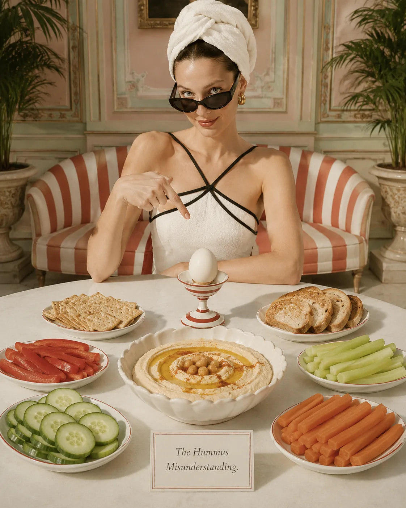

### 9. Protein Smoothie

A smoothie can be a satisfying snack, but only if it is built well.

A fruit-only smoothie may taste fresh but leave you hungry quickly. Add protein, fiber, and fat to make it more supportive.

Try this:

* Greek yogurt, kefir, or protein powder
* berries or banana
* chia or flaxseeds
* milk or protein-rich milk
* nut butter or PB2, optional
* spinach, optional

It’s satisfying, because

It gives you protein, carbohydrates, fiber, and fluid. It is especially helpful after training or when you need something quick.

Related reading: [High-Protein Breakfast Ideas for Steady Energy](/journal/high-protein-breakfast-ideas-for-steady-energy/)

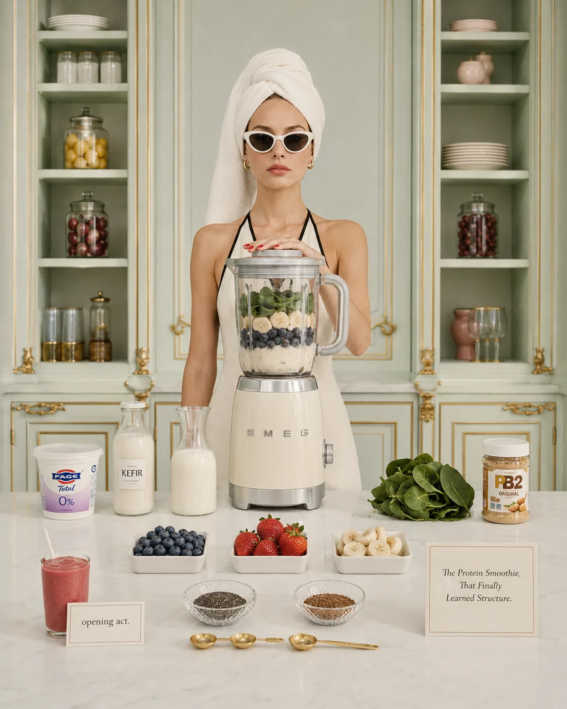

### 10. Roasted Chickpeas With Yogurt Dip

Roasted chickpeas can be crunchy, satisfying, and rich in fiber.

To make them higher in protein, pair them with a Greek yogurt dip.

Try this:

* roasted chickpeas
* Greek yogurt
* lemon
* garlic
* herbs
* cucumber slices

Why it keeps you satiated

Chickpeas provide fiber and some protein. Greek yogurt increases the protein and makes the snack feel more complete.

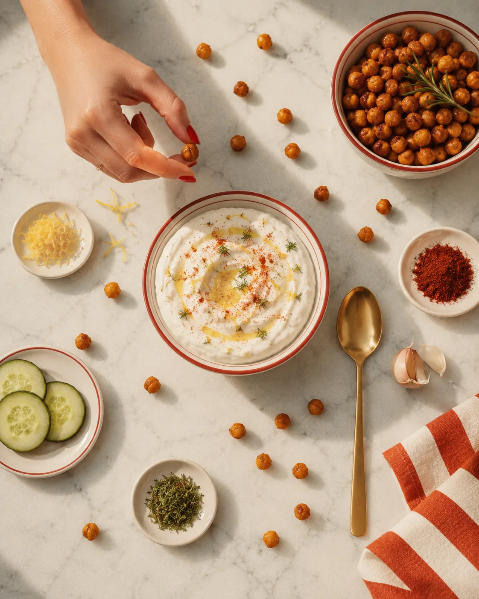

### 11. Chia Pudding With Greek Yogurt

Chia pudding can be lovely, but chia alone is not especially high in protein.

Mix it with Greek yogurt to make it more filling.

Try this:

* chia seeds
* Greek yogurt
* milk
* berries
* cinnamon
* nuts or seeds

It keeps full, because

You get protein from yogurt, fiber from chia and berries, and healthy fats from seeds or nuts.

This is a good option if you want something sweet, creamy, and prepared in advance.

### 12. Cheese With Fruit and Nuts

Cheese can be part of a balanced snack, especially when paired with fiber-rich foods.

Try this:

* cheese
* pear, apple, grapes, or berries
* a few walnuts or almonds

This works, because

Cheese provides protein and fat. Fruit adds fiber and freshness. Nuts add texture and satiety.

This is a snack that feels simple, adult, and satisfying — a small plate, not a panic decision.

### 13. Kefir With Oats and Berries

Kefir is a fermented dairy drink that can provide protein and probiotics.

On its own, it may not be enough for everyone, so make it more substantial.

Try this:

* kefir
* oats
* berries
* chia seeds
* cinnamon

Why it is satiating

It combines protein, carbohydrates, fiber, and fluid. It is easy to prepare and gentle for many people.

### 14. Tofu Cubes With Soy Sauce or Tahini Dip

For a plant-based savory snack, tofu can work very well.

Use baked tofu, air-fried tofu, or ready-to-eat tofu if available.

Try this:

* tofu cubes
* soy sauce or tamari
* sesame seeds
* cucumber
* tahini dip or chili sauce

Why it keeps you full

Tofu provides plant-based protein, and pairing it with vegetables and fat makes it more satisfying.

### 15. Lentil or Bean Dip With Whole Grain Crackers

Beans and lentils are excellent for fiber and steady energy.

Blend lentils or beans with olive oil, lemon, herbs, and spices to create a satisfying dip.

Try this:

* lentil dip or bean dip
* whole grain crackers
* cucumber
* tomatoes
* optional boiled egg, tofu, or Greek yogurt for extra protein

It keeps you full, because

This snack gives fiber, slow-digesting carbohydrates, and some protein. Add an extra protein source if you want it to hold you longer.

## Sweet High-Protein Snacks

Sometimes you want something sweet.

That is not a problem.

A sweet craving does not mean you failed at health. It may mean you are tired, underfed, stressed, or simply in the mood for sweetness because you are a human being and sweetness is pleasant.

The goal is not to remove sweetness.

The goal is to make sweet snacks more supportive.

Try:

* Greek yogurt with berries and honey
* cottage cheese with banana and cinnamon
* chia pudding with Greek yogurt
* protein smoothie with berries
* apple with Greek yogurt dip
* kefir with oats and berries
* ricotta or cottage cheese on toast with fruit
* Greek yogurt with cocoa powder and berries
* dates with nut butter and Greek yogurt on the side

A sweet snack can still be balanced.

It does not need to send your blood sugar on a dramatic little holiday.

Related reading: [Blood Sugar Balance for Women: What It Means and Why It Matters](/journal/blood-sugar-balance-for-women/)

## Savory High-Protein Snacks

Savory snacks often feel more satisfying for women who do not want sweetness in the afternoon.

Try:

* boiled eggs with vegetables
* tuna on crackers
* cottage cheese with cucumber and herbs
* smoked salmon on toast
* turkey or chicken roll-ups
* tofu cubes with tahini dip
* edamame with sea salt
* hummus with vegetables and eggs
* roasted chickpeas with Greek yogurt dip
* cheese with tomatoes and whole grain crackers
* lentil dip with cucumber and toast

Savory snacks can be especially helpful when you want something that feels like real food, not dessert wearing a wellness costume.

## High-Protein Snacks Without Protein Powder

Protein powder can be useful, but it is not required.

There are plenty of whole-food snacks that provide protein.

Try:

* Greek yogurt with berries
* cottage cheese with fruit
* boiled eggs
* tuna or salmon crackers
* tofu cubes
* edamame
* turkey roll-ups
* kefir with chia seeds
* cheese with fruit
* roasted chickpeas with yogurt dip
* lentils with Greek yogurt
* smoked salmon cucumber bites
* hummus with boiled eggs
* tempeh slices with vegetables

Protein powder is just a tool.

Use it if it makes your life easier. Skip it if it does not.

## High-Protein Snacks for Busy Days

Some days you are not assembling a beautiful snack plate.

Some days you need to eat something between tasks, in the car, after training, or while answering messages.

For those days, keep it simple.

Easy portable options:

* Greek yogurt cup
* cottage cheese cup
* boiled eggs
* tuna packet
* roasted edamame
* protein bar with decent ingredients
* kefir bottle
* turkey or chicken roll-ups
* cheese portion with fruit
* protein smoothie
* roasted chickpeas
* tofu bites
* nuts plus a protein source

A note on protein bars: they can be convenient, but some are more like candy bars with a better PR team. Choose ones that actually satisfy you and do not upset your digestion.

Convenience is allowed.

Just make sure the snack still supports you.

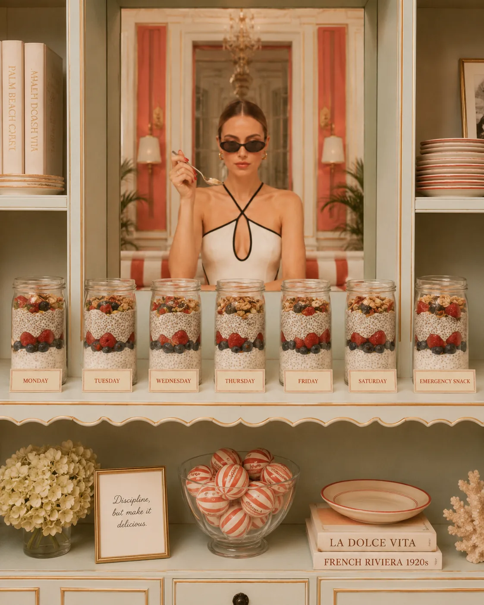

## Common Snack Mistakes That Make You Hungrier

### 1. Choosing Only Low-Calorie Snacks

Low-calorie does not automatically mean supportive.

If a snack is too small, you may end up eating three more things after it.

Sometimes a slightly more substantial snack prevents a much larger evening snack spiral.

### 2. Eating Carbohydrates Alone

Crackers, fruit, toast, cereal, or rice cakes alone may not keep you full.

Pair them with protein or fat.

Examples:

* fruit + Greek yogurt
* crackers + tuna
* toast + cottage cheese
* rice cakes + smoked salmon
* dates + nut butter + yogurt

### 3. Forgetting Fiber

Protein helps, but fiber matters too.

Add berries, fruit, vegetables, oats, chia seeds, flaxseeds, beans, lentils, or whole grains.

### 4. Using Coffee as a Snack

Coffee is not a snack.

Wonderful? Yes. Emotionally important? Often. Food? No.

If you are hungry, coffee may delay the hunger for a while, but it will not nourish you.

And later, your body may ask louder.

### 5. Snacking Because Lunch Was Not Enough

If you need snacks every hour after lunch, your snack may not be the problem.

Your lunch may need more protein, carbohydrates, fat, or total food.

No snack can fully repair a day that started with under-eating and continued with wishful thinking.

## How to Build Your Own Filling High-Protein Snack

Use this simple formula:

Protein + Fiber + Fat or Carbohydrate

You do not need all four every time, but you usually need at least two or three elements.

Formula examples:

* Greek yogurt + berries + chia
* cottage cheese + fruit + walnuts
* boiled eggs + vegetables + toast
* tuna + crackers + cucumber
* tofu + tahini + vegetables
* edamame + fruit
* hummus + eggs + cucumber
* kefir + oats + berries
* cheese + apple + nuts

Before choosing a snack, ask:

What do I need this snack to do?

If you only need something small before dinner, keep it simple.

If dinner is four hours away, make it more substantial.

If you just trained, include protein and carbohydrates.

If you are craving sweetness, build a sweet snack that still supports you.

This is how snacks become intentional without becoming obsessive.

## A Simple Snack Prep List

To make high-protein snacks easier, keep a few basics available.

Protein options:

* Greek yogurt
* cottage cheese
* eggs
* tuna or salmon
* tofu
* edamame
* turkey or chicken slices
* kefir
* cheese
* hummus
* lentils or beans
* protein powder, if useful

Fiber and carbohydrate options:

* berries
* apples
* bananas
* pears
* whole grain crackers
* sourdough
* oats
* vegetables
* roasted chickpeas
* rice cakes
* potatoes
* dates

Fat and flavor options:

* nuts
* seeds
* chia
* flax
* olive oil
* avocado
* tahini
* nut butter
* herbs
* cinnamon
* lemon
* spices

When these foods are available, you do not have to make a decision from zero every time hunger appears.

You have options.

And options make consistency easier.

## Related Reading

- [How Much Protein Do Women Over 35 Really Need?](/journal/how-much-protein-do-women-over-35-need) — helps you understand how snacks fit into your daily protein needs.
- [Cravings, Blood Sugar, and Stress: The Connection Explained](/journal/cravings-blood-sugar-and-stress) — explains when snack cravings are linked to stress, sleep, or unstable fuel.
- [Simple Ways to Reduce Afternoon Energy Crashes](/journal/simple-ways-to-reduce-afternoon-energy-crashes) — gives more ideas for using snacks to support steady energy.

## The Bigger Picture: Snacks Should Support You

Snacking does not need to be chaotic.

It also does not need to be forbidden.

A good snack is not a tiny punishment between meals. It is a bridge.

It helps carry you from one part of the day to the next with more steadiness.

For women over 35, this can be especially helpful because energy, cravings, stress, training, hormonal changes, and appetite are not always predictable.

Some days, three meals are enough.

Some days, a protein-rich snack is exactly what keeps the evening from becoming a hunger emergency.

Neither day is better.

They are just different days.

The goal is not to snack less at all costs.

The goal is to feel supported.

So the next time you feel hungry between meals, pause before judging yourself.

Ask:

Did I eat enough earlier?  
Would a protein-rich snack help me feel steadier?  
Can I pair protein with fiber, fat, or carbohydrates?

Then feed yourself like someone you are responsible for caring for.

Because you are.

And your body does not need another rule.

It needs reliable support.

Related reading: [High-Protein Breakfast Ideas for Steady Energy](/journal/high-protein-breakfast-ideas-for-steady-energy/)

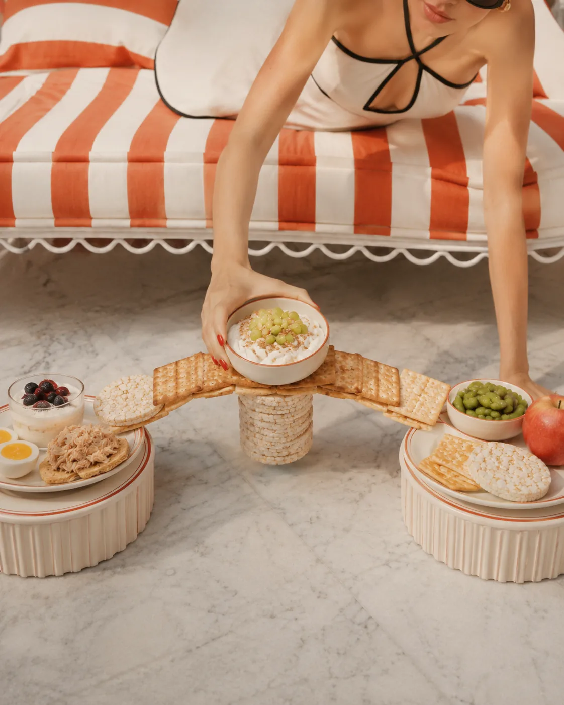
