There is a very common pattern many women fall into.

You are trying to eat well. You choose lighter meals. You have coffee in the morning, maybe something small with it. Lunch is often quick — a salad, some leftovers, a piece of toast, a bowl of soup. Dinner is the first proper meal of the day.

And then, sometime in the afternoon or evening, everything gets harder.

You feel snacky.

You crave something sweet.

You feel tired but restless.

You want to eat, but you also feel like you “shouldn’t.”

You wonder why your discipline disappears at the exact same time every day.

Often, this is not a discipline problem.

It may be a protein problem.

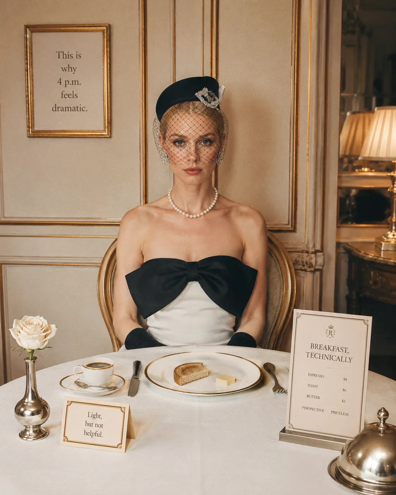

For many women over 35, protein is one of the most quietly powerful nutrition shifts. Not because it is trendy. Not because every meal needs to become a bodybuilder plate. But because protein supports the things many women are trying to protect at this stage of life: energy, muscle, metabolism, strength, fullness, recovery, and long-term health.

And most women are not intentionally under-eating protein.

They are just busy.

They are feeding everyone else. They are working. They are rushing. They are trying to be healthy, but the version of “healthy” they learned years ago often means eating light, eating less, and hoping willpower fills in the gaps.

Your body may need something steadier than that.

## Why Protein Becomes More Important After 35

Protein matters at every age, but it becomes especially important as women move through their mid-30s, 40s, and beyond.

This is partly because muscle mass naturally becomes harder to maintain with age if it is not supported by strength training and enough protein. Research on aging and protein often suggests that older adults may benefit from more than the basic minimum recommendation, especially for supporting muscle mass and function over time. Several expert groups suggest around 1.0–1.2 grams of protein per kilogram of body weight per day for healthy older adults, with higher needs for those who are active or exercising.

Now, if you are 35 or 42, you may not think of yourself as an “older adult” — and honestly, fair.

But this is exactly the point.

You do not have to wait until muscle loss, low strength, poor recovery, or metabolic changes become obvious before you start supporting your body better.

Protein helps with:

* maintaining and building muscle

* supporting metabolism

* improving fullness after meals

* supporting recovery from exercise

* stabilizing energy when meals are well-balanced

* supporting immune function

* preserving strength as you age

It is not just a “fitness nutrient.”

It is a foundational nutrient for women who want to feel strong, steady, and well-supported in their body.

## So, How Much Protein Do Women Over 35 Need?

The answer depends on your body size, activity level, health status, training routine, and goals.

But as a practical starting point, many women over 35 may benefit from aiming for approximately:

1.2–1.6 grams of protein per kilogram of body weight per day

For women who strength train regularly, are trying to build or maintain muscle, or are in a fat-loss phase, needs may be closer to the higher end of that range.

For exercising individuals, the International Society of Sports Nutrition states that a daily protein intake of 1.4–2.0 grams per kilogram of body weight per day is sufficient for most people who train and want to support muscle protein balance.

A practical guide:

| Body Weight | Moderate Protein Target | Higher Protein Target |
| --- | --- | --- |
| 55 kg / 121 lb | 66 g/day | 88 g/day |
| 60 kg / 132 lb | 72 g/day | 96 g/day |
| 65 kg / 143 lb | 78 g/day | 104 g/day |
| 70 kg / 154 lb | 84 g/day | 112 g/day |
| 75 kg / 165 lb | 90 g/day | 120 g/day |
| 80 kg / 176 lb | 96 g/day | 128 g/day |

This does not mean every woman needs to hit the high end.

It simply gives you a realistic range.

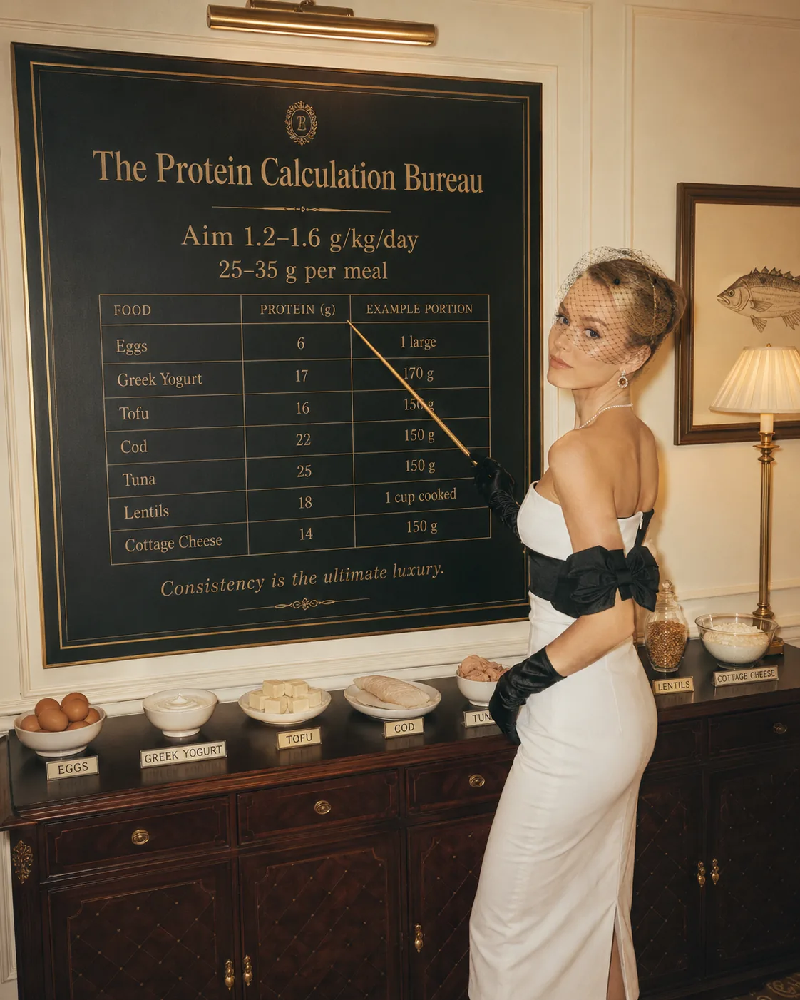

For many women, even getting to 80–100 grams per day consistently can feel very different from their usual intake.

More fullness.

Fewer cravings.

Better recovery.

Less chaotic snacking.

More stable energy.

Not magic. Just better support.

## Why the Minimum Recommendation May Not Be Enough

The standard Recommended Dietary Allowance for protein is often listed as 0.8 grams per kilogram of body weight per day. This is widely used as a basic minimum to prevent deficiency in the general adult population.

But “minimum” is not the same as “optimal.”

That matters.

A woman who is strength training, walking daily, working under stress, sleeping imperfectly, managing hormonal changes, and trying to maintain muscle may need more than the bare minimum.

This is where many women get confused.

They may technically be eating “enough” protein to avoid deficiency, but not enough to feel strong, satisfied, and well-recovered.

There is a difference between surviving and being supported.

And after 35, that difference becomes more noticeable.

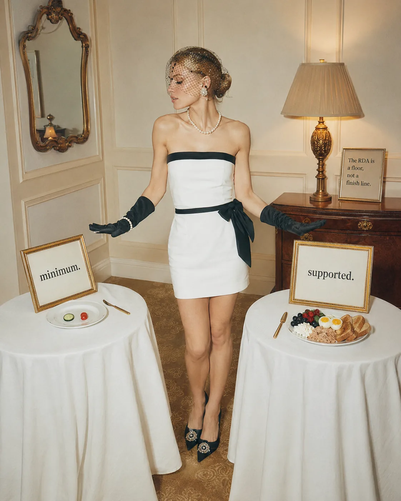

## Signs You May Not Be Eating Enough Protein

You do not need to track your food forever to notice whether protein may be low.

Your body often gives clues.

You may not be eating enough protein if you often experience:

* hunger soon after meals

* strong cravings in the afternoon or evening

* constant snacking

* low energy despite eating “healthy”

* poor recovery after workouts

* difficulty building or maintaining muscle

* feeling unsatisfied after meals

* hair shedding or brittle nails, though this can have many causes

* relying on coffee to get through the day

* overeating at night after eating lightly earlier

Of course, these signs can have many causes: poor sleep, stress, low calories, hormonal changes, low iron, thyroid issues, or other medical factors.

But protein is a simple and meaningful place to check.

Sometimes the issue is not that you need a more complicated plan.

Sometimes breakfast just needs more protein.

## Protein and Muscle: Why This Matters for Metabolism

One of the most important reasons women over 35 need enough protein is muscle.

Muscle is not just about looking toned.

Muscle helps you move well, train well, regulate blood sugar, support posture, protect joints, maintain independence as you age, and support metabolic health.

And muscle needs two main things:

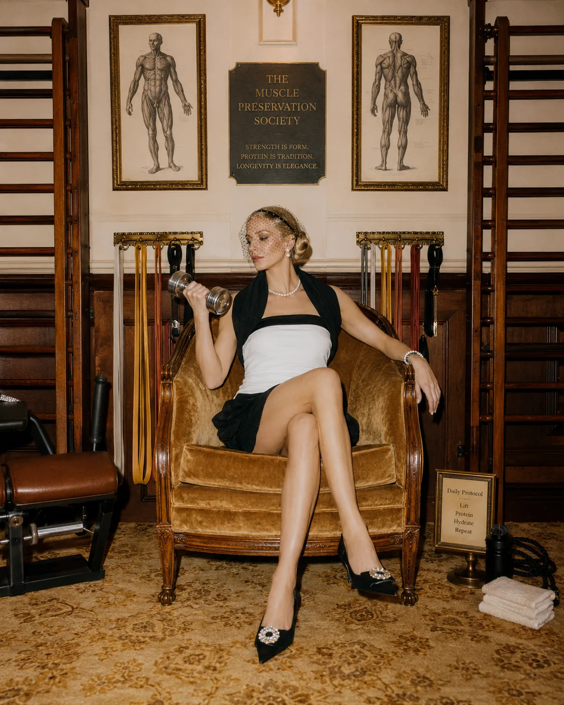

A reason to stay: strength training.

The materials to repair and grow: protein.

Protein alone will not build muscle in a meaningful way if your body has no training stimulus. Strength training alone will not work as well if your body does not have enough nutrition to recover.

They belong together.

This is why women who want to support metabolism after 35 should not only ask, “How do I eat less?”

A better question is:

How do I support the muscle that supports my metabolism?

That question changes everything.

It moves you away from punishment and toward strength.

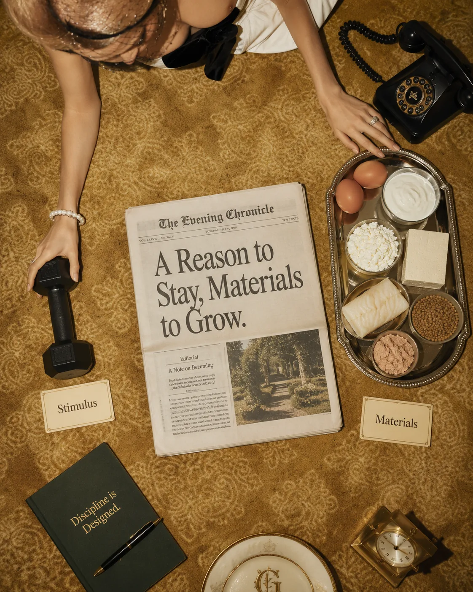

> Related reading: [Nutrition for Women Over 35: How to Support Energy, Metabolism, Hormones, and Long-Term Health](/journal/nutrition-for-women-over-35/)

## Should You Eat Protein at Every Meal?

For most women, yes — this is a very helpful habit.

You do not need to obsess over perfect timing, but spreading protein across the day is usually more effective than eating very little early on and trying to fit everything into dinner.

This is especially true if you want better energy, fullness, and recovery.

Instead of thinking only about your daily total, think about your meals.

A useful target for many women is:

25–35 grams of protein per meal

Some women may need a little less, some may need more. But this range is practical, realistic, and enough to make meals feel more satisfying.

For example:

* breakfast: 25–30 grams

* lunch: 30–35 grams

* dinner: 30–40 grams

* optional snack: 10–20 grams

That could easily bring you into the 90–120 gram range without needing to force anything extreme.

And no, you do not need to eat chicken breast out of a plastic container unless you genuinely enjoy that particular sadness.

Food can still be beautiful. Warm. Cultural. Social. Satisfying.

It just needs enough structure to support you.

> Related reading: [Protein Timing: Does It Matter for Women?](/journal/protein-timing-does-it-matter-for-women/)

## What Does 25–35 Grams of Protein Look Like?

This is where protein becomes much easier.

Because “eat more protein” sounds vague.

But real meals are simple.

Here are examples of meals that can provide around 25–35 grams of protein, depending on portions and brands:

### Breakfast Ideas

* Greek yogurt with berries, chia seeds, and walnuts

* 2 eggs plus egg whites with sourdough and avocado

* cottage cheese with fruit and nuts

* tofu scramble with vegetables and toast

* smoked salmon with eggs or Greek yogurt on the side

* protein oats made with milk or yogurt

### Lunch Ideas

* chicken salad with quinoa, chickpeas, herbs, and olive oil

* tuna or salmon bowl with rice, cucumber, avocado, and vegetables

* lentil soup with Greek yogurt or eggs on the side

* tofu bowl with rice, edamame, vegetables, and tahini

* turkey or chicken wrap with vegetables and hummus

### Dinner Ideas

* salmon with potatoes and greens

* lean beef or turkey with rice and vegetables

* tofu or tempeh stir-fry with noodles or rice

* chicken with roasted vegetables and couscous

* bean and lentil stew with added yogurt, eggs, or fish on the side

The goal is not to turn every meal into math.

The goal is to learn what enough protein looks like on your plate.

Once you see it, it becomes much easier to repeat.

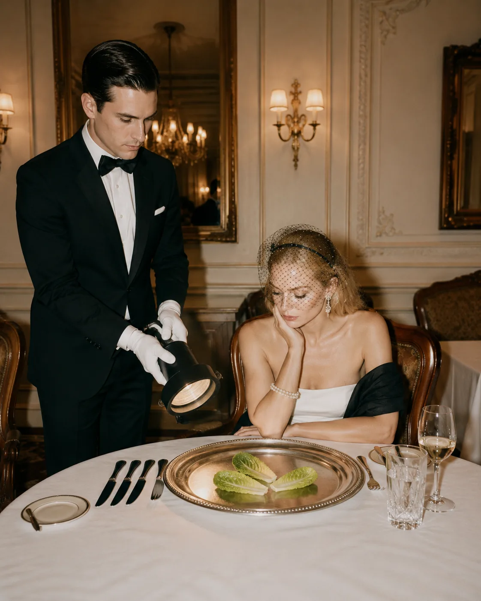

> Related reading: [High-Protein Breakfast Ideas for Steady Energy](/journal/high-protein-breakfast-ideas-for-steady-energy/)

## Best Protein Sources for Women Over 35

There is no single best protein source.

The best options are the ones you enjoy, digest well, and can eat consistently.

### Animal-Based Protein Sources

* eggs

* Greek yogurt

* cottage cheese

* chicken

* turkey

* lean beef

* fish

* seafood

* milk

* cheese

* kefir

Animal proteins are often rich in essential amino acids and can be very efficient sources of protein.

### Plant-Based Protein Sources

* tofu

* tempeh

* edamame

* lentils

* beans

* chickpeas

* soy milk

* seitan

* peas

* quinoa

* nuts and seeds

Plant-based proteins can absolutely support protein intake, but they often require a little more planning because some are lower in protein per serving or less concentrated than animal-based options.

For example, lentils are wonderful — but they also contain carbohydrates and fiber. That is not a problem. It just means you may need larger portions or combine several plant proteins across the day.

A plant-based high-protein meal might include tofu, edamame, rice, vegetables, and tahini.

A Mediterranean-style meal might include fish, beans, olive oil, greens, and potatoes.

A simple breakfast might be Greek yogurt, berries, chia, and nuts.

There is no need to make protein boring.

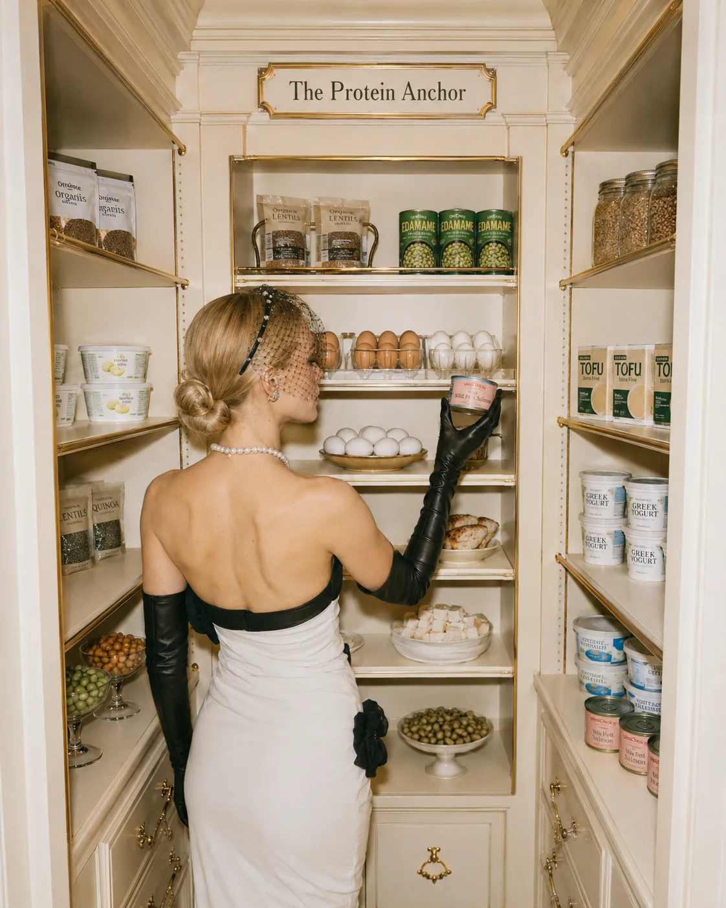

> Related reading: [High-Protein Snacks That Actually Keep You Full](/journal/high-protein-snacks-that-keep-you-full/)

## Do Women Need Protein Powder?

Not necessarily.

Protein powder is a tool. Not a requirement. Not a personality.

Some women find it helpful because it is quick, convenient, and easy to add to breakfast or snacks.

It can be useful if:

* you struggle to eat enough protein

* you are busy in the morning

* you train regularly

* you need a portable option

* you do not always want meat, eggs, or dairy

* your appetite is low earlier in the day

But whole foods should still make up most of your nutrition when possible.

If you use protein powder, choose one you digest well and actually enjoy. Also check ingredients if you are sensitive to sweeteners, dairy, or certain additives.

And if you do not like protein powder, you do not need to force it.

There are many ways to eat enough protein without it.

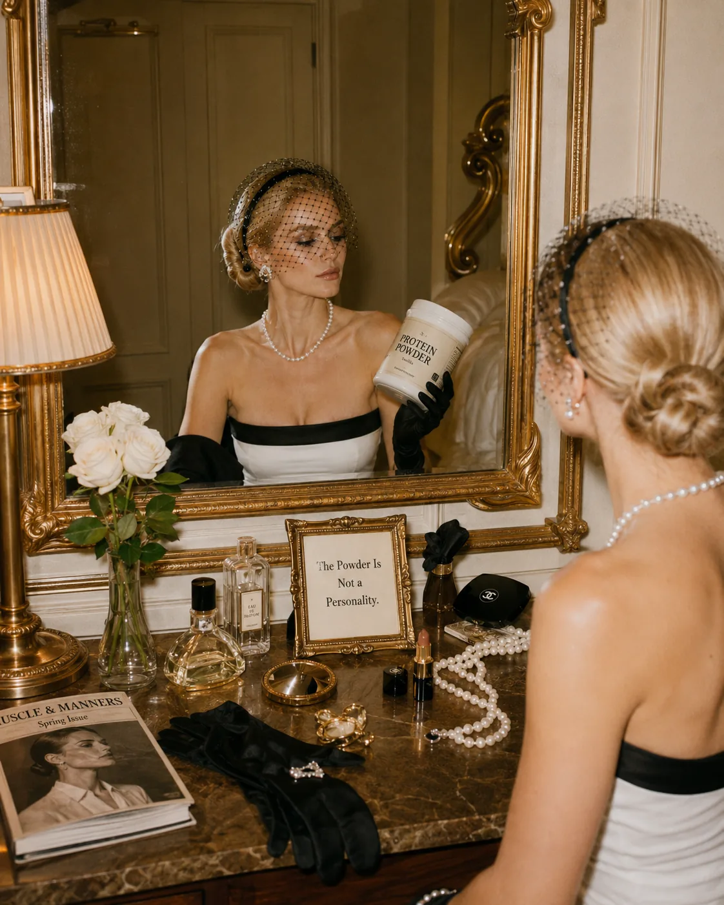

## Can You Eat Too Much Protein?

For most healthy adults, a moderately higher-protein diet is generally considered safe, especially when it comes from a balanced diet that also includes fiber-rich carbohydrates, healthy fats, and plenty of plants.

However, more is not always better.

Very high protein intakes may crowd out other important foods like fruits, vegetables, legumes, and whole grains. Some health systems advise that regularly exercising adults may need around 1.1–1.7 grams per kilogram, while noting that intakes above 2 grams per kilogram per day may be excessive for many people.

You should speak with a qualified healthcare professional or registered dietitian before increasing protein significantly if you:

* have kidney disease

* have liver disease

* are pregnant or breastfeeding

* have a medical condition requiring dietary management

* have a history of eating disorders

* are unsure what intake is appropriate for your body

Protein is supportive.

It does not need to become extreme.

## Simple Ways to Eat More Protein Without Overthinking

If your current protein intake is low, do not jump from 40 grams to 130 grams overnight.

Start gently.

1. Upgrade breakfast first

Breakfast is often the lowest-protein meal.

Instead of coffee and toast alone, try adding eggs, Greek yogurt, cottage cheese, smoked salmon, tofu, or a protein-rich smoothie.

2. Add one palm-sized protein source to lunch and dinner

This visual cue works well for many women.

A palm-sized portion of chicken, fish, tofu, tempeh, lean meat, or eggs can help make meals more satisfying.

3. Pair snacks with protein

Instead of eating fruit, crackers, or rice cakes alone, pair them with protein.

Try:

* apple with Greek yogurt

* crackers with tuna

* fruit with cottage cheese

* boiled eggs with vegetables

* hummus with whole grain toast

* edamame with sea salt

4. Keep easy protein available

Busy women need convenient options.

Keep a few of these on hand:

* boiled eggs

* Greek yogurt

* cottage cheese

* canned tuna or salmon

* cooked chicken

* tofu

* edamame

* lentils

* beans

* smoked salmon

* kefir

* protein powder, if useful

5. Stop making salads that are just leaves and hope

A salad can be a beautiful meal.

But it needs substance.

Add protein, fiber-rich carbohydrates, and fat.

For example:

* greens

* chicken or tofu

* chickpeas or quinoa

* olive oil dressing

* avocado or seeds

* herbs and vegetables

Now it is a meal.

Not a prelude to raiding the kitchen at 5 p.m.

6. Think “protein anchor,” not perfect tracking

Before each meal, ask:

What is my protein anchor here?

That one question can change your entire day.

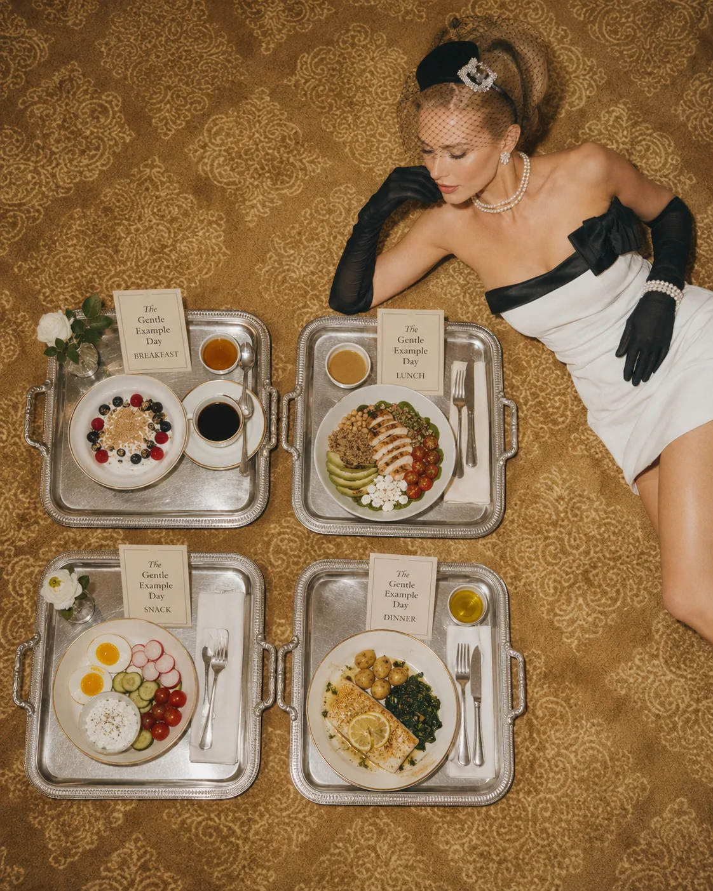

It keeps nutrition simple, structured, and calm.

## A Gentle Example Day With Enough Protein

Here is what a higher-protein day could look like without feeling like a strict meal plan:

### Breakfast

Greek yogurt with berries, chia seeds, walnuts, and a little honey.

### Lunch

Chicken or tofu bowl with rice, cucumber, tomatoes, herbs, olive oil, and chickpeas.

### Snack

Cottage cheese with fruit, or boiled eggs with vegetables.

### Dinner

Salmon with potatoes, greens, and olive oil.

This is not complicated.

It is not extreme.

It is just supportive.

That is the tone we want with nutrition after 35.

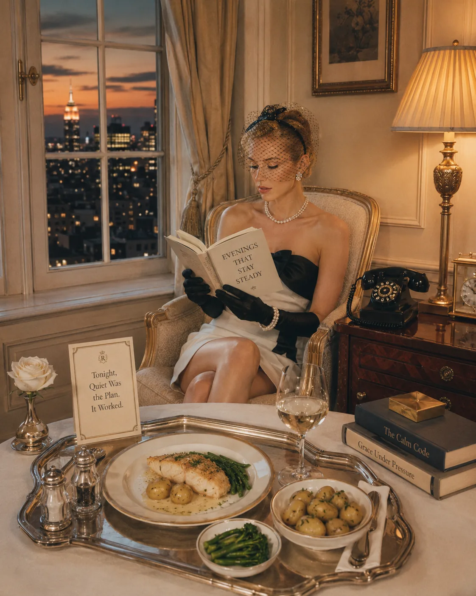

## Related Reading

- [Why Protein Matters More as You Age](/journal/why-protein-matters-more-as-you-age) — explains the bigger aging, muscle, and metabolism context.
- [Protein Timing: Does It Matter for Women?](/journal/protein-timing-does-it-matter-for-women) — helps you decide how to distribute protein across the day.
- [High-Protein Snacks That Actually Keep You Full](/journal/high-protein-snacks-that-keep-you-full) — gives practical ways to add protein between meals.

## The Bigger Picture

Protein is not about dieting harder.

It is about giving your body enough of what it needs to feel steady, strong, and satisfied.

For many women over 35, eating more protein can feel like relief.

Not because it fixes everything.

But because it removes some of the daily chaos.

The constant hunger.

The cravings that feel louder than your intentions.

The energy dips.

The poor recovery.

The feeling that your body is working against you.

Sometimes your body is not working against you.

Sometimes it is just under-supported.

Start with one meal.

Add a real protein source.

Notice how you feel.

Then repeat.

Not perfectly. Just often enough for your body to begin trusting that it will be nourished.

Because the goal is not to control your body into submission.

The goal is to support it well enough that it feels easier to live in.

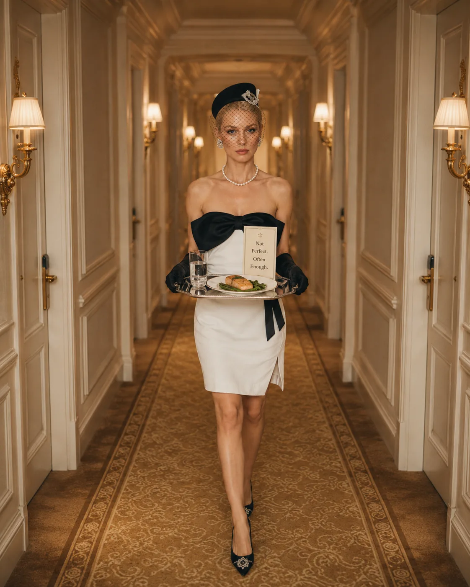
