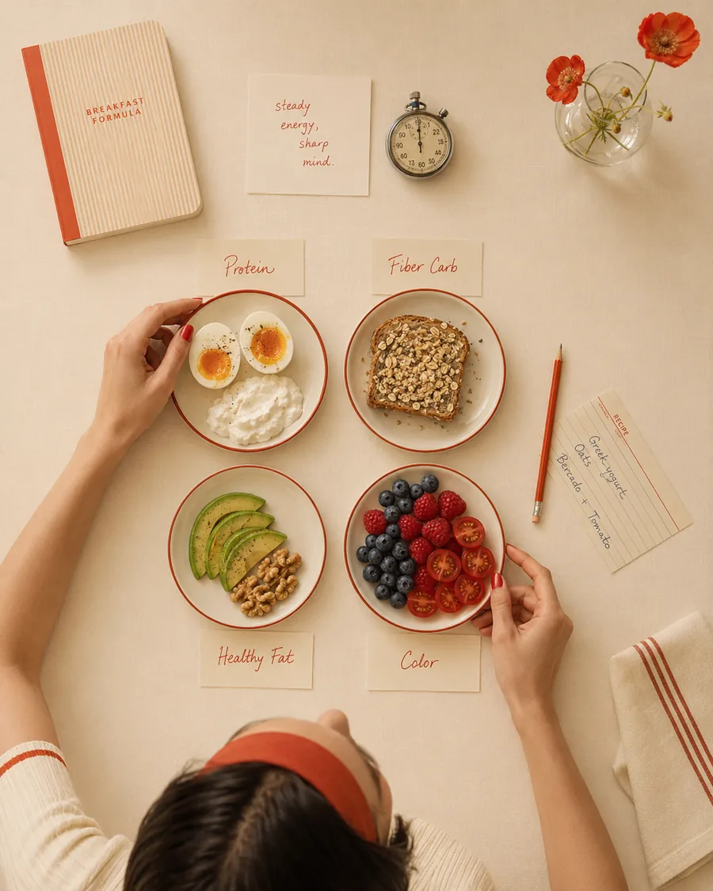
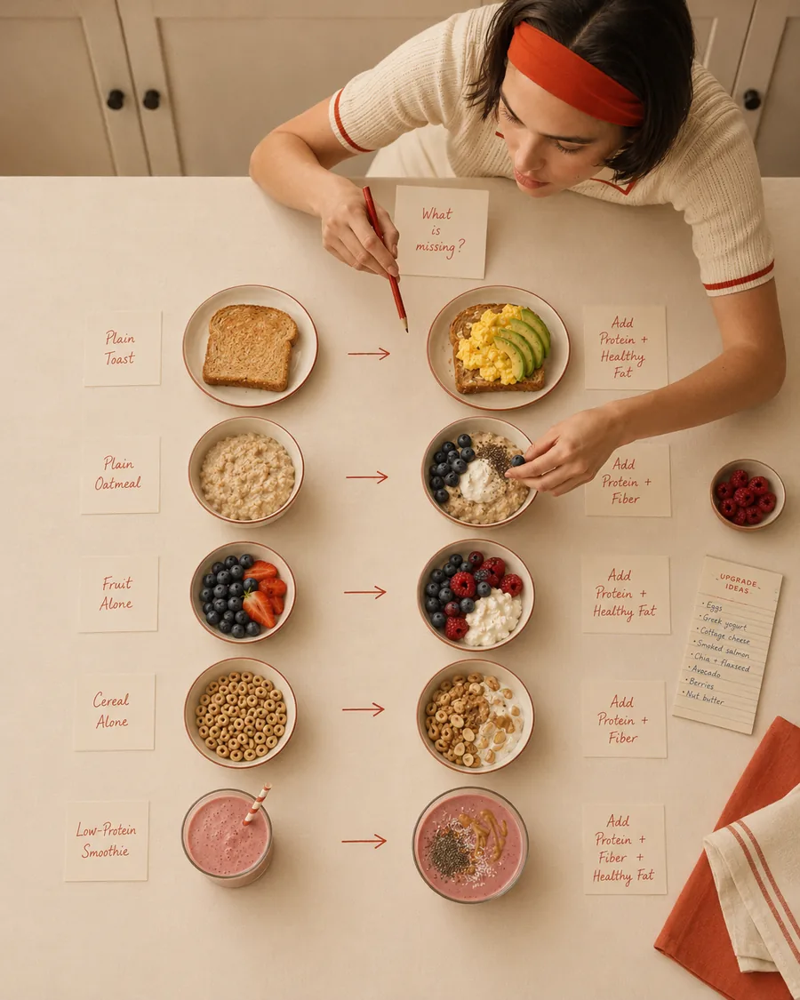
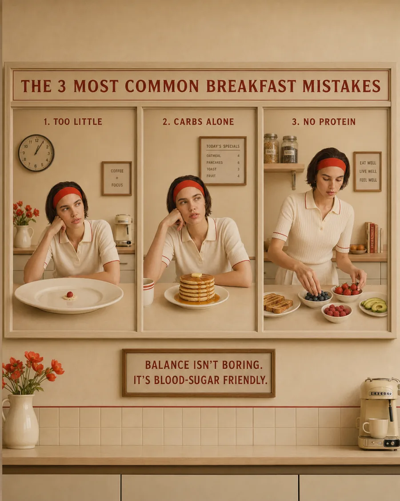

Breakfast can set the tone for your entire morning.
Not in a dramatic, “everything depends on this one meal” kind of way — but in a very real, very practical way.
A rushed coffee and a slice of toast might feel fine for the first hour. Then suddenly, your energy drops. Your focus feels thin. You feel snacky, irritable, shaky, or strangely tired. And by midday, it can feel like your body is asking for quick energy with the urgency of a small fire alarm.
For many women, especially in their 30s, 40s, and beyond, breakfast becomes more important than it used to feel.
Stress is higher. Sleep may be less predictable. Hormones begin to shift. Muscle mass becomes more valuable. And the old “coffee until lunch” routine may no longer feel as forgiving.
A blood-sugar-friendly breakfast is not about restriction, dieting, or removing every carbohydrate from your plate.
It is about building a meal that gives your body energy in a steadier, calmer way.
One that helps you feel nourished, clear, satisfied, and less pulled around by cravings.
If you are new to this topic, you may also want to read our guide to [blood sugar balance for women](/journal/blood-sugar-balance-for-women) to understand why steady energy matters throughout the day.

Gentle note: This article is for educational purposes only and does not replace medical advice. If you have diabetes, insulin resistance, PCOS, reactive hypoglycemia, thyroid concerns, eating disorder history, or any medical condition, please work with a qualified healthcare professional for personalized guidance.

## What Is a Blood-Sugar-Friendly Breakfast?
A blood-sugar-friendly breakfast is a meal designed to support a steadier rise in blood glucose after eating.
That does not mean “no carbs.”
It does not mean “tiny portions.”
And it does not mean eating something joyless while pretending it is enough.
A supportive breakfast usually includes:
* Protein
* Fiber-rich carbohydrates
* Healthy fats
* Color from fruit or vegetables
* Enough food to actually satisfy you
The CDC explains that carbohydrates raise blood sugar, but how quickly they do so depends on the type of food and what you eat with it. Eating carbohydrates with protein, fat, or fiber can slow how quickly blood sugar rises. (CDC)
That is the heart of a blood-sugar-friendly breakfast.
Not fear.
Not perfection.
Just better pairing.

## Why Breakfast Can Affect Your Energy So Much
After breakfast, your body begins managing incoming nutrients.
Carbohydrates are broken down into glucose, which enters the bloodstream and provides energy. In response, insulin helps move glucose from the blood into your cells.
This is normal. This is not a problem.
The issue is when breakfast is mostly quick-digesting carbohydrates with very little protein, fiber, or fat.
This is one reason some women feel a noticeable dip after meals. We explore this more deeply in [why you feel tired after eating](/journal/why-you-feel-tired-after-eating-and-what-may-help).

That kind of meal may leave some people with a faster rise in blood sugar, followed by a noticeable dip in energy, mood, or focus.
Harvard’s Nutrition Source explains that high-glycemic foods, such as white bread, are digested quickly and can cause larger blood sugar fluctuations, while lower-glycemic foods, such as whole oats, are digested more slowly and tend to create a more gradual rise. (The Nutrition Source)
This is why two breakfasts with similar calories can feel completely different in your body.
A sweet pastry and coffee may give you quick energy.
Greek yogurt with berries, seeds, and nuts may give you steadier energy.
Both are food.
Only one is likely to hold you.

## The Blood-Sugar-Friendly Breakfast Formula
The easiest way to build a steadier breakfast is to stop asking, “Is this good or bad?”
**Ask instead:**
> What is missing from this meal?
Most blood-sugar-friendly breakfasts include four key elements.

### 1. Start With Protein
Protein is the anchor.
It helps you feel full, supports muscle maintenance, and gives your breakfast more staying power. For women over 35, this becomes especially important because muscle tissue plays a central role in metabolic health, strength, aging, and long-term energy.
For a deeper look at this, read [why protein matters more as you age](/journal/why-protein-matters-more-as-you-age).

A breakfast without enough protein may look healthy but still leave you hungry an hour later.
Examples include:
* toast with jam
* fruit alone
* coffee with a biscuit
* cereal with very little protein
* a smoothie made mostly with fruit and almond milk
* a small bowl of oatmeal without protein added
These are not “bad” breakfasts.
They may simply be incomplete.
#### Good protein options for breakfast
* Eggs
* Greek yogurt
* Cottage cheese
* Smoked salmon
* Turkey or chicken slices
* Tofu or tempeh
* Protein powder, if it suits you
* High-protein milk or yogurt
* Beans or lentils
* Edamame
* Chia seeds and hemp seeds, as supportive add-ons
A helpful goal for many women is to include a clear protein source at breakfast not just a little sprinkle of nuts and hope.
For more practical morning inspiration, explore these [high-protein breakfast ideas for steady energy](/journal/high-protein-breakfast-ideas-for-steady-energy).

### 2. Choose Fiber-Rich Carbohydrates
Carbohydrates can absolutely belong in a blood-sugar-friendly breakfast.
The key is choosing carbs that bring more than just quick energy.
Fiber-rich carbohydrates digest more slowly and can help support a steadier blood sugar response. Harvard’s Nutrition Source notes that soluble fiber forms a gel in the gut, slowing digestion and helping reduce blood glucose surges after eating. (The Nutrition Source)
The CDC also explains that sugars and starches raise blood sugar, while fiber is not digested in the same way. (CDC)
#### Blood-sugar-friendlier carbohydrate options
* Oats
* Whole grain or seeded bread
* Sourdough bread
* Berries
* Apples
* Pears
* Chia pudding
* Beans
* Lentils
* Sweet potato
* Potatoes with skin
* Quinoa
* Buckwheat
* Whole grain wraps
This does not mean you can never have white bread, pastries, or pancakes.
It means your everyday breakfast may support you better when your carbohydrates come with fiber, structure, and nourishment.

### 3. Add Healthy Fats for Satisfaction
Fat slows digestion and makes meals more satisfying.
This can be especially helpful at breakfast, when a meal that is too light may send you searching for snacks before your morning has even properly started.
#### Healthy fat options include:
* Avocado
* Olive oil
* Nuts
* Seeds
* Nut butter
* Tahini
* Chia seeds
* Flaxseed
* Olives
* Full-fat or reduced-fat dairy, depending on your needs and preference
You do not need to add large amounts.
A little can go a long way.
Think almond butter with oats, avocado with eggs, olive oil on a breakfast bowl, or chia seeds in yogurt.

### 4. Add Color From Fruit or Vegetables
This is where breakfast becomes more nourishing.
Fruit and vegetables add fiber, fluid, antioxidants, minerals, and volume. They can also make breakfast feel fresher and more satisfying.
#### Good options include:
* Berries
* Kiwi
* Apple
* Citrus
* Spinach
* Tomatoes
* Mushrooms
* Peppers
* Zucchini
* Arugula
* Herbs
* Roasted vegetables
A blood-sugar-friendly breakfast does not have to look like a green smoothie.
It can be warm eggs with tomatoes.
Greek yogurt with berries.
Oats with apple and cinnamon.
A savory bowl with vegetables and feta.
A tofu scramble with mushrooms and spinach.
Simple still counts.

## The Becoming Elysian Blood-Sugar-Friendly Breakfast Formula
Use this as your easy morning structure:
**Protein + Fiber-Rich Carb + Healthy Fat + Color**
#### For example:
* Eggs + sourdough + avocado + tomatoes
* Greek yogurt + berries + chia seeds + walnuts
* Tofu scramble + sweet potato + olive oil + spinach
* Oats + protein powder or Greek yogurt + flaxseed + apple
* Cottage cheese + seeded toast + cucumber + olive oil
You do not need a complicated breakfast plan.
You need a breakfast that is complete enough to carry you.

## Breakfasts That May Spike Blood Sugar More Easily
Some breakfasts are more likely to leave people tired, hungry, or craving more food shortly after eating — especially when eaten alone or in large amounts.
These include:
* sugary cereal
* pastries
* sweet coffee drinks
* white toast with jam
* fruit juice
* pancakes or waffles with syrup and little protein
* low-protein smoothies
* granola with very little protein
* breakfast bars that are mostly sugar
* coffee as breakfast
This does not mean these foods are forbidden.
It means they may feel better when paired differently.
#### For example:
* Instead of: croissant and coffee
* Try: croissant with Greek yogurt or eggs on the side
* Instead of: cereal alone
* Try: higher-fiber cereal with Greek yogurt, berries, and nuts
* Instead of: smoothie with only fruit
* Try: smoothie with protein, berries, chia seeds, and nut butter
* Instead of: toast with jam
* Try: toast with eggs, avocado, and fruit
The goal is not to remove pleasure.
The goal is to give pleasure a foundation.

## 10 Blood-Sugar-Friendly Breakfast Ideas
### 1. Greek Yogurt, Berries, Chia Seeds, and Walnuts
This is one of the simplest steady-energy breakfasts.
It gives you protein from Greek yogurt, fiber from berries and chia seeds, and healthy fats from walnuts.
Add cinnamon or a small drizzle of honey if you like a little sweetness.
### 2. Eggs With Sourdough, Avocado, and Tomatoes
A classic for a reason.
Eggs provide protein, sourdough gives carbohydrates, avocado adds fat, and tomatoes bring freshness and fiber.
It feels satisfying without being heavy.
### 3. Protein Oats With Berries and Flaxseed
Oats can be a beautiful breakfast, but many women feel better when they add protein.
Try oats with Greek yogurt stirred in after cooking, protein powder, cottage cheese, or egg whites cooked into the oats. Add berries, flaxseed, and cinnamon.
### 4. Cottage Cheese Bowl With Apple, Cinnamon, and Almond Butter
This is creamy, sweet, and filling.
Cottage cheese brings protein, apple brings fiber, cinnamon adds warmth, and almond butter makes it satisfying.
### 5. Tofu Scramble With Spinach and Sweet Potato
A lovely savory option, especially if you do not eat eggs.
Tofu provides protein, sweet potato provides fiber-rich carbohydrates, and spinach adds color and minerals.

### 6. Smoked Salmon Breakfast Plate
Try smoked salmon with seeded toast, cucumber, tomato, avocado, and a little lemon.
This feels elegant but takes almost no time.
### 7. Chia Pudding With Greek Yogurt and Berries
Chia seeds are rich in fiber, but chia pudding alone may not always provide enough protein.
Mix it with Greek yogurt or serve it with a protein-rich side to make it more complete.
### 8. Savory Breakfast Bowl
Use a base of quinoa, potatoes, or beans. Add eggs, tofu, chicken, or feta, plus vegetables and olive oil.
This is especially helpful if sweet breakfasts make you hungrier.
### 9. High-Protein Smoothie
A blood-sugar-friendly smoothie should be built like a meal, not a juice.
Try protein powder or Greek yogurt, berries, spinach, chia seeds, and nut butter. Keep fruit portions reasonable and avoid making it mostly banana, dates, and juice.
### 10. Beans, Eggs, and Avocado
This is filling, fiber-rich, and deeply satisfying.
Try black beans or white beans with eggs, avocado, salsa, herbs, and a small piece of toast or potatoes.

## What About Coffee?
Coffee is not the enemy.
But coffee alone is not breakfast.
For some women, especially those under stress, drinking coffee on an empty stomach may make them feel jittery, anxious, nauseous, or more prone to an energy crash later.
If this sounds familiar, try having coffee after or with breakfast rather than before food.
You do not need to give up the ritual.
You may just need to give your nervous system a little more support before the caffeine arrives.

This can also be useful if you tend to feel wired, anxious, or tired after eating — especially during stressful seasons.

## What About Intermittent Fasting?
Some women feel good skipping breakfast.
Others feel worse; more anxious, more snacky, more tired, more likely to overeat later, or less stable in their mood and energy.
There is no universal rule here.
But if you are dealing with:
* poor sleep
* high stress
* intense training
* perimenopause symptoms
* cravings
* irregular cycles
* low energy
* blood sugar dips
* anxiety or shakiness in the morning
then a nourishing breakfast may be more supportive than pushing food later and later.
Wellness should support your life, not become another rule you have to obey.

## A Simple Morning Upgrade: Build From What You Already Eat
You do not have to reinvent breakfast.
Start with your current breakfast and add what is missing.
The same approach can be used across your whole day. You may also like [how to build a balanced plate for steady energy](/journal/simple-balanced-plate-method-for-women).

If you eat toast:
Add eggs, cottage cheese, smoked salmon, avocado, or tofu.
If you eat oatmeal:
Add Greek yogurt, protein powder, egg whites, chia seeds, flaxseed, or nut butter.
If you drink a smoothie:
Add protein, fiber, and fat. Avoid making it mostly fruit juice and bananas.
If you only drink coffee:
Start with something small: Greek yogurt, boiled eggs, cottage cheese, or a protein-rich smoothie.
If you eat fruit:
Pair it with Greek yogurt, cottage cheese, eggs, nuts, seeds, or nut butter.
If you eat cereal:
Choose a higher-fiber option and pair it with Greek yogurt or high-protein milk. Add berries and nuts.
Small changes can create a very different energy response.

## The 3 Most Common Breakfast Mistakes
### 1. Eating Too Little
A tiny breakfast may feel “healthy,” but if it leaves you hungry, distracted, and craving sugar by 10:30, it is not serving you.
Your breakfast should match your morning.
If you have work, training, parenting, meetings, errands, and decision-making ahead of you, your body may need more than coffee and a rice cake.
### 2. Eating Carbs Alone
Carbs are not the problem.
Lonely carbs are often the problem.
Bread, oats, fruit, potatoes, and grains can all work beautifully when paired with protein, fiber, and fat.
### 3. Forgetting Protein
This is the big one.
Many common breakfasts are mostly carbohydrates. They may be quick and comforting, but they may not provide enough protein to support satiety, muscle, and steady energy.
If you change only one thing, start here.

If you struggle to stay full between meals, these [high-protein snacks that actually keep you full](/journal/high-protein-snacks-that-keep-you-full) can help you build steadier energy later in the day too.

## A Gentle 5-Minute Breakfast Template
When mornings are chaotic, try one of these:
### Option 1: Greek Yogurt Bowl
* Greek yogurt + berries + chia seeds + walnuts + cinnamon
### Option 2: Egg Toast
Toast + eggs + avocado + tomato
### Option 3: Cottage Cheese Plate
* Cottage cheese + fruit + seeded crackers or toast + nut butter
### Option 4: Protein Smoothie
Protein + berries + spinach + chia seeds + nut butter + milk of choice
### Option 5: Savory Leftovers
Leftover protein + vegetables + rice, potatoes, or beans + olive oil
Breakfast does not need to be aesthetic.
It needs to help you function.

## How to Know If Your Breakfast Is Working
A good breakfast should help you feel:
* satisfied for a few hours
* focused, not foggy
* energized, not wired
* calm, not shaky
* less controlled by cravings
* able to reach lunch without feeling desperate
You do not need to feel perfectly full for six hours.
But you also should not feel like your breakfast disappeared in 45 minutes.
Try noticing how you feel one, two, and three hours after eating.
Your body often gives useful feedback when you slow down enough to hear the pattern.

## Related Reading

- [High-Protein Breakfast Ideas for Steady Energy](/journal/high-protein-breakfast-ideas-for-steady-energy) — gives more concrete breakfast combinations to try.
- [Blood Sugar Balance for Women: What It Means and Why It Matters](/journal/blood-sugar-balance-for-women) — explains the bigger blood sugar picture behind the breakfast formula.
- [Simple Ways to Reduce Afternoon Energy Crashes](/journal/simple-ways-to-reduce-afternoon-energy-crashes) — shows how a steadier morning can affect later energy.

## When to Get Extra Support
If you regularly feel shaky, dizzy, faint, extremely tired, sweaty, anxious, or weak after breakfast, it is worth speaking with a healthcare professional.
You may also want support if you have:
* PCOS
* insulin resistance
* diabetes or prediabetes
* thyroid concerns
* irregular cycles
* unexplained fatigue
* intense cravings
* frequent energy crashes
* history of disordered eating
* perimenopause symptoms that affect daily life
Blood sugar is influenced by food, yes — but also sleep, stress, hormones, medication, training, and overall health.
You deserve a full picture, not a simplistic food rule.
