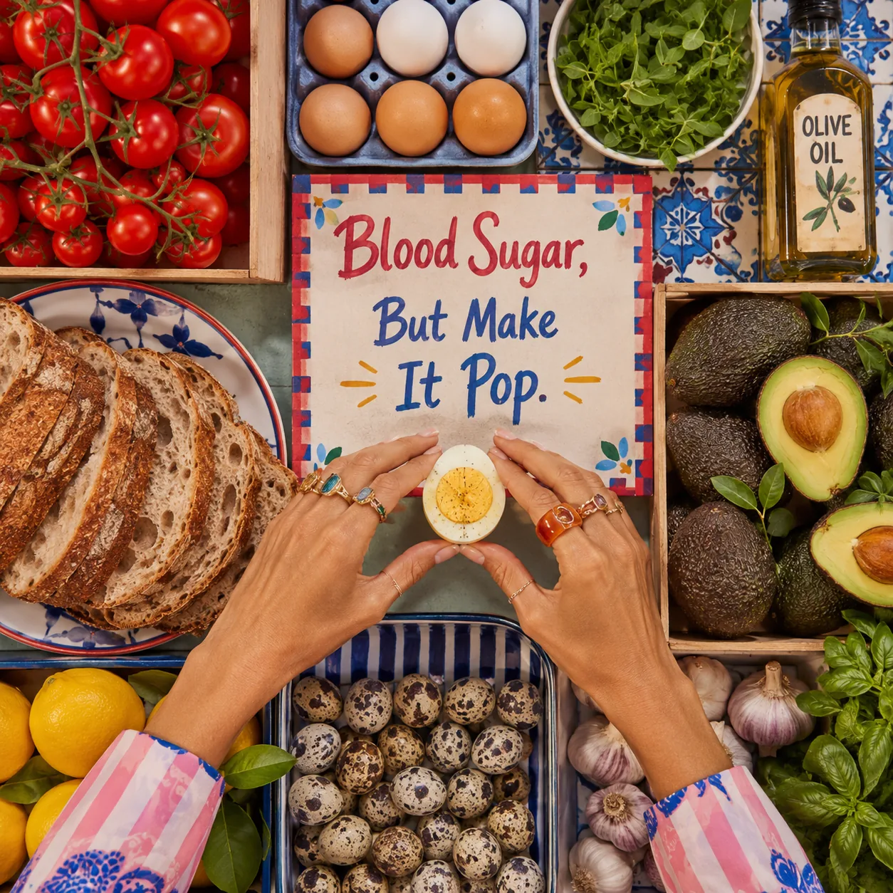
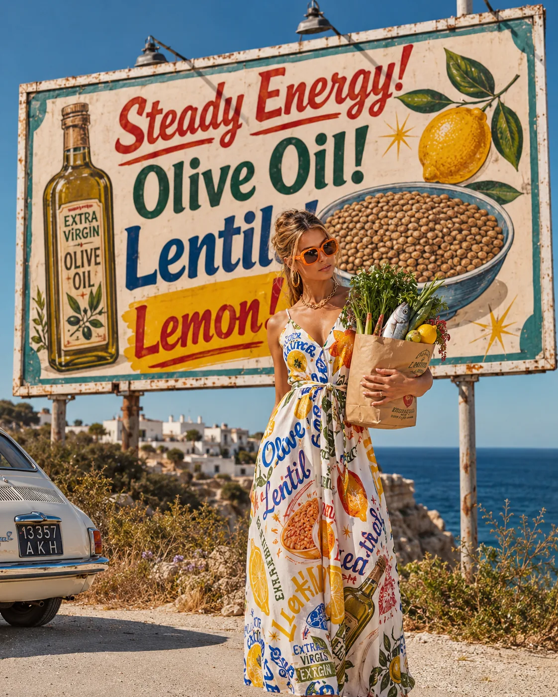
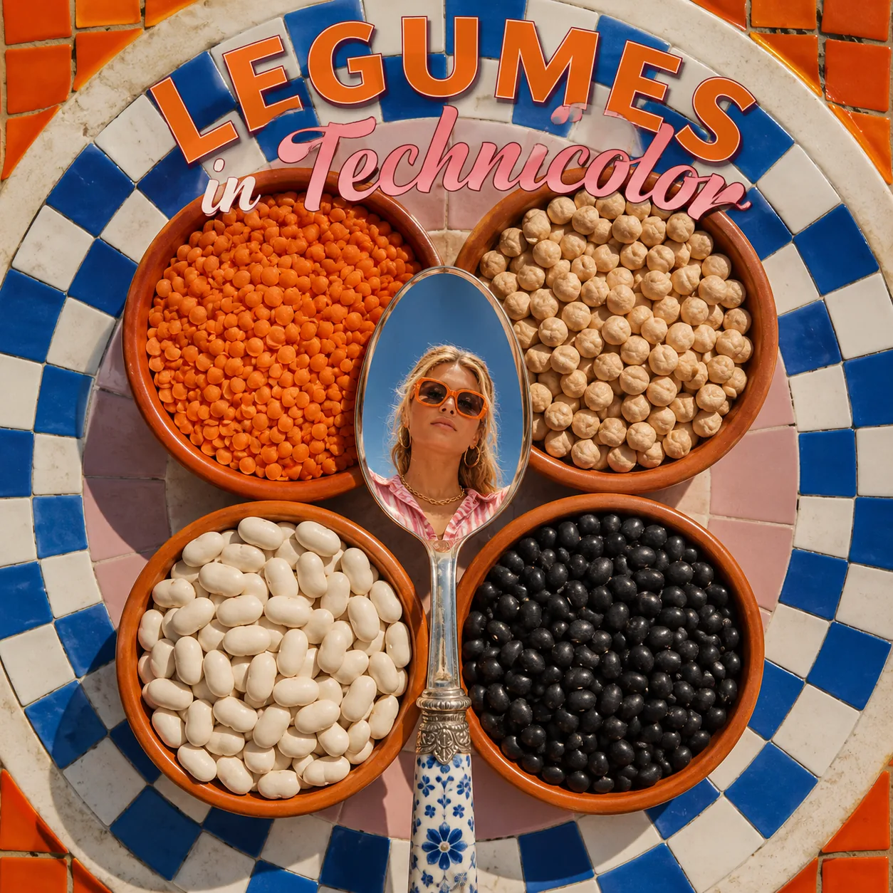
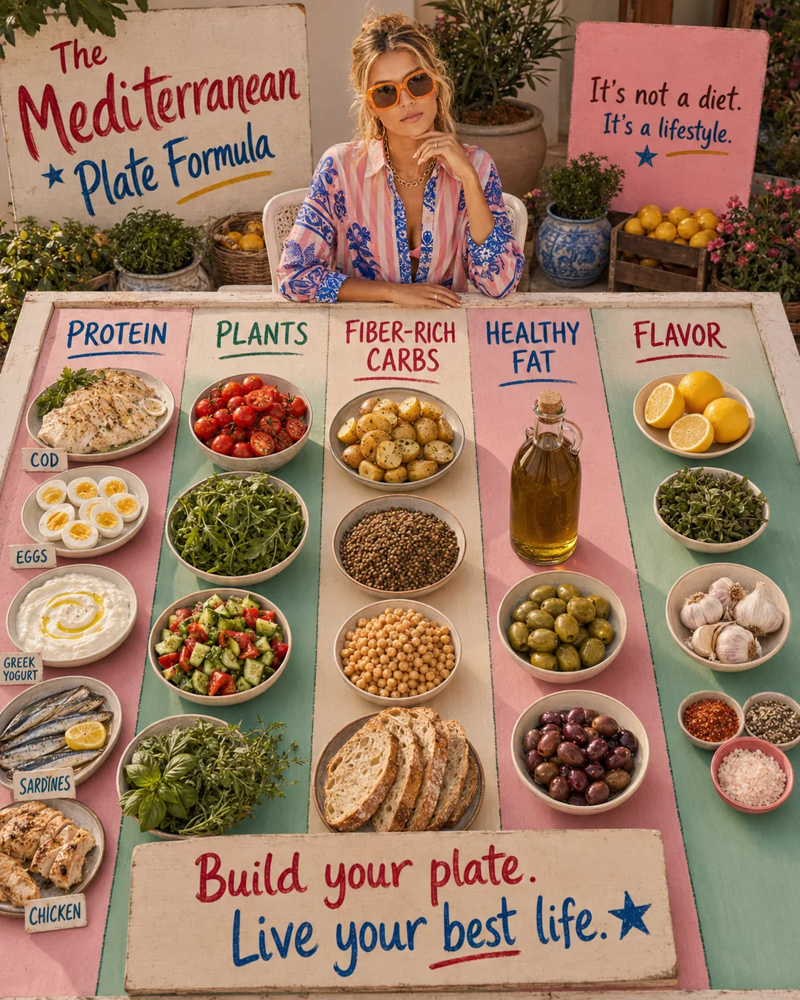
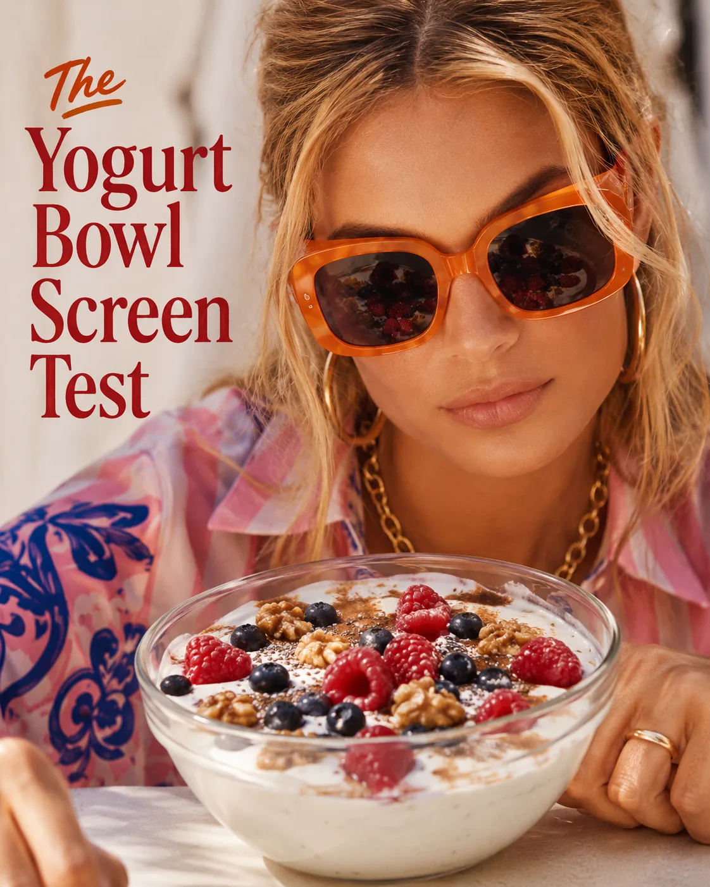

Mediterranean Diet for Women Over 40: What to Eat and Why It Works
There is a reason the Mediterranean diet keeps coming back into the conversation.
Not as a trend.
Not as a quick fix.
Not as another strict wellness rulebook.
But as one of the most practical, pleasurable, and well-studied ways of eating for long-term health.
For women over 40, this way of eating can feel especially supportive. This is a decade when many women begin to notice changes in energy, body composition, sleep, blood sugar, mood, digestion, cholesterol, inflammation, and hormonal patterns.
Sometimes the body simply feels less forgiving than it used to.
The answer is not to eat less and less. It is not to cut out every food you enjoy. And it is not to turn wellness into another full-time job.
The Mediterranean diet offers something calmer.
It is built around real food: vegetables, fruit, beans, lentils, whole grains, fish, olive oil, herbs, nuts, seeds, yogurt, eggs, and simple meals that feel both nourishing and satisfying.
It supports your body without asking you to live in restriction.
That is why it works so beautifully for many women over 40.

## What Is the Mediterranean Diet?
The Mediterranean diet is not one exact diet plan.
It is a flexible eating pattern inspired by traditional diets from countries around the Mediterranean Sea. There is no single definition, but it usually emphasizes vegetables, fruits, whole grains, beans, nuts, seeds, olive oil, and herbs and spices. Mayo Clinic describes it as a heart-healthy eating plan built around these foods, with olive oil as a key fat source. (Mayo Clinic)
The Mediterranean diet commonly includes:
* vegetables
* fruits
* legumes such as beans, lentils, and chickpeas
* whole grains
* extra virgin olive oil
* nuts and seeds
* herbs and spices
* fish and seafood
* yogurt and cheese in moderate amounts
* eggs and poultry
* smaller amounts of red meat and sweets
Cleveland Clinic describes the Mediterranean diet as a pattern that emphasizes plant-based foods and healthy fats, with extra virgin olive oil as the main fat source. It also notes that this eating pattern may reduce the risk of cardiovascular disease and other chronic conditions. (Cleveland Clinic)
But what makes it so useful is not only the food list.
It is the rhythm.
Meals are colorful.
Fats are mostly unsaturated.
Protein is included.
Plants are abundant.
Food still feels pleasurable.
For women who are tired of extreme diets, this matters.

## Why the Mediterranean Diet Works So Well After 40
After 40, women often need an approach that supports several systems at once.
Not just weight.
Not just calories.
Not just “clean eating.”
The Mediterranean diet works well because it supports the foundations that become increasingly important in this stage of life:
* heart health
* metabolic health
* blood sugar balance
* healthy inflammation regulation
* gut health
* hormonal transitions
* brain health
* muscle maintenance
* steady energy
* long-term sustainability
A 2024 systematic review of Mediterranean diet interventions in menopausal women found that adherence to the Mediterranean diet may support improvements in several markers, including blood pressure, triglycerides, total cholesterol, LDL cholesterol, weight, and blood omega-6 to omega-3 ratio. (PMC)
This does not mean the Mediterranean diet is a cure for hormonal changes or medical conditions.
It means it is a strong foundation — one that supports the body through a stage of life where nourishment, consistency, and prevention matter more than ever.

### 1. It Supports Heart Health
Heart health becomes especially important for women in midlife.
Cardiovascular risk tends to rise with age, and the menopause transition can bring changes in cholesterol, blood pressure, blood sugar, and body composition for some women.
This is one reason a Mediterranean-style eating pattern can be so valuable.
The Mediterranean diet has one of the strongest bodies of evidence for cardiovascular health. A review published in Circulation Research describes the available evidence on the traditional Mediterranean diet and cardiovascular health as large, strong, and consistent. (AHA Journals)
This makes sense when you look at the foods it emphasizes:
* olive oil instead of less supportive fats
* fish and seafood
* nuts and seeds
* beans and lentils
* vegetables and fruits
* whole grains
* herbs and spices
* fewer ultra-processed foods
For women over 40, eating for heart health is not something to postpone until later.
It is part of caring for the body now.
Not fearfully.
Practically.

### 2. It Supports Metabolic Health and Blood Sugar
The Mediterranean diet is also supportive for metabolic health because it naturally includes many foods that help with blood sugar stability.
Think:
* protein from fish, eggs, yogurt, legumes, poultry, and seafood
* fiber from vegetables, beans, lentils, fruit, and whole grains
* healthy fats from olive oil, nuts, seeds, avocado, and fish
* fewer highly processed carbohydrates eaten alone
This combination helps meals feel more satisfying and often supports steadier energy.

For women over 40, this can be especially helpful because blood sugar swings may become more noticeable with stress, poor sleep, lower muscle mass, hormonal changes, or inconsistent eating.
The Mediterranean pattern has also been linked to a lower risk of type 2 diabetes and metabolic syndrome in Mayo Clinic’s Mediterranean diet overview. (mcforms.mayo.edu)
If this is an area you want to understand more deeply, read [Blood Sugar Balance for Women: What It Means and Why It Matters](/journal/blood-sugar-balance-for-women/) and [Metabolic Health for Women Over 35: A Simple Guide](/journal/metabolic-health-for-women-over-35/).

### 3. It Supports Healthy Inflammation Balance
Anti-inflammatory eating and Mediterranean eating overlap beautifully.
Both emphasize:
* colorful plants
* olive oil
* nuts and seeds
* legumes
* fish
* herbs and spices
* minimally processed foods
This does not mean inflammation is controlled by food alone. Stress, sleep, movement, medical conditions, alcohol, smoking, environmental exposures, and body composition can all play a role.
But food is one of the most practical places to begin.
A Mediterranean-style pattern is rich in fiber, antioxidants, polyphenols, and unsaturated fats — all part of a food environment that may support healthier inflammatory balance.
For a full beginner’s guide, read [Anti-Inflammatory Eating for Women: A Practical Beginner’s Guide](/journal/anti-inflammatory-eating-for-women/).

### 4. It Supports Hormonal Transitions
The Mediterranean diet does not “balance hormones” in a magical way.
No diet does.
But it can support the foundations that influence how women feel during perimenopause, menopause, and beyond.
These foundations include:
* blood sugar stability
* adequate protein
* enough healthy fats
* fiber intake
* micronutrients
* gut health
* heart health
* reduced reliance on ultra-processed foods
* steady energy
* better meal satisfaction
This matters because hormonal transitions can affect sleep, mood, body composition, cravings, hot flashes, cycle changes, and energy.
A European Menopause and Andropause Society position-style review notes that the Mediterranean diet may improve several areas relevant to menopausal health, including cardiovascular risk factors such as blood pressure, cholesterol, and blood glucose levels, as well as mood and some symptoms of menopause. (Maturitas)
That does not mean food replaces medical care. If symptoms are disruptive, medical support matters.
But food can become a daily form of support — steady, quiet, and deeply practical.

For more on fats and hormonal support, read [Healthy Fats for Hormones, Skin, and Energy](/journal/healthy-fats-for-hormones-skin-and-energy/).

### 5. It Supports Muscle, Strength, and Healthy Aging
One common misconception is that the Mediterranean diet is only about vegetables and olive oil.
But for women over 40, protein still matters.
A Mediterranean-style approach can support muscle when it includes enough protein from:
* fish
* seafood
* Greek yogurt
* eggs
* poultry
* beans
* lentils
* chickpeas
* tofu or tempeh, if you include them
* cottage cheese
* lean meats occasionally, if preferred
Muscle is one of the most important assets for women after 40. It supports metabolism, insulin sensitivity, posture, strength, bone health, and independence with age.
This is why Mediterranean eating should not become a low-protein salad diet.

A beautiful plate of vegetables is lovely. But if it does not include enough protein, you may feel hungry, tired, and less supported.
For body composition and strength goals, read [Body Recomposition for Women: Nutrition Basics](/journal/body-recomposition-for-women-nutrition-basics/) and [Why Protein Matters More as You Age](/journal/why-protein-matters-more-as-you-age/).

### 6. It Supports Steadier Energy
Many women over 40 do not just want to “eat healthy.”
They want to feel better.
Less foggy.
Less snacky.
Less tired after meals.
Less dependent on caffeine.
Less pulled between restriction and cravings.
Mediterranean eating can help because the meals are naturally balanced when built well.
For example:
* Greek yogurt with berries, walnuts, and chia seeds
* eggs with greens, tomatoes, olive oil, and sourdough
* salmon with potatoes, vegetables, and herbs
* lentil soup with olive oil and a side salad
* tuna and white bean salad with greens and lemon
* chicken with quinoa, roasted vegetables, and tahini
These meals include protein, fiber, carbohydrates, healthy fats, and flavor.
That combination is often much better for energy than coffee alone, a low-protein breakfast, or a very light lunch that leads to evening cravings.
For more practical guidance, read [How to Build a Blood-Sugar-Friendly Breakfast](/journal/how-to-build-a-blood-sugar-friendly-breakfast/) and [Why You Feel Tired After Eating — and What May Help](/journal/why-you-feel-tired-after-eating-and-what-may-help/).

## What to Eat on a Mediterranean Diet
Let’s make this simple.
The Mediterranean diet is not about rare ingredients or complicated recipes. It is about returning to a few strong foundations often.

### 1. Vegetables and Herbs
Vegetables are central to Mediterranean eating.
Aim for variety across the week, not perfection at every meal.
Good options include:
* tomatoes
* leafy greens
* cucumber
* peppers
* zucchini
* eggplant
* onions
* garlic
* mushrooms
* carrots
* broccoli
* cauliflower
* artichokes
* asparagus
* cabbage
* herbs such as parsley, basil, mint, dill, thyme, rosemary, and oregano
Ways to use them:
* chopped salads
* roasted vegetable trays
* sautéed greens
* vegetable soups
* omelets
* grain bowls
* pasta dishes
* stews
* side dishes with olive oil and lemon
A simple beginner goal:
Add color to two meals per day.

### 2. Fruits and Berries
Fruit brings fiber, water, vitamins, minerals, and polyphenols.
Good options include:
* berries
* oranges
* apples
* pears
* kiwi
* figs
* grapes
* peaches
* plums
* cherries
* pomegranate
Pair fruit with protein or healthy fats when you want a more satisfying snack.
Examples:
* berries with Greek yogurt
* apple with almond butter
* orange with walnuts
* pear with cottage cheese
* figs with yogurt
* pomegranate over salad
Fruit is not something to fear.
It is one of the simplest ways to add color and pleasure to your diet.

### 3. Beans, Lentils, and Chickpeas
Legumes are one of the most valuable Mediterranean foods.

They provide fiber, plant protein, slow-digesting carbohydrates, and minerals. They are also affordable and versatile.
Options include:
* lentils
* chickpeas
* white beans
* cannellini beans
* black beans
* kidney beans
* split peas
* fava beans
Ideas:
* lentil soup with olive oil and herbs
* chickpea salad with cucumber, tomatoes, lemon, and parsley
* white bean dip
* beans with tuna and greens
* hummus with vegetables and eggs
* lentil bowls with tahini
* bean stew with tomatoes and spinach
If legumes make you bloated, start with smaller portions and increase gradually.

### 4. Whole Grains and Fiber-Rich Carbohydrates
The Mediterranean diet includes carbohydrates — but usually in a more nourishing context.
Good options include:
* oats
* barley
* farro
* quinoa
* brown rice
* whole grain pasta
* rye bread
* whole grain sourdough
* potatoes
* sweet potatoes
* bulgur
* buckwheat
Carbohydrates are often more supportive when paired with protein, healthy fats, and plants.
Examples:
* oats with Greek yogurt and walnuts
* pasta with tuna, tomatoes, olive oil, and spinach
* potatoes with salmon and greens
* quinoa with chicken, vegetables, and tahini
* sourdough with eggs and avocado
You do not need to avoid carbs after 40. You may simply need to build them better.

### 5. Extra Virgin Olive Oil
Extra virgin olive oil is the signature fat of the Mediterranean diet.
Use it as your main added fat when possible.
Try it:
* over salads
* with roasted vegetables
* in soups
* over beans and lentils
* with fish
* on eggs
* in dips and dressings
* with herbs, lemon, and garlic
Olive oil helps meals feel satisfying and pleasurable. This is one reason Mediterranean eating is easier to sustain than low-fat, dry, restrictive plans.

### 6. Fish and Seafood
Fish and seafood are important protein sources in Mediterranean eating, especially fatty fish rich in omega-3 fats.
Good choices include:
* salmon
* sardines
* mackerel
* trout
* anchovies
* herring
* tuna, in moderation
* shrimp
* mussels
* clams
* cod
* sea bass
Ideas:
* salmon with greens and potatoes
* sardines on sourdough with tomatoes
* tuna and white bean salad
* shrimp with rice and vegetables
* cod with tomatoes, olives, and herbs
* mackerel with cucumber salad
If you do not eat fish, focus on other proteins and include plant-based omega-3 sources such as chia seeds, flaxseed, hemp seeds, and walnuts.

### 7. Nuts and Seeds
Nuts and seeds bring healthy fats, fiber, minerals, and texture.
Options include:
* walnuts
* almonds
* pistachios
* hazelnuts
* pumpkin seeds
* chia seeds
* flaxseed
* hemp seeds
* sesame seeds
* tahini
Ways to use them:
* walnuts in yogurt
* almonds with fruit
* chia seeds in oats
* tahini over bowls
* pumpkin seeds on soup
* pistachios on salad
* sesame seeds over vegetables
Because they are energy-dense, use them intentionally rather than endlessly. A small portion can be enough.

### 8. Yogurt, Eggs, Poultry, and Other Proteins
Mediterranean eating includes more than fish and beans.
Depending on your preferences, you can also include:
* Greek yogurt
* kefir
* cottage cheese
* eggs
* chicken
* turkey
* small amounts of cheese
* tofu or tempeh
* occasional lean red meat, if you eat it
A Cleveland Clinic podcast on Mediterranean-style eating notes that protein often comes mainly from fish, but poultry, lean meats in small amounts, and dairy such as Greek yogurt or cottage cheese can also fit into the pattern. (Cleveland Clinic)
For women over 40, the key is to make sure protein does not get lost.
Mediterranean eating should feel abundant, not like a bowl of lettuce with a drizzle of olive oil and no substance.

### 9. Flavor Builders
This is where Mediterranean food becomes joyful.
Use more:
* lemon
* vinegar
* garlic
* onion
* parsley
* dill
* basil
* mint
* oregano
* thyme
* rosemary
* cumin
* paprika
* black pepper
* mustard
* capers
* olives
* sun-dried tomatoes
Flavor matters because consistency matters.
You are more likely to keep eating nourishing food when it actually tastes good.

## Foods to Limit Without Fear
The Mediterranean diet is not a purity test.
Still, some foods are best kept as occasional rather than foundational.
Limit:
* sugary drinks
* frequent pastries and sweets
* processed meats
* deep-fried foods
* ultra-processed snacks
* refined carbohydrates eaten alone
* large amounts of butter, cream, or processed high-fat foods
* excessive alcohol
* very low-protein meals
This does not mean you can never have dessert, pizza, wine, or bread.
It means your everyday pattern carries the most weight.
A piece of cake at dinner with friends is not the problem. Living on coffee, snacks, and low-protein meals while feeling exhausted is the bigger issue.
Mediterranean eating is not about fear.
It is about returning to foods that support you most of the time.

## How to Build a Mediterranean Plate
Use this simple formula:
Protein + colorful plants + fiber-rich carbohydrate + healthy fat + flavor
Choose Protein
Fish, eggs, Greek yogurt, poultry, lentils, beans, chickpeas, seafood, tofu, cottage cheese.
Add Colorful Plants
Tomatoes, greens, cucumber, peppers, eggplant, zucchini, herbs, berries, citrus.
Add Fiber-Rich Carbohydrates
Potatoes, oats, quinoa, whole grains, beans, lentils, fruit, whole grain bread.
Add Healthy Fat
Extra virgin olive oil, avocado, nuts, seeds, tahini, olives, fatty fish.
Add Flavor
Lemon, garlic, herbs, spices, vinegar, capers, mustard.
Examples:
* salmon + potatoes + greens + olive oil + lemon
* Greek yogurt + berries + oats + walnuts + cinnamon
* eggs + sourdough + tomatoes + avocado + herbs
* lentils + roasted vegetables + tahini + parsley
* chicken + quinoa + cucumber salad + olive oil dressing
This is the kind of meal structure that supports energy, metabolism, and satisfaction.

## Mediterranean Breakfast Ideas
A Mediterranean breakfast can be sweet or savory. The key is to include enough protein and fiber so you feel steady.
Try:
* Greek yogurt with berries, chia seeds, walnuts, and cinnamon
* eggs with tomatoes, spinach, avocado, and sourdough
* cottage cheese with pear, pistachios, and cinnamon
* oats with Greek yogurt, flaxseed, berries, and almond butter
* smoked salmon with rye bread, cucumber, lemon, and dill
* tofu scramble with vegetables, olive oil, and potatoes
* kefir smoothie with berries, chia seeds, and oats
For more ideas, read [High-Protein Breakfast Ideas for Steady Energy](/journal/high-protein-breakfast-ideas-for-steady-energy/).

## Mediterranean Lunch and Dinner Ideas
These meals are simple, flexible, and easy to repeat.
Try:
* salmon with roasted potatoes, greens, olive oil, and lemon
* lentil soup with herbs and a side salad
* chickpea salad with cucumber, tomatoes, parsley, olive oil, and tahini
* chicken bowl with quinoa, roasted vegetables, and yogurt sauce
* sardines on sourdough with tomatoes, arugula, and olives
* tofu with rice, vegetables, sesame, and herbs
* tuna and white bean salad with greens and lemon
* whole grain pasta with tomatoes, garlic, olive oil, spinach, and tuna
* egg frittata with vegetables and side salad
* shrimp with rice, peppers, herbs, and olive oil
The best Mediterranean meals are not complicated. They are built from good ingredients and repeated often.

## Mediterranean Snacks
Snacks can be part of this eating pattern, especially when they include protein, fiber, or healthy fats.
Try:
* Greek yogurt with berries
* apple with almond butter
* hummus with vegetables
* boiled eggs with tomatoes
* cottage cheese with fruit
* walnuts with orange slices
* tuna on whole grain crackers
* roasted chickpeas
* kefir with cinnamon
* olives with cucumber and cheese
* chia pudding with berries
For more ideas, read [High-Protein Snacks That Actually Keep You Full](/journal/high-protein-snacks-that-keep-you-full/).

## A Simple 3-Day Mediterranean Meal Rhythm
This is not a strict meal plan. It is a simple example to show how Mediterranean eating can look in real life.
**Day 1**
Breakfast: Greek yogurt with berries, chia seeds, walnuts, and cinnamon
Lunch: Tuna and white bean salad with greens, olive oil, lemon, and herbs
Snack: Apple with almond butter
Dinner: Salmon with potatoes, broccoli, olive oil, and a side salad
**Day 2**
Breakfast: Eggs with spinach, tomatoes, avocado, and sourdough
Lunch: Lentil soup with herbs and Greek yogurt on the side
Snack: Hummus with cucumber and carrots
Dinner: Chicken or tofu bowl with quinoa, roasted vegetables, tahini, and lemon
**Day 3**
Breakfast: Oats with Greek yogurt, berries, flaxseed, and cinnamon
Lunch: Chickpea salad with cucumber, tomatoes, parsley, olive oil, and boiled eggs
Snack: Cottage cheese with pear and pistachios
Dinner: Whole grain pasta with tomatoes, garlic, spinach, olive oil, and sardines or tofu
Notice the rhythm:
Protein.
Plants.
Fiber.
Healthy fats.
Flavor.
That is the foundation.

## Common Mistakes to Avoid
### 1. Making It Too Low-Protein
A Mediterranean plate should still include protein, especially for women over 40. Do not let it become only vegetables and olive oil.
### 2. Fearing Carbohydrates
The Mediterranean diet includes whole grains, potatoes, fruit, beans, and lentils. Carbohydrates can support energy, training, mood, and satisfaction when paired well.
### 3. Adding Olive Oil but Ignoring the Rest
Olive oil is wonderful, but it does not make an otherwise low-nutrient pattern automatically healthy. The whole pattern matters.
### 4. Treating It Like a Strict Diet
This way of eating is flexible. You do not need perfect Mediterranean meals every day. You need a supportive rhythm you can return to.
### 5. Forgetting Strength Training
Food matters, but women over 40 also need muscle-supporting movement. Mediterranean eating pairs beautifully with strength training, walking, and recovery.
### 6. Expecting Instant Results
The Mediterranean diet is not a quick reset. It is a long-term pattern. Some benefits, like steadier energy or better digestion, may appear sooner. Other changes take time.

## How to Start This Week
Start with three simple shifts.
### 1. Use Olive Oil, Lemon, and Herbs More Often
This instantly makes meals feel more Mediterranean and more satisfying.
### 2. Add Legumes Twice This Week
Try lentil soup, hummus, chickpea salad, or white beans with tuna and greens.
### 3. Build One Mediterranean Breakfast
Choose Greek yogurt with berries and walnuts, or eggs with tomatoes and avocado. Repeat it until it feels easy.
That is enough to begin.
You do not need to overhaul your whole kitchen.

## Related Reading

- [Anti-Inflammatory Eating for Women: A Practical Beginner’s Guide](/journal/anti-inflammatory-eating-for-women) — explains the anti-inflammatory side of Mediterranean-style meals.
- [Healthy Fats for Hormones, Skin, and Energy](/journal/healthy-fats-for-hormones-skin-and-energy) — goes deeper on olive oil, nuts, seeds, fish, and other satisfying fats.
- [Fiber for Women’s Health: Gut, Hormones, and Blood Sugar](/journal/fiber-for-womens-health-gut-hormones-blood-sugar) — helps you build the plant-rich foundation of the Mediterranean pattern.

## Final Thoughts
The Mediterranean diet works for women over 40 because it supports the body in a full, intelligent way.
It supports heart health, metabolic health, blood sugar balance, inflammation, hormones, gut health, energy, and long-term aging — not through restriction, but through nourishment.
It is not about eating perfectly.
It is about building meals you can return to:
Vegetables.
Protein.
Olive oil.
Beans.
Fish.
Fruit.
Whole grains.
Nuts.
Herbs.
Flavor.
Pleasure.
This is what makes it sustainable.
For women who are tired of extremes, the Mediterranean diet offers something deeply refreshing: a way of eating that feels both health-supportive and human.
Not smaller.
Not stricter.
Not colder.
Just steadier, more generous, and more connected to real life.

Gentle note: This article is for educational purposes only and does not replace medical advice. If you have diabetes, heart disease, high cholesterol, kidney disease, digestive conditions, food allergies, a history of disordered eating, or significant hormonal symptoms, speak with a qualified healthcare professional or registered dietitian for personalized guidance.
