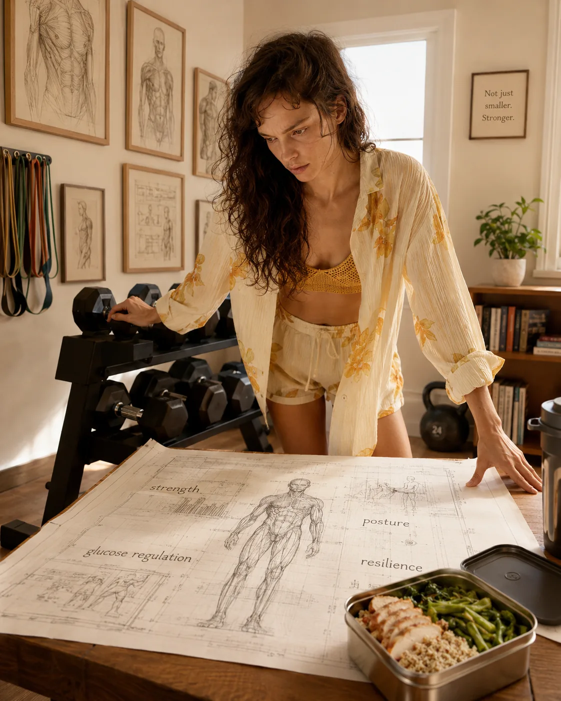
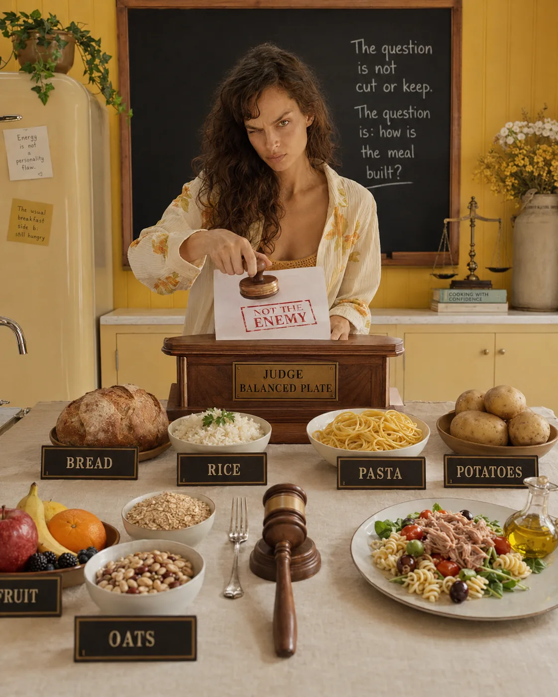
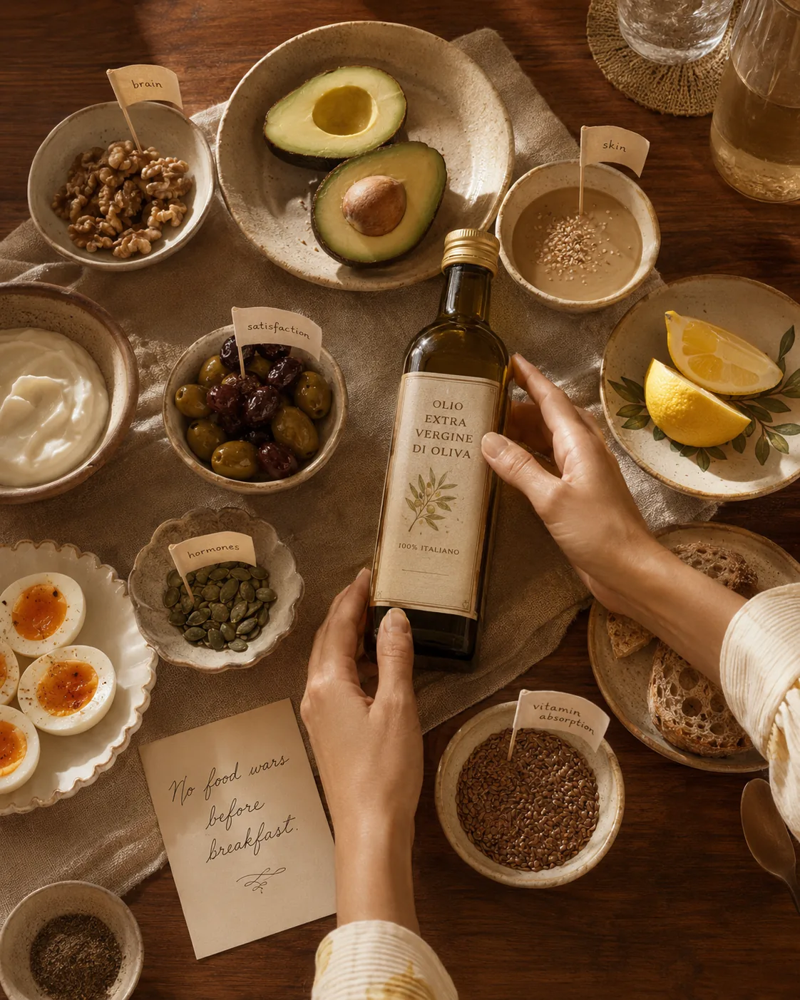
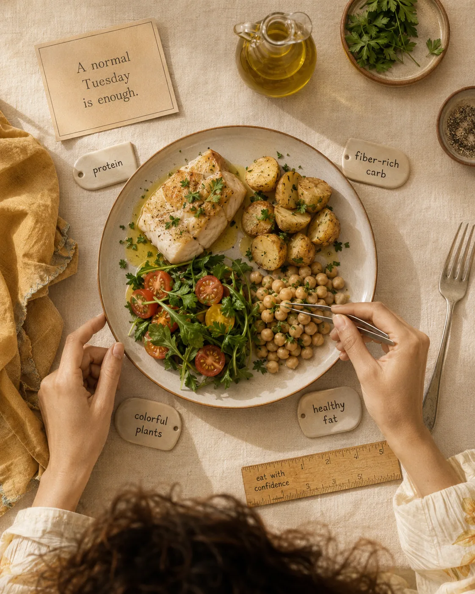

There is a moment many women recognize.
You are eating more or less the same way you always have, but your body feels different.
Your energy is not as steady. Your cravings feel louder. Your usual breakfast does not keep you full. You feel tired after meals, more sensitive to stress, less resilient after poor sleep, or frustrated because your body composition is changing even though you are “not doing anything wrong.”
And then, very quickly, the advice around you gets louder.
Eat less.
Cut carbs.
Try fasting.
Take this supplement.
Balance your hormones.
Fix your metabolism.
Be more disciplined.
But most women do not need more pressure around food.
They need a calmer, more supportive foundation.
Nutrition for women over 35 is not about chasing a perfect diet. It is about learning how to nourish a body that is carrying a lot — physically, hormonally, emotionally, and mentally.
It is about supporting your energy, metabolism, hormones, digestion, mood, strength, and long-term health in a way that still feels realistic for your actual life.
Not a life where you have endless time to meal prep.
Not a life where stress disappears.
Not a life where every meal is perfectly planned.
Your real life.

## Why Nutrition Can Start to Feel Different After 35

After 35, many women begin to notice subtle changes in their body.
Sometimes it starts with energy.
You wake up tired, even after sleeping. You need more coffee than before. You feel fine in the morning, but by mid-afternoon your body seems to disappear into a fog of cravings, fatigue, and low motivation.
Sometimes it shows up in digestion.
Meals that once felt normal now leave you bloated or heavy. You feel more sensitive to alcohol, sugar, or eating late at night.
Sometimes it shows up in body composition.
Your clothes fit differently. Your waist feels softer. You feel like you are doing the same things, but getting a different result.
It can feel confusing. Even unfair.
But these changes usually do not mean your body is broken. They often mean your body needs a different level of support than it did ten years ago.
As women move through their mid-30s and 40s, several things can shift:
* muscle mass can gradually decline if it is not supported
* stress may have a stronger effect on energy and appetite
* sleep can become more fragile
* insulin sensitivity may change
* hormonal fluctuations may become more noticeable
* recovery from workouts, busy weeks, and emotional stress may take longer
* years of dieting or under-eating can catch up with the body
And at the same time, life is usually not getting lighter.
Many women in this stage are managing careers, relationships, family responsibilities, emotional labor, financial pressure, aging parents, children, businesses, homes, and their own health — often while quietly feeling that they should still look, perform, and function as if none of it affects them.
So when a woman says, “My metabolism has changed,” she may not only be talking about calories.
She may be talking about exhaustion.
She may be talking about stress.
She may be talking about a body that no longer responds well to being pushed, restricted, ignored, and expected to keep going.
That is why the answer is not always to eat less.
Often, the better place to begin is this:
How can I nourish my body in a way that helps me feel more stable, strong, and supported?

## The First Shift: Eat Enough, Not Perfectly

One of the biggest nutrition traps for women over 35 is trying to solve every body change by becoming more restrictive.
Less food.
Less carbs.
Less fat.
Smaller portions.
Longer gaps between meals.
More rules.
At first, this can feel responsible. Like you are “getting back on track.”
But over time, constantly eating too little can leave the body feeling under-supported.
You may notice:
* stronger cravings at night
* low energy during the day
* irritability or mood dips
* poor workout recovery
* trouble building or maintaining muscle
* more snacking, even when you are trying not to
* feeling cold, depleted, or wired
* needing caffeine to push through
* feeling hungry but not knowing what to eat
This is where many women blame themselves.
They think they have no discipline.
But often, the body is not asking for more discipline. It is asking for more nourishment.
This does not mean you need to eat without awareness. It does not mean nutrition has no structure. It simply means that your body cannot thrive on being constantly underfed, especially if your life is already demanding.
A supportive nutrition approach after 35 should help you feel more steady.
More satisfied.
More clear.
More capable of moving through your day without feeling like you are in a constant negotiation with your hunger, cravings, and energy.
The goal is not to eat perfectly.
The goal is to eat in a way your body can trust.

## Protein: A Quiet Game-Changer for Women Over 35

If there is one place many women can start, it is protein.
Not in an obsessive way. Not in a “track every gram forever” way. But in a practical, grounded way.
Protein supports muscle, recovery, immune function, fullness, body composition, and healthy aging. It also helps meals feel more satisfying, which can make cravings feel less urgent.
Many women do eat protein, but often not enough throughout the day.
A little milk in coffee.
A small amount of cheese in a salad.
A few bites of chicken at dinner.
Technically, yes, there is protein there.
But it may not be enough to support a woman who is training, working, managing stress, sleeping imperfectly, and trying to feel strong in her body.
A common pattern looks like this:
You start the day with coffee and something light.
Lunch is a salad or something quick.
By late afternoon, cravings arrive.
Dinner becomes bigger than planned.
Then you want something sweet.
And you wonder why your willpower disappears at night.
This is not a character flaw.
It may simply be that your earlier meals did not give your body enough.
Including a clear protein source at each meal can make a noticeable difference.
Good protein sources include:
* eggs
* Greek yogurt
* cottage cheese
* fish
* chicken
* turkey
* lean meat
* tofu
* tempeh
* lentils
* beans
* edamame
* protein-rich grains
* a protein powder, if it suits your body and lifestyle
Breakfast is often the most powerful place to begin.
A higher-protein breakfast can help you feel fuller, steadier, and less pulled toward sugar or caffeine later in the day.
It does not need to be complicated.
Eggs with sourdough.
Greek yogurt with berries and nuts.
Cottage cheese with fruit.
Tofu scramble with avocado.
Overnight oats with added protein.
Smoked salmon with toast and cucumber.
Simple food. Better structure. Less chaos later.
*Internal link suggestion: [How Much Protein Do Women Over 35 Really Need?](/journal/how-much-protein-do-women-over-35-need)*
*Internal link suggestion: [High-Protein Breakfast Ideas for Steady Energy](/journal/high-protein-breakfast-ideas-for-steady-energy)*
*Internal link suggestion: [Why Protein Matters More as You Age](/journal/why-protein-matters-more-as-you-age)*

## Blood Sugar Balance: Why Your Energy Feels So Up and Down

Blood sugar balance can sound clinical, but in real life it often feels very familiar.
It is the mid-afternoon crash.
The sudden need for something sweet.
The shaky feeling when lunch was too light.
The brain fog after a carb-heavy meal.
The irritability that arrives when you have gone too long without eating.
The feeling of being “out of control” around snacks when your body is actually just under-fueled and dysregulated.
Blood sugar balance is not about fearing carbohydrates.
It is about building meals that give your body a steadier release of energy.
A meal made mostly of refined carbohydrates — for example, a pastry and coffee, or toast with jam — may taste good in the moment but leave you hungry soon after.
When you add protein, fiber, and healthy fats, the same meal becomes more supportive.
This could look like:
* toast with eggs instead of toast alone
* fruit with Greek yogurt instead of fruit alone
* oats with protein and chia seeds instead of plain oats
* rice with salmon, vegetables, and olive oil instead of rice by itself
* crackers with hummus or tuna instead of crackers alone
The goal is not to make every meal perfect.
The goal is to stop sending your body on a rollercoaster and then blaming yourself for feeling dizzy.
For many women, blood sugar support is one of the most compassionate nutrition changes they can make.
Because when energy is steadier, everything feels a little less dramatic.
Your cravings feel less urgent.
Your mood feels less fragile.
Your hunger feels less like an emergency.
Your body feels easier to live in.
*Internal link suggestion: [Blood Sugar Balance for Women: What It Means and Why It Matters](/journal/blood-sugar-balance-for-women)*
*Internal link suggestion: [Why You Feel Tired After Eating — and What May Help](/journal/why-you-feel-tired-after-eating-and-what-may-help)*
*Internal link suggestion: [Simple Ways to Reduce Afternoon Energy Crashes](/journal/simple-ways-to-reduce-afternoon-energy-crashes)*

## Metabolism After 35: It Is Not Just About Eating Less

The word metabolism gets used a lot, usually in a way that makes women feel like their body is either “good” or “bad.”
Fast metabolism, good.
Slow metabolism, bad.
But metabolism is not a moral score.
It is the collection of processes your body uses to turn food into energy, regulate blood sugar, maintain tissue, manage hormones, support body temperature, repair cells, and keep you alive.
It is not just about how many calories you burn during a workout.
For women over 35, supporting metabolism often means supporting the body more intelligently, not punishing it harder.
That includes:
* eating enough protein
* maintaining or building muscle
* strength training regularly
* walking and moving throughout the day
* getting enough sleep where possible
* managing stress realistically
* eating enough fiber
* avoiding repeated crash diets
* giving your body consistent meals
Muscle is especially important.
As women age, muscle becomes one of the most valuable forms of metabolic support. It helps with strength, glucose regulation, posture, independence, body composition, and long-term resilience.
This is why protein and strength training work so well together.
Protein gives the body raw materials.
Strength training gives the body a reason to use them.
You do not need to train like an athlete.
You do not need to build your whole life around fitness.
But you do deserve to feel strong in your body — not just smaller.
*Internal link suggestion: [Metabolic Health for Women Over 35: A Simple Guide](/journal/metabolic-health-for-women-over-35)*
*Internal link suggestion: [Why Your Metabolism Changes in Your 30s and 40s](/journal/why-your-metabolism-changes-in-your-30s-and-40s)*
*Internal link suggestion: [Why Eating Less Is Not Always Better for Your Metabolism](/journal/why-eating-less-is-not-always-better-for-your-metabolism)*

## Carbohydrates Are Not the Problem

Many women reach their late 30s or 40s and start feeling suspicious of carbohydrates.
Bread becomes suspicious.
Rice becomes suspicious.
Pasta becomes a “bad choice.”
Fruit somehow gets dragged into the drama.
But carbohydrates are not the enemy.
Your body uses carbohydrates for energy. Your brain, muscles, nervous system, and workouts can all benefit from them.
The issue is usually not carbohydrates themselves. It is the type, amount, timing, and what they are eaten with.
A bowl of plain cereal may not keep you full.
But oats with Greek yogurt, chia, berries, and nuts? Much more supportive.
A large plate of pasta with no protein may leave you sleepy.
But pasta with tuna, vegetables, olive oil, herbs, and a side salad? Very different.
Carbohydrates can absolutely have a place in healthy nutrition for women over 35.
Supportive sources include:
* oats
* potatoes
* sweet potatoes
* rice
* quinoa
* beans
* lentils
* chickpeas
* fruit
* whole grain bread
* vegetables
* yogurt with berries
Instead of asking, “Should I cut carbs?” a better question may be:
How can I build this meal so it supports my energy better?
That question is calmer.
And usually much more useful.

## Healthy Fats Help Meals Feel Satisfying

For years, many women were taught to be careful with fat.
Then wellness culture shifted, and suddenly fat was praised while carbs were blamed.
But your body does not need another food war.
It needs balance.
Healthy fats support hormone production, brain health, skin health, absorption of certain vitamins, and fullness after meals.
They also make food more satisfying — which matters.
Because a meal can be technically “healthy” and still leave you feeling emotionally and physically unsatisfied.
Helpful fat sources include:
* extra virgin olive oil
* avocado
* nuts
* seeds
* tahini
* fatty fish
* olives
* eggs
* chia seeds
* flaxseeds
The key is not to pour olive oil on everything and hope for the best.
It is to include enough fat to make meals satisfying, while still being aware that fats are energy-dense.
Think of fats as support.
Not something to fear.
Not something to over-glorify.
Just part of a well-built plate.
*Internal link suggestion: [Healthy Fats for Hormones, Skin, and Energy](/journal/healthy-fats-for-hormones-skin-and-energy)*

## Fiber: The Underrated Nutrient Women Need More Of

Fiber is not glamorous, but it is powerful.
It supports digestion, gut health, blood sugar balance, cholesterol, fullness, and healthy hormone metabolism.
Many women focus on calories, sugar, carbs, or supplements before they ever look at fiber.
But fiber is one of those quiet foundations that can change how your body feels day to day.
Fiber-rich foods include:
* vegetables
* berries
* apples
* pears
* beans
* lentils
* chickpeas
* oats
* chia seeds
* flaxseeds
* whole grains
* nuts
* seeds
If you do not currently eat much fiber, do not suddenly double your intake overnight. That is not elegant. That is a bloating appointment.
Increase slowly.
Add berries to breakfast.
Add lentils to a soup.
Add vegetables to dinner.
Add chia seeds to yogurt.
Add chickpeas to a salad.
Small changes count.
Your digestion does not need shock therapy. It needs consistency.
*Internal link suggestion: [Fiber for Women’s Health: Gut, Hormones, and Blood Sugar](/journal/fiber-for-womens-health-gut-hormones-blood-sugar)*

## Nutrition and Hormones After 35

Hormonal changes can begin earlier than many women expect.
Perimenopause can start in the late 30s or 40s for some women, and the changes are not always obvious at first.
It may not begin with hot flashes.
It may begin with worse sleep.
More PMS.
Shorter or heavier cycles.
Mood changes.
More anxiety.
Breast tenderness.
Weight changes.
Cravings.
A lower tolerance for stress.
Feeling like your body is suddenly more sensitive to everything.
Nutrition cannot “fix” hormones in a simplistic way. Your body is more complex than that.
But nutrition can absolutely create a more supportive environment.
That means:
* eating enough
* prioritizing protein
* supporting blood sugar balance
* including healthy fats
* eating enough fiber
* reducing alcohol if it worsens sleep or symptoms
* avoiding crash diets
* supporting gut health
* eating mineral-rich foods
* pairing nutrition with strength training, sleep, and recovery
This is where many women need less intensity and more steadiness.
Because hormonal transitions are not the ideal time to under-eat, overtrain, sleep five hours, drink three coffees, skip breakfast, and wonder why the body feels stressed.
Of course it feels stressed.
It is trying to keep up.
A more supportive approach begins with asking:
What would make my body feel safer, more nourished, and less pushed?
That question can change the entire tone of your health.
Gentle disclaimer: If you are experiencing significant cycle changes, heavy bleeding, intense fatigue, hot flashes, mood changes, unexplained weight changes, or symptoms that concern you, speak with a qualified healthcare professional. Nutrition can be supportive, but it is not a replacement for medical care.

## The Balanced Plate Method: A Simple Way to Eat Better Without Overthinking

When nutrition feels overwhelming, the balanced plate method is one of the easiest places to start.
You do not need to track everything.
You do not need a perfect meal plan.
You do not need to turn your kitchen into a wellness laboratory.
Most meals can be built around four elements:

### 1. Protein

Eggs, Greek yogurt, fish, chicken, tofu, beans, lentils, tempeh, meat, or another protein-rich food.

### 2. Fiber-rich carbohydrates

Potatoes, oats, rice, quinoa, beans, lentils, fruit, or whole grains.

### 3. Colorful plants

Vegetables, herbs, greens, berries, tomatoes, peppers, cucumbers, or whatever you actually enjoy eating.

### 4. Healthy fats

Olive oil, avocado, nuts, seeds, tahini, olives, or fatty fish.
That is it.
This structure is simple enough to use on a busy Tuesday and flexible enough to work with different cultures, cuisines, preferences, and schedules.
A balanced plate could look like:
* Greek yogurt with berries, chia seeds, and walnuts
* eggs with sourdough, avocado, and tomatoes
* salmon with potatoes, olive oil, and greens
* tofu bowl with rice, vegetables, and tahini sauce
* chicken salad with quinoa, chickpeas, herbs, and olive oil
* lentil soup with bread, yogurt, and a side salad
It does not have to be aesthetic.
It has to support you.
*Internal link suggestion: [A Simple Balanced Plate Method for Women Who Feel Overwhelmed by Nutrition](/journal/simple-balanced-plate-method-for-women)*

## Anti-Inflammatory and Mediterranean-Style Eating

For many women over 35, Mediterranean-style eating is one of the most supportive and sustainable approaches.
Not because it is trendy.
Because it is flexible, nourishing, enjoyable, and realistic.
It usually includes:
* vegetables
* fruit
* legumes
* whole grains
* olive oil
* fish
* herbs and spices
* nuts and seeds
* moderate dairy, if tolerated
* minimally processed foods
It supports fiber, healthy fats, blood sugar balance, gut health, and overall nutrient density without making food feel joyless.
Anti-inflammatory eating does not need to become another strict identity.
It can be as simple as:
adding more color,
using olive oil,
eating enough protein,
including fish or omega-3-rich foods,
choosing more legumes,
and reducing the frequency of meals that leave you feeling heavy, tired, or inflamed.
You do not need a perfect anti-inflammatory diet.
You need more meals that make your body feel well.
*Internal link suggestion: [Anti-Inflammatory Eating for Women: A Practical Beginner’s Guide](/journal/anti-inflammatory-eating-for-women)*
*Internal link suggestion: [Mediterranean Diet for Women Over 40: What to Eat and Why It Works](/journal/mediterranean-diet-for-women-over-40)*

## What to Limit Without Becoming Restrictive

There are some things that may be worth reducing if they consistently make you feel worse.
But this is not about fear.
It is about paying attention.
You may feel better with less:
* alcohol, especially if it affects sleep, cravings, anxiety, or hot flashes
* ultra-processed foods that do not keep you full
* very low-protein meals
* sugary snacks eaten alone
* constant grazing without proper meals
* repeated crash diets
* skipping meals and then overeating later
* using caffeine as a replacement for food and rest
The goal is not to make your diet smaller and smaller.
The goal is to understand what supports you and what drains you.
There is room for pleasure. There is room for dinner out. There is room for dessert. There is room for real life.
But if your everyday pattern leaves you tired, hungry, bloated, wired, or constantly craving, your body may be asking for more structure.
Not punishment.
Structure.

## Simple Nutrition Habits to Start This Week

You do not need to change your entire diet this week.
In fact, please do not.
Choose one or two small shifts and let them become familiar.

### 1. Add protein to breakfast

This is often the easiest win for steadier energy.
Try eggs, Greek yogurt, cottage cheese, tofu scramble, smoked salmon, protein oats, or a balanced smoothie.

### 2. Build proper meals before judging your snacks

If you are constantly snacking, first check whether your meals are actually satisfying.
Do they include protein?
Fiber?
Carbohydrates?
Healthy fats?
Many cravings soften when meals become more complete.

### 3. Pair carbohydrates with protein or fat

Instead of fruit alone, try fruit with yogurt.
Instead of toast alone, try toast with eggs.
Instead of crackers alone, try crackers with hummus, tuna, or cheese.
This one change can make snacks feel much more stabilizing.

### 4. Add fiber gently

Add one extra fiber-rich food each day.
Berries. Lentils. Beans. Vegetables. Oats. Chia seeds. Flaxseeds.
No drama. Just consistency.

### 5. Stop skipping meals to “be good”

If skipping meals leads to overeating, cravings, or low energy later, it is not helping you.
A steady eating rhythm can be one of the kindest things you offer your body.

### 6. Think in patterns, not perfection

One meal does not define your health.
What you do most of the time matters more than what you do occasionally.
You are allowed to be human and healthy at the same time.

## A Gentle Note on Supplements

Supplements can be useful, but they are not the foundation.
Before reaching for another supplement, it is worth looking at the basics:
* Are you eating enough protein?
* Are your meals consistent?
* Are you getting enough fiber?
* Are you sleeping as well as realistically possible?
* Are you drinking more alcohol than your body tolerates?
* Are you strength training?
* Are you constantly under-eating?
Some women may benefit from checking vitamin D, iron, B12, thyroid markers, or other labs with a healthcare professional, especially if fatigue is persistent.
Supplements should be personalized, especially if you are pregnant, breastfeeding, taking medication, managing a medical condition, or experiencing significant hormonal symptoms.
More is not always better.
Targeted support is better than a cabinet full of hope.

## Related Reading

- [How Much Protein Do Women Over 35 Really Need?](/journal/how-much-protein-do-women-over-35-need) — helps you turn the protein foundation into practical daily targets.
- [Blood Sugar Balance for Women: What It Means and Why It Matters](/journal/blood-sugar-balance-for-women) — explains why steadier meals can change energy, cravings, and mood.
- [A Simple Balanced Plate Method for Women Who Feel Overwhelmed by Nutrition](/journal/simple-balanced-plate-method-for-women) — gives a simple meal-building structure for everyday use.

## The Bigger Picture: Nutrition Should Support Your Life

The best nutrition approach for women over 35 is not the one that looks the most impressive online.
It is the one you can return to on a normal week.
A busy week.
A stressful week.
A hormonal week.
A week when you are tired, behind on laundry, and not in the mood to reinvent your life through meal prep.
Your body does not need perfection from you.
It needs enough consistency to feel supported.
A nourishing approach to food can help you feel more energized, less reactive around cravings, stronger in your workouts, calmer in your mood, and more connected to your body.
Not because you controlled everything.
But because you started listening to what your body has been asking for:
Enough protein.
Enough food.
More fiber.
Steadier meals.
Less chaos.
More care.
Nutrition after 35 is not about becoming stricter.
It is about becoming more supportive.
Because your body is not a project to constantly fix.
It is the place you live.
And it deserves to feel like home.
