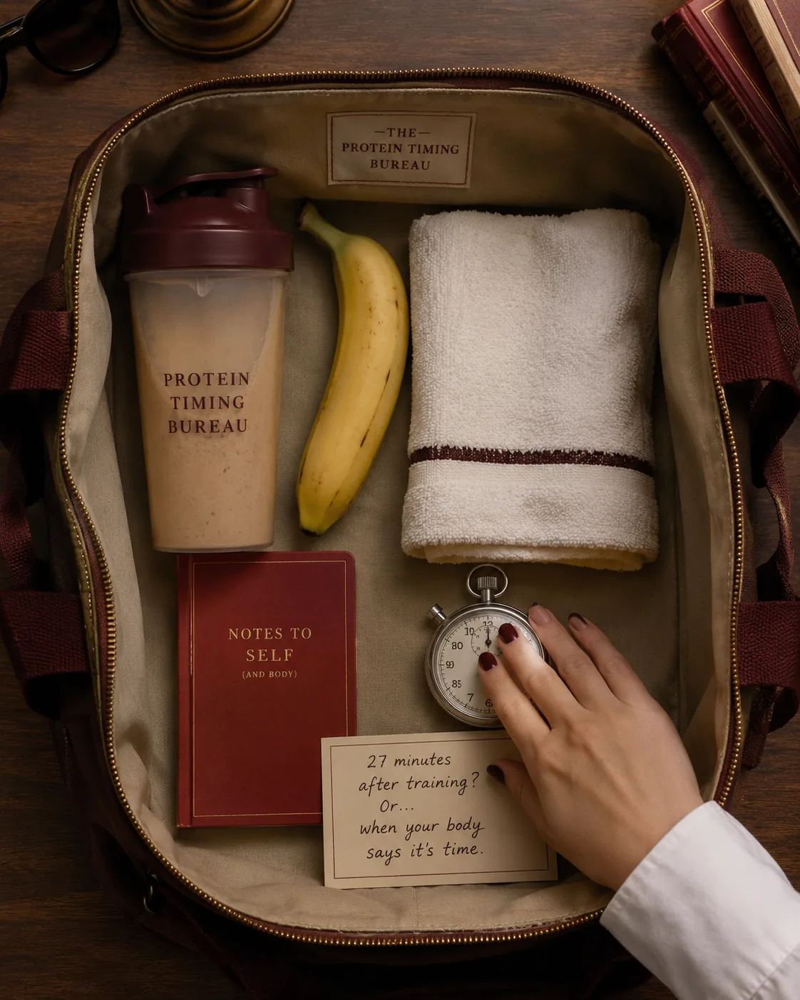
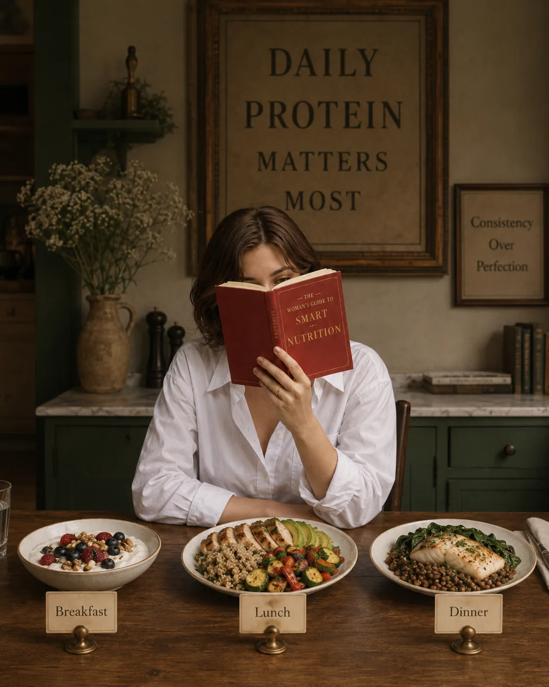
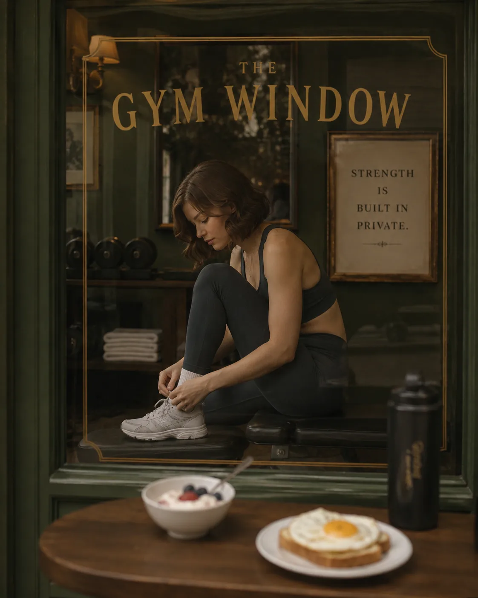
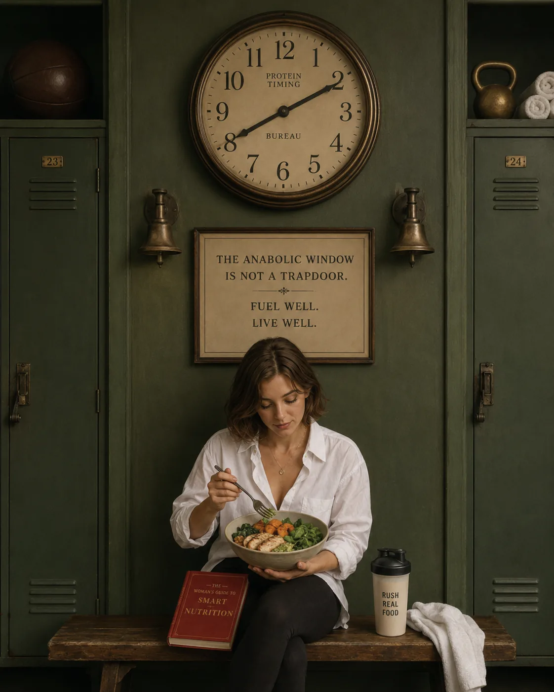
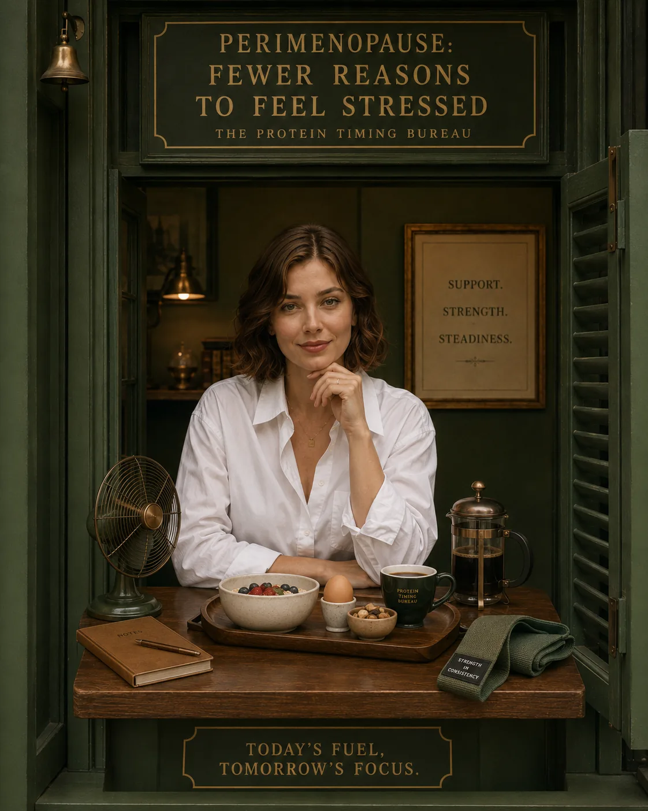

Protein timing can sound like one of those wellness topics that starts simple and then somehow becomes a full-time administrative role.

Eat protein within 30 minutes after training.

No, before training.

No, every three hours.

No, only after lifting.

No, not too late.

No, definitely before bed.

Also, maybe your breakfast is wrong.

Exhausting.

And for many women, this is exactly where nutrition starts to feel overwhelming. Not because they do not care about their health, but because every piece of advice seems to arrive with a rule attached.

So let’s make this calmer.

Protein timing does matter.

But probably not in the strict, stressful way you have been told.

For most women, especially women over 35, the most important thing is eating enough total protein across the day. After that, timing can help you feel more steady, satisfied, strong, and well-recovered.

Not because you need to live by a stopwatch.

Because your body tends to feel better when it receives support consistently not only at the end of the day when you are already tired, hungry, and wondering why dinner suddenly has to solve your entire life.

## The Simple Answer: Daily Protein Matters Most

If you remember one thing, let it be this:

Your total daily protein intake matters more than perfect protein timing.

Research in exercising individuals generally supports a daily protein intake of around 1.4–2.0 grams per kilogram of body weight per day for people who want to support muscle protein balance, especially alongside training. The International Society of Sports Nutrition also notes that protein doses are ideally distributed across the day every 3–4 hours.

So the foundation is not:

Did I have protein exactly 27 minutes after training?

The better foundation is:

Did I eat enough protein today, and did I spread it across meals in a way that supports my body?

That question is more useful.

And much less annoying.

## Why Protein Timing Can Matter More After 35

Protein is important at every age, but many women begin to notice its impact more clearly after 35.

This is the stage where a lot of women start saying things like:

“I feel hungry all day.”

“My body is changing.”

“I recover more slowly.”

“I get cravings at night.”

“I feel tired after lunch.”

“I am eating healthy, but I do not feel strong.”

“I do not understand my metabolism anymore.”

Sometimes the problem is not that your nutrition is terrible.

Sometimes the issue is that your protein is too low, too inconsistent, or too concentrated in one meal.

For example, many women eat very little protein at breakfast and lunch, then have most of their protein at dinner.

That means the body spends much of the day under-supported.

You may be asking your body to handle work, stress, movement, emotional regulation, and training on coffee, a light breakfast, and a salad that is mostly leaves.

Very elegant in theory. Deeply insufficient in practice.

Protein timing matters because it helps support:

* muscle maintenance
* recovery from training
* fullness after meals
* steadier energy
* fewer cravings
* blood sugar balance
* metabolism
* healthy aging
It is not about becoming rigid.

It is about giving your body support before it has to shout for it.

> Related read: [Why Protein Matters More as You Age](/journal/why-protein-matters-more-as-you-age).

## Protein Distribution: The Habit That Matters Most

The most useful form of protein timing is not complicated.

It is simply this:

Spread protein across the day.

Many people naturally eat a small amount of protein at breakfast, a moderate amount at lunch, and a large amount at dinner. But research suggests that distributing protein more evenly across meals may support muscle protein synthesis better than heavily skewing protein toward the evening. One study found that a moderate amount of protein at each meal stimulated 24-hour muscle protein synthesis more effectively than a pattern where most protein was eaten at dinner.

This does not mean every meal needs to be identical.

It does not mean you need to carry a calculator in your handbag.

It simply means your body may respond better when protein shows up more consistently.

A practical target for many women is:

25–35 grams of protein per meal

This might look like:

* breakfast: 25–30 grams
* lunch: 30–35 grams
* dinner: 30–40 grams
* optional snack: 10–20 grams
That rhythm is usually more supportive than:

* breakfast: 5 grams
* lunch: 12 grams
* dinner: 65 grams
* evening snack: chaos
No judgment. Many of us have lived there.

But if energy, cravings, recovery, and fullness feel unstable, protein distribution is a very good place to start.

> Related read: [How Much Protein Do Women Over 35 Really Need?](/journal/how-much-protein-do-women-over-35-need).

## Protein at Breakfast: The Timing Shift Many Women Feel First

If you are going to start with one timing change, start with breakfast.

Breakfast is often the lowest-protein meal of the day. It is also the meal that can set the tone for hunger, cravings, blood sugar, and energy.

A low-protein breakfast might look like:

* coffee only
* toast with jam
* fruit alone
* cereal with a little milk
* a pastry
* plain oats made with water
* a small smoothie with mostly fruit
None of these foods are “bad.”

They are just often incomplete.

A higher-protein breakfast can help you feel more satisfied and less pulled toward snacks later.

Examples:

* Greek yogurt with berries, chia, and walnuts
* eggs with sourdough, avocado, and tomatoes
* cottage cheese with fruit and seeds
* tofu scramble with potatoes or toast
* protein oats with Greek yogurt
* smoked salmon toast with cucumber and herbs
* kefir smoothie with berries and chia
The goal is not to become a breakfast perfectionist.

The goal is to stop starting the day underfed and then blaming yourself when your body asks for more later.

> Related read: [High-Protein Breakfast Ideas for Steady Energy](/journal/high-protein-breakfast-ideas-for-steady-energy).

## Protein Around Workouts: Do You Need It Immediately?

This is where protein timing gets dramatic.

For years, many people were told they had to drink protein immediately after a workout or the whole session would somehow evaporate into the universe.

Thankfully, your body is not that petty.

The “anabolic window” the period after exercise when the body is especially responsive to protein, appears to be more flexible than the old 30-minute rule. The ISSN notes that the anabolic effect of exercise lasts at least 24 hours, although it likely decreases as more time passes after training. It also states that benefits can come from protein eaten before or after training, depending on individual tolerance.

So no, you do not need to panic-drink a shake in the gym changing room.

But eating protein somewhere near your workout can still be helpful.

Especially if you train regularly, strength train, or go long periods without eating.

### If You Train in the Morning

If you train early and do not like eating much before, that is fine for many people.

But try to have a protein-rich breakfast after training.

Examples:

* eggs with toast
* Greek yogurt bowl
* tofu scramble
* protein oats
* cottage cheese with fruit
* smoothie with Greek yogurt or protein powder
If you train hard and feel weak, dizzy, or depleted, you may also benefit from a small pre-workout snack with carbohydrates and some protein.

### If You Train in the Afternoon

Try not to train on a tiny lunch and three coffees.

Have a balanced lunch with protein and carbohydrates a few hours before training.

After training, eat a proper dinner with protein.

Simple. Effective. No gym-bag emergency shake required unless you genuinely like one.

### If You Train in the Evening

Have protein at lunch, possibly a protein-containing snack before training, and a protein-rich dinner after.

If dinner is soon after training, that can be your recovery meal.

The goal is to support recovery without making your whole day revolve around protein logistics.

## Protein Before a Workout

You do not always need protein right before a workout.

What matters most is that you have eaten enough across the day and are not training in a depleted state all the time.

Before a workout, carbohydrates are often especially useful because they provide energy. Protein can help too, particularly if it has been several hours since your last meal.

A pre-workout option might be:

* Greek yogurt with fruit
* toast with egg
* banana with cottage cheese
* kefir smoothie
* small turkey or tofu wrap
* oats with milk
If you are training lightly, walking, or doing gentle mobility, you may not need anything special.

If you are lifting, doing intense training, or training after a long gap without food, a small meal or snack can make a big difference.

## Protein After a Workout

After training, protein helps support muscle repair and recovery.

But again, it does not need to be immediate.

A good approach is to eat a protein-rich meal within a few hours after training, especially if your last protein-rich meal was several hours earlier.

Examples:

* salmon with potatoes and greens
* chicken or tofu bowl with rice and vegetables
* Greek yogurt with oats and berries
* eggs with toast and avocado
* lentil bowl with tofu or yogurt
* cottage cheese with fruit and nuts
If you are busy, a protein shake can be useful.

But it is not morally superior to actual food.

It is just convenient.

## Protein at Lunch: The Anti-Crash Meal

Lunch is where many women accidentally set up the afternoon crash.

A small salad.

A soup with very little protein.

A few crackers.

Leftover vegetables.

A quick sandwich with barely any filling.

Then 3 p.m. arrives with a vengeance.

Suddenly you need coffee, chocolate, bread, or something crunchy enough to emotionally reset your nervous system.

This is not weakness.

It may be lunch.

A protein-rich lunch helps carry you through the afternoon with more stability.

Try building lunch around a protein anchor first:

* chicken
* tuna
* salmon
* tofu
* tempeh
* eggs
* cottage cheese
* Greek yogurt sauce
* lentils plus another protein source
* beans with eggs, fish, tofu, or dairy
* turkey
* seafood
Then add fiber-rich carbohydrates, healthy fats, and color.

Examples:

* chicken, quinoa, greens, olive oil, herbs
* tofu, rice, edamame, vegetables, tahini
* tuna, potatoes, cucumber, avocado
* lentil soup with Greek yogurt and bread
* salmon salad with beans and olive oil
* turkey wrap with hummus and vegetables
Lunch does not need to be fancy.

It needs to hold you.

> Related read: [Simple Ways to Reduce Afternoon Energy Crashes](/journal/simple-ways-to-reduce-afternoon-energy-crashes).

## Protein at Dinner: Helpful, But Not Enough Alone

Dinner is often the most protein-rich meal of the day.

That is not a problem.

The problem is when dinner is the only meal doing the work.

If breakfast and lunch were too light, dinner becomes responsible for everything: hunger, recovery, cravings, comfort, satisfaction, and the emotional repair of a long day.

That is too much pressure for one plate.

A protein-rich dinner is still important, especially if you train, want to maintain muscle, or are working on body composition.

But it works better when it is part of a full-day rhythm.

Examples:

* fish with potatoes and vegetables
* chicken with rice and salad
* tofu stir-fry with noodles or rice
* turkey meatballs with pasta and greens
* lentil stew with yogurt or eggs
* lean beef with roasted vegetables
* tempeh bowl with quinoa and tahini
Dinner should feel satisfying.

But it should not have to rescue the entire day.

## Protein Before Bed: Does It Help?

Protein before bed can be useful in some cases, especially for women who train in the evening, struggle to meet protein needs during the day, or wake up hungry at night.

Some research in sports nutrition suggests that pre-sleep protein can contribute to overnight muscle protein synthesis, particularly in training contexts, but it is not necessary for everyone. For most women, it is more important to first get enough total protein and distribute it well across meals.

A protein-rich evening snack might be helpful if:

* dinner was light
* you trained in the evening
* you are genuinely hungry
* you struggle to hit your protein target
* you wake up hungry overnight
* you need something calming and satisfying
Options:

* Greek yogurt with cinnamon
* cottage cheese with berries
* warm milk or kefir
* chia pudding with Greek yogurt
* boiled eggs with vegetables
* tofu or edamame snack
* small protein smoothie
But if you are not hungry and already ate enough protein, you do not need to force a bedtime snack.

More rules are not the goal.

Support is the goal.

## How Often Should Women Eat Protein?

A useful rhythm for many women is to eat protein every 3–5 hours during the day.

This often means:

* breakfast
* lunch
* dinner
* optional snack if needed
For some women, three protein-rich meals are enough.

Others feel better with a protein-rich snack between meals, especially if they train, have long workdays, or experience afternoon cravings.

A simple rhythm might look like this:

### Option 1: Three Meals

* breakfast: 30g protein
* lunch: 35g protein
* dinner: 35g protein
Total: around 100g

### Option 2: Three Meals + Snack

* breakfast: 25g protein
* lunch: 30g protein
* snack: 15g protein
* dinner: 35g protein
Total: around 105g

### Option 3: Training Day

* breakfast: 30g protein
* lunch: 30g protein
* post-workout snack: 20g protein
* dinner: 35g protein
Total: around 115g

These are not prescriptions.

They are examples.

The best pattern is the one that supports your energy, appetite, digestion, training, and actual schedule.

> Related read: [High-Protein Snacks That Actually Keep You Full](/journal/high-protein-snacks-that-keep-you-full).

## What About Intermittent Fasting?

Intermittent fasting can make protein timing more difficult for some women.

Not because fasting is inherently bad for everyone, but because a shorter eating window can make it harder to eat enough protein without feeling overly full.

For example, if you need around 100 grams of protein per day and you skip breakfast, you may need to fit that protein into lunch, dinner, and maybe one snack.

Some women can do this comfortably.

Others end up under-eating protein, feeling snacky at night, or making dinner do too much work.

If fasting feels good, your energy is stable, your training is supported, your cycle and sleep are fine, and you are eating enough protein, it may work for you.

But if fasting leads to:

* low energy
* intense cravings
* poor recovery
* overeating at night
* irritability
* sleep disruption
* difficulty eating enough protein
* feeling disconnected from hunger cues
…it may not be the best tool for this season of your life.

Especially during perimenopause or high-stress periods, many women feel better with a steadier eating rhythm.

Not stricter.

Steadier.

## Protein Timing During Perimenopause

Perimenopause can make the body feel less forgiving.

Sleep may become more fragile. Stress may feel louder. Cravings may change. Recovery may slow. Body composition may shift. Blood sugar fluctuations may feel more noticeable.

Protein timing can help because it brings more consistency to the day.

Not as a hormone “hack.”

As support.

During this stage, many women benefit from:

* protein at breakfast
* protein at every meal
* not saving most food for dinner
* pairing carbohydrates with protein
* eating enough after training
* avoiding repeated under-eating
* using protein-rich snacks when needed
This is not about controlling your hormones with perfect meals.

It is about giving your body fewer reasons to feel stressed.

Gentle disclaimer: If you are experiencing significant hormonal symptoms, cycle changes, heavy bleeding, hot flashes, intense fatigue, mood changes, or unexplained weight changes, speak with a qualified healthcare professional. Nutrition can support your body, but it is not a replacement for medical care.

> Related read: [Nutrition for Women Over 35: How to Support Energy, Metabolism, Hormones, and Long-Term Health](/journal/nutrition-for-women-over-35).

## Simple Protein Timing Examples

Here are a few realistic patterns.

Not perfect wellness-diary patterns.

Actual-life patterns.

### Example 1: Busy Workday

**Breakfast**

Greek yogurt with berries, chia, and walnuts.

**Lunch**

Chicken or tofu bowl with rice, vegetables, olive oil, and herbs.

**Snack**

Cottage cheese with fruit.

**Dinner**

Salmon with potatoes and greens.

### Example 2: Morning Workout

**Pre-workout, optional**

Banana or small yogurt if needed.

**Post-workout breakfast**

Eggs with sourdough, avocado, and tomatoes.

**Lunch**

Tuna or tofu salad with beans and olive oil.

**Dinner**

Turkey, lentil, or tempeh bowl with rice and vegetables.

### Example 3: Evening Workout

**Breakfast**

Protein oats with Greek yogurt and berries.

**Lunch**

Chicken, quinoa, vegetables, and olive oil.

**Pre-workout snack**

Kefir smoothie or Greek yogurt with fruit.

**Dinner**

Fish, tofu, or lean meat with potatoes and salad.

### Example 4: No-Cook Day

**Breakfast**

Cottage cheese with fruit, seeds, and toast.

**Lunch**

Smoked salmon or tofu wrap with hummus and vegetables.

**Snack**

Edamame or Greek yogurt.

**Dinner**

Rotisserie chicken or canned lentils with salad, olive oil, and bread.

No-cook days count.

Meals do not have to be impressive to be supportive.

## Common Protein Timing Mistakes

### 1. Eating Almost No Protein Until Dinner

This is the most common pattern.

It can lead to low energy, cravings, and feeling overly hungry later in the day.

Start by adding protein to breakfast or lunch.

### 2. Obsessing Over the Post-Workout Window

Protein after training is helpful.

Panic is not.

If you eat a protein-rich meal within a few hours after training, you are probably fine.

### 3. Using Protein Shakes Instead of Meals Too Often

Protein shakes can be useful, especially when busy.

But they should not become the only way you nourish yourself.

Food gives you fiber, vitamins, minerals, texture, pleasure, and satisfaction.

A shake is a tool, not a life plan.

### 4. Eating Protein Without Enough Carbohydrates

Some women increase protein but become afraid of carbs.

This can leave them tired, flat in training, or unsatisfied.

Protein supports you. Carbohydrates can support you too.

They are allowed to sit at the same table.

### 5. Turning Timing Into Another Rule

This is the one we are trying to avoid.

Protein timing should make your life easier.

If it makes you anxious, rigid, or obsessive, simplify.

Start with protein at breakfast.

Then protein at lunch.

Then protein at dinner.

That is enough for most women to feel a meaningful difference.

## Related Reading

- [How Much Protein Do Women Over 35 Really Need?](/journal/how-much-protein-do-women-over-35-need) — helps you confirm the daily protein foundation before fine-tuning timing.
- [High-Protein Breakfast Ideas for Steady Energy](/journal/high-protein-breakfast-ideas-for-steady-energy) — makes the breakfast timing habit easier to put into practice.
- [Why Protein Matters More as You Age](/journal/why-protein-matters-more-as-you-age) — explains why protein becomes more important for muscle, recovery, and metabolism over time.

## The Bigger Picture: Timing Is Support, Not Control

Protein timing matters.

But not because your body needs you to be perfect.

It matters because your body often feels better when nourishment is steady.

A protein-rich breakfast can soften cravings later.

A solid lunch can reduce the afternoon crash.

Protein after training can support recovery.

A balanced dinner can help your body repair.

A protein-rich snack can be useful when life stretches the gap between meals.

This is not about living by strict rules.

It is about creating a rhythm your body can rely on.

For women over 35, that rhythm can feel like relief.

Less chaos.

Less guessing.

Less blaming yourself.

Less waiting until the evening to finally eat enough.

Start with the simplest question:

Where is protein missing from my day?

Then add it there.

Not perfectly.

Not dramatically.

Just consistently enough for your body to feel supported.

Because nutrition should not become another thing that controls your life.

It should help you live it with more steadiness, strength, and ease.
