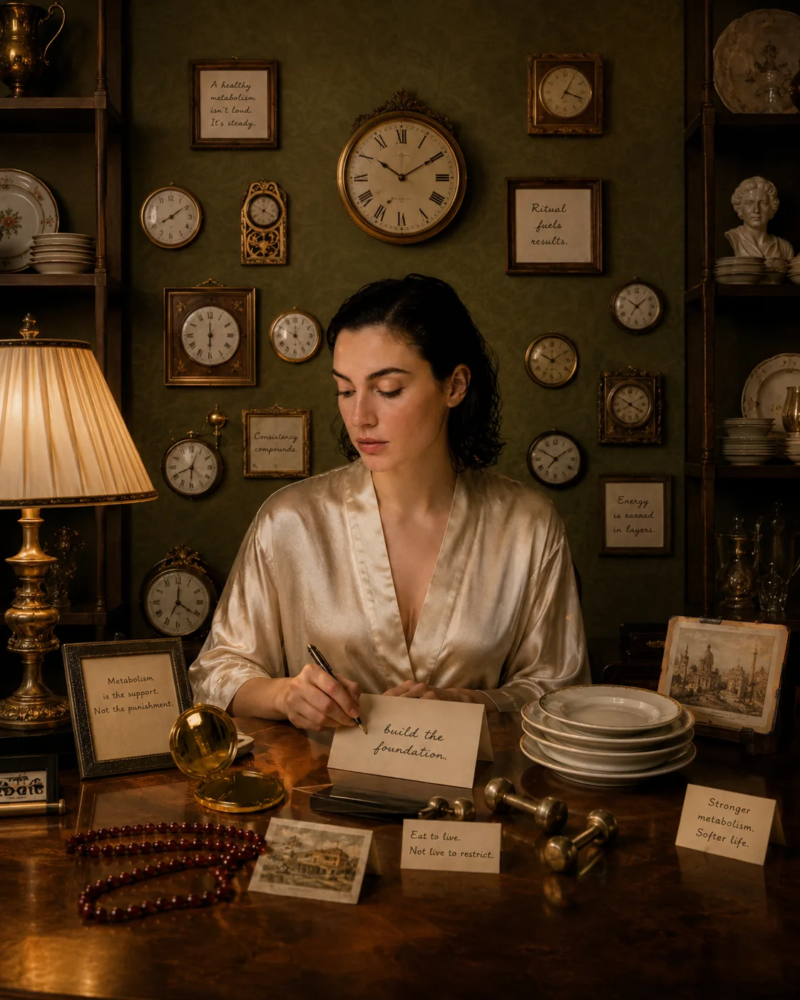
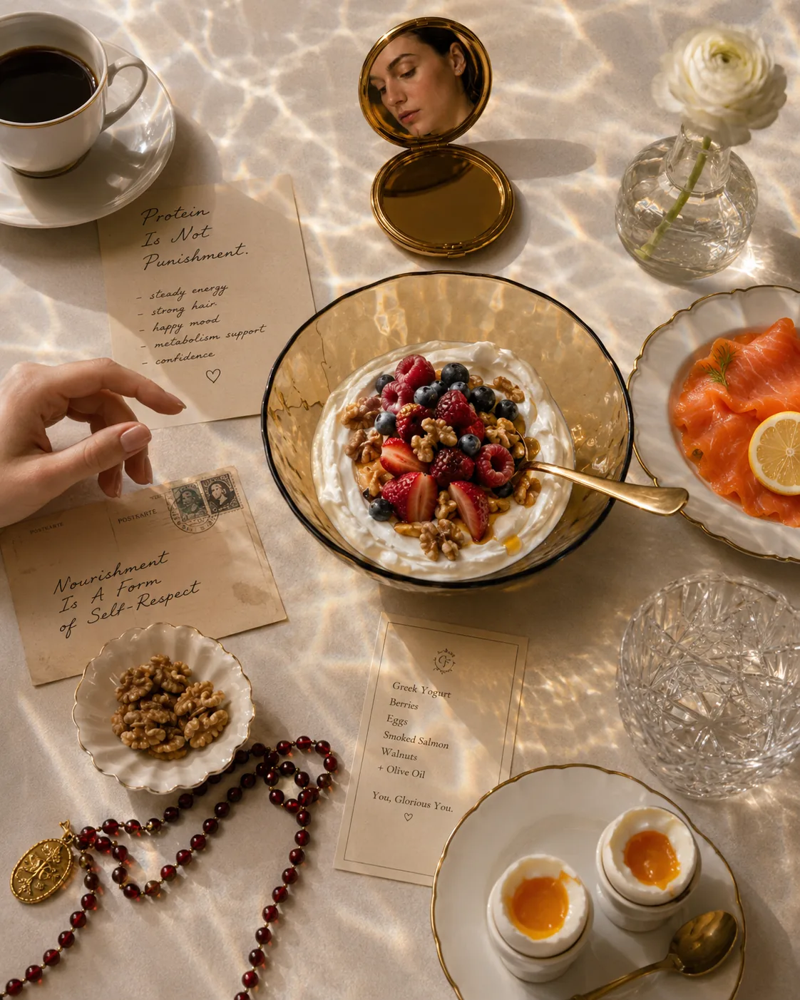
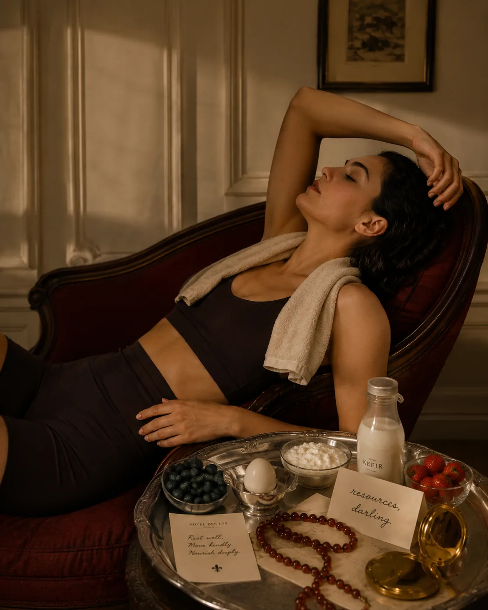
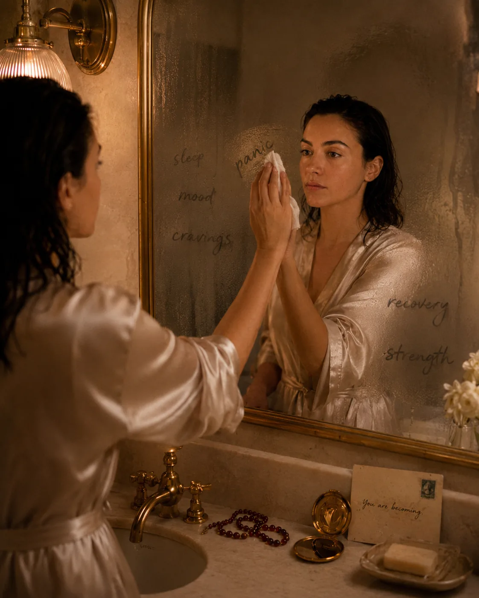
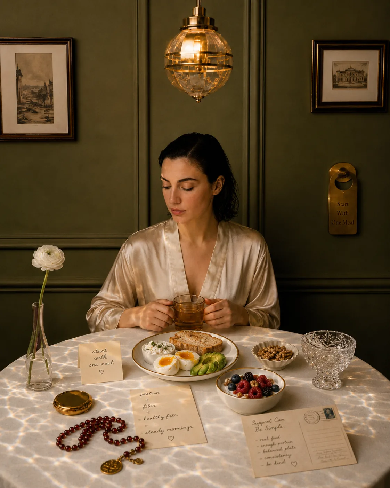

There is a certain kind of frustration that many women understand.
You are not dramatically changing your habits, but your body feels different.
You feel softer in places that used to feel more defined.

Your energy is less predictable.

Your workouts take longer to recover from.

Your cravings feel more noticeable.

You eat something small for breakfast, then wonder why you are thinking about snacks all afternoon.
And somewhere in the background, a familiar thought appears:
What is happening to my body?
It can feel unfair. Especially if you are doing many of the “right” things.
But your body is not betraying you. It is changing.
And as it changes, it often needs more support, not more punishment.
One of the most important forms of support is protein.
Protein is not just a fitness trend. It is not only for people who lift heavy weights or drink shakes after the gym. It is one of the foundational nutrients your body uses to maintain muscle, repair tissue, support recovery, regulate appetite, and age with strength.
For women over 35, protein becomes less of a “nice to have” and more of a quiet essential.
Not because you need to obsess over it.
Because your body deserves to be supported well before it starts shouting for help.

## The Quiet Shift: Why Your Body Needs More Support With Age

Aging does not suddenly begin at 35.
But for many women, the mid-30s and 40s are when subtle changes become harder to ignore.
You may notice that sleep affects you more than it used to. Stress stays in your body longer. Recovery feels slower. Body composition changes more easily. Meals that used to keep you full no longer do. Your energy may feel less forgiving.
This is not only about age.
It is also about the reality of life.
By this stage, many women are carrying more than ever: careers, relationships, businesses, family needs, emotional labor, home responsibilities, hormonal changes, and the quiet pressure to still look and function as if none of it has an effect.
So when your body starts asking for more support, it makes sense.
Protein matters because it helps support the physical foundation underneath everything else.
Your strength.

Your muscle.

Your metabolism.

Your fullness.

Your recovery.

Your ability to feel steady in your body.
And no, protein will not solve every problem.
It will not replace sleep, reduce all stress, or magically balance your hormones.
But it can make the foundation stronger.
And sometimes that changes more than we expect.

## Protein and Muscle: The Foundation of Strength

One of the biggest reasons protein matters more as you age is muscle.
Muscle is often discussed in terms of appearance, looking toned, lean, or defined.
But muscle is so much more than that.
Muscle helps you:
* lift groceries
* climb stairs
* move with confidence
* train without constant aches
* support your joints
* maintain posture
* regulate blood sugar
* protect your independence later in life
* feel capable in your body
Muscle is not vanity.
Muscle is protection.
As we age, muscle mass can gradually decline if it is not actively supported. Research on older adults consistently emphasizes that adequate protein and resistance training are important tools for maintaining muscle mass, strength, and function with age.
This matters for women long before old age.
Because muscle is easier to protect than rebuild after years of neglect.
You do not have to wait until you feel weak, tired, or disconnected from your body to begin supporting it.
Protein gives your body the raw materials it needs to repair and maintain muscle.
Strength training gives your body the signal to keep it.
Together, they are one of the most powerful combinations for women who want to age with strength, not fragility.

Related reading: [How Much Protein Do Women Over 35 Really Need?](/journal/how-much-protein-do-women-over-35-need/)

## Protein and Metabolism: Why Muscle Changes the Conversation

Many women are told that metabolism slows with age, usually in a way that feels discouraging.
As if the only solution is to eat less and accept feeling deprived.
But metabolism is not only about calories.
It is connected to muscle mass, movement, hormones, blood sugar regulation, sleep, stress, and overall metabolic health.
Muscle is metabolically active tissue. It helps your body use energy and glucose more effectively. When muscle declines, the body can become less metabolically resilient.
This is one reason protein becomes important as you age.
Not because protein “boosts metabolism” in a dramatic, magical way.
But because protein helps support the muscle that supports your metabolism.
That distinction matters.
The goal is not to force your body to burn more.
The goal is to build and protect the tissues that help your body function well.
This is why the old advice to simply “eat less” can become less helpful over time.
If eating less leads to low protein intake, poor recovery, more muscle loss, and stronger cravings, it may make the bigger picture harder, not easier.
A better question is:
How can I nourish my body in a way that helps me stay strong?
That question is more useful than:
How little can I eat?

Related reading: [Nutrition for Women Over 35: How to Support Energy, Metabolism, Hormones, and Long-Term Health](/journal/nutrition-for-women-over-35/)

## Protein and Fullness: Why You Feel Snacky All Day

One of the most immediate benefits of eating enough protein is fullness.
Not the uncomfortable kind of fullness.
The steady, satisfied feeling that lets you move on with your day without constantly thinking about food.
Many women who struggle with cravings are not lacking willpower.
They are eating meals that do not hold them.
A breakfast of coffee and toast may feel light and responsible, but it may not keep you full. A salad with very little protein may look healthy, but it may leave you searching for something sweet two hours later.
This is not failure.
It is physiology.
Protein helps meals feel more satisfying. When you include protein consistently, your appetite often feels calmer and more predictable.
You may notice:
* fewer urgent cravings
* less grazing
* fewer energy dips
* more stable hunger
* less evening overeating
* fewer “why am I like this?” moments at 9 p.m.
And honestly, we support fewer of those.
Protein does not remove pleasure from food.
It often makes eating feel more peaceful because your body is no longer trying to make up for what it did not receive earlier.

Related reading: [High-Protein Breakfast Ideas for Steady Energy](/journal/high-protein-breakfast-ideas-for-steady-energy/)

## Protein and Recovery: Why Your Body May Need More Than Before

There may have been a time when you could train hard, sleep badly, eat randomly, and somehow feel fine.
That time may have left the building.
As women age, recovery can become more sensitive.
Poor sleep hits harder. Stress affects training more. Soreness lingers. Busy weeks feel heavier in the body. Hormonal shifts can also influence energy, mood, and recovery.
Protein supports tissue repair and muscle recovery, especially when paired with strength training and enough total food.
This is important because many women try to improve their body composition by doing more while eating less.
More workouts.

More steps.

More restriction.

More pressure.
But the body does not only need stimulus.
It needs recovery.
And recovery requires resources.
Protein is one of them.
If you are training regularly but not eating enough protein, you may feel like your body is not responding the way it should.
You may be putting in the effort without giving your body enough material to adapt.
That is deeply frustrating and very common.

## Protein and Blood Sugar Balance

Protein also plays a role in steadier meals.
When you eat carbohydrates alone, especially refined carbohydrates, they may digest quickly and leave you feeling hungry or tired soon after.
When you add protein, fiber, and healthy fats, the same meal often becomes more stabilizing.
For example:
* toast alone becomes toast with eggs
* fruit alone becomes fruit with Greek yogurt
* oats alone become oats with protein and chia
* rice alone becomes rice with salmon, tofu, or chicken
* crackers alone become crackers with hummus, tuna, or cottage cheese
This is not about fearing carbohydrates.
Carbohydrates can absolutely be part of a supportive diet.
It is about pairing them in a way that helps your energy feel steadier.
For many women, this is one of the simplest ways to reduce afternoon crashes and cravings.
Not by cutting everything out.
By building meals better.

Related reading: [Blood Sugar Balance for Women: What It Means and Why It Matters](/journal/blood-sugar-balance-for-women/)

## Protein During Perimenopause and Menopause

Hormonal transitions can change how women feel in their bodies.
Perimenopause can begin in the late 30s or 40s for some women, and it may affect sleep, mood, cycle patterns, cravings, body composition, energy, and stress tolerance.
Protein cannot “fix” perimenopause.
And any advice that makes hormones sound like a simple switch is probably selling something.
But protein can be part of a more supportive foundation during this stage.
It can help support:
* muscle maintenance
* fullness
* recovery
* blood sugar balance
* strength
* body composition
* healthy aging
This matters because hormonal changes often arrive at the same time as higher stress, poorer sleep, and more life responsibility.
In other words, the body is already dealing with a lot.
This is not the time to under-eat protein, skip meals, overtrain, and live on caffeine.
It is the time to become more supportive, not more extreme.
Gentle disclaimer: If you are experiencing significant changes in your cycle, heavy bleeding, intense fatigue, hot flashes, mood changes, unexplained weight changes, or symptoms that worry you, speak with a qualified healthcare professional. Nutrition can support your body, but it is not a replacement for medical care.

## How Much Protein Do Women Need as They Age?

Protein needs vary based on body size, activity level, training, health status, and goals.
The general adult Recommended Dietary Allowance is 0.8 grams of protein per kilogram of body weight per day, but many experts suggest that older adults may benefit from higher intakes — often around 1.0–1.2 grams per kilogram per day — to support muscle and function with age.
For active women or women who strength train, protein needs may be higher. The International Society of Sports Nutrition states that 1.4–2.0 grams per kilogram per day is sufficient for most exercising individuals to support muscle protein balance.
For many women over 35, a practical range is often:
1.2–1.6 grams of protein per kilogram of body weight per day
This is not a rigid rule.
It is a starting point.
Some women will need less. Some will need more. Some may need personalized guidance, especially with medical conditions, pregnancy, breastfeeding, kidney disease, liver disease, or a history of disordered eating.
A simple habit that works well for many women is to include:
25–35 grams of protein per meal
This makes protein feel less overwhelming.
Instead of trying to hit a perfect number, you build meals around a clear protein source.
Breakfast.

Lunch.

Dinner.

Optional snack.
Calm. Simple. Repeatable.

Related reading: [How Much Protein Do Women Over 35 Really Need?](/journal/how-much-protein-do-women-over-35-need/)

## Best Protein Sources for Women as They Age

The best protein sources are the ones you enjoy, digest well, and can eat consistently.
There is no need to force foods that do not suit your body or lifestyle.

### Animal-Based Protein Sources
* eggs
* Greek yogurt
* cottage cheese
* kefir
* milk
* fish
* seafood
* chicken
* turkey
* lean beef
* cheese
Animal proteins are usually rich in essential amino acids and can be efficient sources of protein.

### Plant-Based Protein Sources
* tofu
* tempeh
* edamame
* lentils
* beans
* chickpeas
* seitan
* soy milk
* peas
* quinoa
* nuts and seeds
Plant-based protein can absolutely work, but it often requires more intention.
For example, lentils are wonderful, but they are not only protein. They also contain carbohydrates and fiber. That is a benefit — but it means you may need larger portions or a combination of plant proteins across the day.
A supportive plant-based meal might include tofu, edamame, rice, vegetables, and tahini.
A Mediterranean-style meal might include fish, beans, olive oil, vegetables, and potatoes.
A simple breakfast might be Greek yogurt, berries, chia seeds, and walnuts.
Protein does not have to be dry chicken and sadness.
It can be beautiful, warm, colorful, and deeply satisfying.

## Simple Ways to Eat More Protein Without Overthinking

If your current protein intake is low, do not try to change everything overnight.
Start with one meal.

### 1. Add a Protein Anchor to Breakfast
Breakfast is often where women undereat protein the most.
Try:
* eggs with sourdough
* Greek yogurt with berries
* cottage cheese with fruit
* tofu scramble
* smoked salmon toast
* protein oats
* kefir smoothie
A better breakfast often changes the whole day.

Related reading: [High-Protein Breakfast Ideas for Steady Energy](/journal/high-protein-breakfast-ideas-for-steady-energy/)

### 2. Build Lunch Around Protein First
Instead of starting with leaves and hoping for the best, begin with the protein.
Ask:
What is the protein anchor here?
Then add carbohydrates, fats, and color.
For example:
* chicken, quinoa, greens, olive oil
* tofu, rice, vegetables, tahini
* tuna, potatoes, salad, avocado
* lentils, eggs, herbs, yogurt
* salmon, couscous, vegetables, olive oil
This makes lunch more satisfying and helps prevent the late-afternoon snack spiral.

### 3. Keep Easy Protein Available
Busy women do not need more complicated plans.
They need options that are ready when life is full.
Keep a few of these available:
* boiled eggs
* Greek yogurt
* cottage cheese
* canned tuna or salmon
* tofu
* smoked salmon
* cooked chicken
* lentils
* beans
* edamame
* kefir
* protein-rich wraps
* protein powder, if useful
Make the supportive choice easier.
That is half the work.

### 4. Pair Snacks With Protein
If you snack, make the snack support you.
Try:
* fruit with Greek yogurt
* crackers with tuna
* boiled eggs with vegetables
* cottage cheese with berries
* edamame with sea salt
* apple with nut butter
* hummus with toast or vegetables
This helps snacks feel less like a temporary distraction and more like actual nourishment.

Related reading: [High-Protein Snacks That Actually Keep You Full](/journal/high-protein-snacks-that-keep-you-full/)

### 5. Stop Making Dinner Carry the Whole Day
Many women eat very little protein until dinner.
Then dinner has to do too much.
It has to satisfy hunger, recover the body, calm cravings, and compensate for the entire day.
That is a lot of emotional responsibility for one plate.
Spreading protein throughout the day usually feels better.
Your body should not have to wait until 8 p.m. to be properly nourished.

## Common Myths About Protein and Aging

### Myth 1: Protein Is Only for People Who Want to Build Muscle
Protein does support muscle, but that is exactly why it matters for everyone.
Especially women who want to age with strength, energy, and independence.
You do not need to have athletic goals to care about muscle.
You need muscle to live well in your body.

### Myth 2: Eating More Protein Will Make Women Bulky
This fear has followed women around for far too long.
Eating enough protein will not suddenly make you bulky.
Building a large amount of muscle requires consistent progressive training, enough calories, time, and often a very intentional plan.
For most women, adequate protein helps them feel stronger, more satisfied, and better recovered.
Not bulky.

### Myth 3: Protein Powder Is Required
It is not.
Protein powder can be convenient, but whole foods can absolutely meet your needs.
Use protein powder if it helps. Skip it if it does not.
It is a tool, not a requirement.

### Myth 4: More Protein Means No Carbs
No.
Protein matters, but carbohydrates matter too.
Carbohydrates can support energy, training, mood, and satisfaction. The goal is not to replace all carbs with protein. The goal is to build balanced meals.
Protein, carbohydrates, fats, and fiber can all belong on the same plate.
A peaceful concept. Apparently controversial on the internet.

### Myth 5: The Minimum Protein Recommendation Is Always Enough
The general RDA prevents deficiency for most adults, but it may not reflect what is optimal for active women, aging adults, or women trying to maintain muscle and recover from training. Research groups focused on aging and exercise often recommend higher intakes than the basic minimum, especially when muscle maintenance is a goal.
This is why many women feel better when they move from “technically enough” protein to “actually supportive” protein.
There is a difference.

## A Simple Day of Protein for Women Over 35

Here is what a protein-supportive day might look like without feeling strict:

**Breakfast**
Greek yogurt with berries, chia seeds, walnuts, and cinnamon.

**Lunch**
Chicken or tofu bowl with rice, vegetables, olive oil, herbs, and chickpeas.

**Snack**
Cottage cheese with fruit, or edamame with sea salt.

**Dinner**
Salmon with potatoes, greens, and olive oil.
This is not extreme.
This is not a diet personality.
It is just a day where your body is consistently supported.

## Related Reading

- [How Much Protein Do Women Over 35 Really Need?](/journal/how-much-protein-do-women-over-35-need) — turns the protein message into practical daily numbers.
- [Protein Timing: Does It Matter for Women?](/journal/protein-timing-does-it-matter-for-women) — helps you spread protein in a way that supports energy and muscle.
- [Body Recomposition for Women: Nutrition Basics](/journal/body-recomposition-for-women-nutrition-basics) — shows how protein supports strength, lean mass, and body composition.

## The Bigger Picture: Protein Is a Form of Care
Protein matters more as you age because your body is doing something important.
It is adapting.
It is carrying your life, your stress, your training, your hormones, your responsibilities, and your history.
It does not need you to punish it for changing.
It needs you to support it with more wisdom.
Protein helps protect muscle.

Muscle supports metabolism.

Better meals support fullness.

Steadier energy supports your mood.

Recovery supports strength.

Strength supports the way you move through life.
This is not about eating perfectly.
It is not about tracking forever.
It is not about becoming strict, controlled, or obsessed.
It is about understanding that your body after 35 may need more support than it did before — and that giving it support is not failure.
It is care.
Start with one meal.
Add a real protein source.
Notice how your body feels.
Then keep building from there.
Quietly. Practically. Consistently.
Because aging well is not about fighting your body.
It is about learning how to stand beside it.
